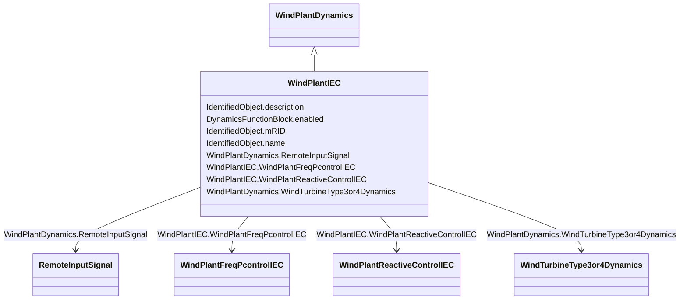

# WindPlantIEC

_Simplified IEC type plant level model. _

_Reference: IEC 61400-27-1:2015, Annex D._

**URI**: [cim:WindPlantIEC](http://iec.ch/TC57/CIM100#WindPlantIEC) 
**Type**: Class

## Inheritance
* [IdentifiedObject](IdentifiedObject.md)
    * [DynamicsFunctionBlock](DynamicsFunctionBlock.md)
        * [WindPlantDynamics](WindPlantDynamics.md)
            * **WindPlantIEC**

## Attributes

| Name | URI | Cardinality and Range | Description | Inheritance |
| ---  | --- | --- | --- | --- |
| WindPlantFreqPcontrolIEC | [cim:WindPlantIEC.WindPlantFreqPcontrolIEC](http://iec.ch/TC57/CIM100#WindPlantIEC.WindPlantFreqPcontrolIEC) | 1..1    [WindPlantFreqPcontrolIEC](WindPlantFreqPcontrolIEC.md)  | Wind plant frequency and active power control model associated with this wind... | direct |
| WindPlantReactiveControlIEC | [cim:WindPlantIEC.WindPlantReactiveControlIEC](http://iec.ch/TC57/CIM100#WindPlantIEC.WindPlantReactiveControlIEC) | 1..1    [WindPlantReactiveControlIEC](WindPlantReactiveControlIEC.md)  | Wind plant model with which this wind reactive control is associated | direct |
| RemoteInputSignal | [cim:WindPlantDynamics.RemoteInputSignal](http://iec.ch/TC57/CIM100#WindPlantDynamics.RemoteInputSignal) | 0..1    [RemoteInputSignal](RemoteInputSignal.md)  | The remote signal with which this power plant is associated | [WindPlantDynamics](WindPlantDynamics.md) |
| WindTurbineType3or4Dynamics | [cim:WindPlantDynamics.WindTurbineType3or4Dynamics](http://iec.ch/TC57/CIM100#WindPlantDynamics.WindTurbineType3or4Dynamics) | 1..*    [WindTurbineType3or4Dynamics](WindTurbineType3or4Dynamics.md)  | The wind turbine type 3 or type 4 associated with this wind plant | [WindPlantDynamics](WindPlantDynamics.md) |
| enabled | [cim:DynamicsFunctionBlock.enabled](http://iec.ch/TC57/CIM100#DynamicsFunctionBlock.enabled) | 1..1    boolean  | Function block used indicator | [DynamicsFunctionBlock](DynamicsFunctionBlock.md) |
| description | [cim:IdentifiedObject.description](http://iec.ch/TC57/CIM100#IdentifiedObject.description) | 0..1    string  | The description is a free human readable text describing or naming the object | [IdentifiedObject](IdentifiedObject.md) |
| mRID | [cim:IdentifiedObject.mRID](http://iec.ch/TC57/CIM100#IdentifiedObject.mRID) | 1..1    string  | Master resource identifier issued by a model authority | [IdentifiedObject](IdentifiedObject.md) |
| name | [cim:IdentifiedObject.name](http://iec.ch/TC57/CIM100#IdentifiedObject.name) | 0..1    string  | The name is any free human readable and possibly non unique text naming the o... | [IdentifiedObject](IdentifiedObject.md) |

## Usages

| used by | used in | type | used |
| ---  | --- | --- | --- |
| [WindPlantFreqPcontrolIEC](WindPlantFreqPcontrolIEC.md) | WindPlantIEC | range | [WindPlantIEC](WindPlantIEC.md) |
| [WindPlantReactiveControlIEC](WindPlantReactiveControlIEC.md) | WindPlantIEC | range | [WindPlantIEC](WindPlantIEC.md) |

## Identifier and Mapping Information

### Schema Source

* from schema: http://iec.ch/TC57/ns/CIM/Dynamics-EU#Package_DynamicsProfile

## Mappings

| Mapping Type | Mapped Value |
| ---  | ---  |
| self | cim:WindPlantIEC |
| native | this:WindPlantIEC |

