# WindPlantReactiveControlIEC

_Simplified plant voltage and reactive power control model for use with type 3 and type 4 wind turbine models._

_Reference: IEC 61400-27-1:2015, Annex D._

**URI**: [cim:WindPlantReactiveControlIEC](http://iec.ch/TC57/CIM100#WindPlantReactiveControlIEC) 
**Type**: Class

```mermaid
 classDiagram
    class WindPlantReactiveControlIEC
      IdentifiedObject <|-- WindPlantReactiveControlIEC
      
      WindPlantReactiveControlIEC : IdentifiedObject.description
        
      WindPlantReactiveControlIEC : WindPlantReactiveControlIEC.dxrefmax
        
          WindPlantReactiveControlIEC --> PU : WindPlantReactiveControlIEC.dxrefmax
        
      WindPlantReactiveControlIEC : WindPlantReactiveControlIEC.dxrefmin
        
          WindPlantReactiveControlIEC --> PU : WindPlantReactiveControlIEC.dxrefmin
        
      WindPlantReactiveControlIEC : WindPlantReactiveControlIEC.kiwpx
        
      WindPlantReactiveControlIEC : WindPlantReactiveControlIEC.kiwpxmax
        
          WindPlantReactiveControlIEC --> PU : WindPlantReactiveControlIEC.kiwpxmax
        
      WindPlantReactiveControlIEC : WindPlantReactiveControlIEC.kiwpxmin
        
          WindPlantReactiveControlIEC --> PU : WindPlantReactiveControlIEC.kiwpxmin
        
      WindPlantReactiveControlIEC : WindPlantReactiveControlIEC.kpwpx
        
      WindPlantReactiveControlIEC : WindPlantReactiveControlIEC.kwpqref
        
          WindPlantReactiveControlIEC --> PU : WindPlantReactiveControlIEC.kwpqref
        
      WindPlantReactiveControlIEC : WindPlantReactiveControlIEC.kwpqu
        
          WindPlantReactiveControlIEC --> PU : WindPlantReactiveControlIEC.kwpqu
        
      WindPlantReactiveControlIEC : IdentifiedObject.mRID
        
      WindPlantReactiveControlIEC : IdentifiedObject.name
        
      WindPlantReactiveControlIEC : WindPlantReactiveControlIEC.tuqfilt
        
          WindPlantReactiveControlIEC --> Seconds : WindPlantReactiveControlIEC.tuqfilt
        
      WindPlantReactiveControlIEC : WindPlantReactiveControlIEC.twppfiltq
        
          WindPlantReactiveControlIEC --> Seconds : WindPlantReactiveControlIEC.twppfiltq
        
      WindPlantReactiveControlIEC : WindPlantReactiveControlIEC.twpqfiltq
        
          WindPlantReactiveControlIEC --> Seconds : WindPlantReactiveControlIEC.twpqfiltq
        
      WindPlantReactiveControlIEC : WindPlantReactiveControlIEC.twpufiltq
        
          WindPlantReactiveControlIEC --> Seconds : WindPlantReactiveControlIEC.twpufiltq
        
      WindPlantReactiveControlIEC : WindPlantReactiveControlIEC.txft
        
          WindPlantReactiveControlIEC --> Seconds : WindPlantReactiveControlIEC.txft
        
      WindPlantReactiveControlIEC : WindPlantReactiveControlIEC.txfv
        
          WindPlantReactiveControlIEC --> Seconds : WindPlantReactiveControlIEC.txfv
        
      WindPlantReactiveControlIEC : WindPlantReactiveControlIEC.uwpqdip
        
          WindPlantReactiveControlIEC --> PU : WindPlantReactiveControlIEC.uwpqdip
        
      WindPlantReactiveControlIEC : WindPlantReactiveControlIEC.WindDynamicsLookupTable
        
          WindPlantReactiveControlIEC --> WindDynamicsLookupTable : WindPlantReactiveControlIEC.WindDynamicsLookupTable
        
      WindPlantReactiveControlIEC : WindPlantReactiveControlIEC.WindPlantIEC
        
          WindPlantReactiveControlIEC --> WindPlantIEC : WindPlantReactiveControlIEC.WindPlantIEC
        
      WindPlantReactiveControlIEC : WindPlantReactiveControlIEC.windPlantQcontrolModesType
        
          WindPlantReactiveControlIEC --> WindPlantQcontrolModeKind : WindPlantReactiveControlIEC.windPlantQcontrolModesType
        
      WindPlantReactiveControlIEC : WindPlantReactiveControlIEC.xrefmax
        
          WindPlantReactiveControlIEC --> PU : WindPlantReactiveControlIEC.xrefmax
        
      WindPlantReactiveControlIEC : WindPlantReactiveControlIEC.xrefmin
        
          WindPlantReactiveControlIEC --> PU : WindPlantReactiveControlIEC.xrefmin
        
      
```

## Inheritance
* [IdentifiedObject](IdentifiedObject.md)
    * **WindPlantReactiveControlIEC**

## Attributes

| Name | URI | Cardinality and Range | Description | Inheritance |
| ---  | --- | --- | --- | --- |
| WindDynamicsLookupTable | [cim:WindPlantReactiveControlIEC.WindDynamicsLookupTable](http://iec.ch/TC57/CIM100#WindPlantReactiveControlIEC.WindDynamicsLookupTable) | 1..*    [WindDynamicsLookupTable](WindDynamicsLookupTable.md)  | The wind dynamics lookup table associated with this voltage and reactive powe... | direct |
| WindPlantIEC | [cim:WindPlantReactiveControlIEC.WindPlantIEC](http://iec.ch/TC57/CIM100#WindPlantReactiveControlIEC.WindPlantIEC) | 1..1    [WindPlantIEC](WindPlantIEC.md)  | Wind plant reactive control model associated with this wind plant | direct |
| dxrefmax | [cim:WindPlantReactiveControlIEC.dxrefmax](http://iec.ch/TC57/CIM100#WindPlantReactiveControlIEC.dxrefmax) | 1..1    [PU](PU.md)  | Maximum positive ramp rate for wind turbine reactive power/voltage reference ... | direct |
| dxrefmin | [cim:WindPlantReactiveControlIEC.dxrefmin](http://iec.ch/TC57/CIM100#WindPlantReactiveControlIEC.dxrefmin) | 1..1    [PU](PU.md)  | Maximum negative ramp rate for wind turbine reactive power/voltage reference ... | direct |
| kiwpx | [cim:WindPlantReactiveControlIEC.kiwpx](http://iec.ch/TC57/CIM100#WindPlantReactiveControlIEC.kiwpx) | 1..1    float  | Plant Q controller integral gain (<i>K</i><i>IWPx</i>) | direct |
| kiwpxmax | [cim:WindPlantReactiveControlIEC.kiwpxmax](http://iec.ch/TC57/CIM100#WindPlantReactiveControlIEC.kiwpxmax) | 1..1    [PU](PU.md)  | Maximum reactive power/voltage reference from integration (<i>K</i><i>IW... | direct |
| kiwpxmin | [cim:WindPlantReactiveControlIEC.kiwpxmin](http://iec.ch/TC57/CIM100#WindPlantReactiveControlIEC.kiwpxmin) | 1..1    [PU](PU.md)  | Minimum reactive power/voltage reference from integration (<i>K</i><i>IW... | direct |
| kpwpx | [cim:WindPlantReactiveControlIEC.kpwpx](http://iec.ch/TC57/CIM100#WindPlantReactiveControlIEC.kpwpx) | 1..1    float  | Plant Q controller proportional gain (<i>K</i><i>PWPx</i>) | direct |
| kwpqref | [cim:WindPlantReactiveControlIEC.kwpqref](http://iec.ch/TC57/CIM100#WindPlantReactiveControlIEC.kwpqref) | 1..1    [PU](PU.md)  | Reactive power reference gain (<i>K</i><i>WPqref</i>) | direct |
| kwpqu | [cim:WindPlantReactiveControlIEC.kwpqu](http://iec.ch/TC57/CIM100#WindPlantReactiveControlIEC.kwpqu) | 1..1    [PU](PU.md)  | Plant voltage control droop (<i>K</i><i>WPqu</i>) | direct |
| tuqfilt | [cim:WindPlantReactiveControlIEC.tuqfilt](http://iec.ch/TC57/CIM100#WindPlantReactiveControlIEC.tuqfilt) | 1..1    [Seconds](Seconds.md)  | Filter time constant for voltage-dependent reactive power (<i>T</i><i>uq... | direct |
| twppfiltq | [cim:WindPlantReactiveControlIEC.twppfiltq](http://iec.ch/TC57/CIM100#WindPlantReactiveControlIEC.twppfiltq) | 1..1    [Seconds](Seconds.md)  | Filter time constant for active power measurement (<i>T</i><i>WPpfiltq</... | direct |
| twpqfiltq | [cim:WindPlantReactiveControlIEC.twpqfiltq](http://iec.ch/TC57/CIM100#WindPlantReactiveControlIEC.twpqfiltq) | 1..1    [Seconds](Seconds.md)  | Filter time constant for reactive power measurement (<i>T</i><i>WPqfiltq... | direct |
| twpufiltq | [cim:WindPlantReactiveControlIEC.twpufiltq](http://iec.ch/TC57/CIM100#WindPlantReactiveControlIEC.twpufiltq) | 1..1    [Seconds](Seconds.md)  | Filter time constant for voltage measurement (<i>T</i><i>WPufiltq<... | direct |
| txft | [cim:WindPlantReactiveControlIEC.txft](http://iec.ch/TC57/CIM100#WindPlantReactiveControlIEC.txft) | 1..1    [Seconds](Seconds.md)  | Lead time constant in reference value transfer function (<i>T</i><i>xft<... | direct |
| txfv | [cim:WindPlantReactiveControlIEC.txfv](http://iec.ch/TC57/CIM100#WindPlantReactiveControlIEC.txfv) | 1..1    [Seconds](Seconds.md)  | Lag time constant in reference value transfer function (<i>T</i><i>xfv</... | direct |
| uwpqdip | [cim:WindPlantReactiveControlIEC.uwpqdip](http://iec.ch/TC57/CIM100#WindPlantReactiveControlIEC.uwpqdip) | 1..1    [PU](PU.md)  | Voltage threshold for UVRT detection in Q control (<i>u</i><i>WPqdip</su... | direct |
| windPlantQcontrolModesType | [cim:WindPlantReactiveControlIEC.windPlantQcontrolModesType](http://iec.ch/TC57/CIM100#WindPlantReactiveControlIEC.windPlantQcontrolModesType) | 1..1    [WindPlantQcontrolModeKind](WindPlantQcontrolModeKind.md)  | Reactive power/voltage controller mode (<i>M</i><i>WPqmode</i>) | direct |
| xrefmax | [cim:WindPlantReactiveControlIEC.xrefmax](http://iec.ch/TC57/CIM100#WindPlantReactiveControlIEC.xrefmax) | 1..1    [PU](PU.md)  | Maximum <i>x</i>WTref (<i>q</i><i>WTref</i> or delta<i>... | direct |
| xrefmin | [cim:WindPlantReactiveControlIEC.xrefmin](http://iec.ch/TC57/CIM100#WindPlantReactiveControlIEC.xrefmin) | 1..1    [PU](PU.md)  | Minimum <i>x</i><i>WTref</i> (<i>q</i><i>WTref</i> or d... | direct |
| description | [cim:IdentifiedObject.description](http://iec.ch/TC57/CIM100#IdentifiedObject.description) | 0..1    string  | The description is a free human readable text describing or naming the object | [IdentifiedObject](IdentifiedObject.md) |
| mRID | [cim:IdentifiedObject.mRID](http://iec.ch/TC57/CIM100#IdentifiedObject.mRID) | 1..1    string  | Master resource identifier issued by a model authority | [IdentifiedObject](IdentifiedObject.md) |
| name | [cim:IdentifiedObject.name](http://iec.ch/TC57/CIM100#IdentifiedObject.name) | 0..1    string  | The name is any free human readable and possibly non unique text naming the o... | [IdentifiedObject](IdentifiedObject.md) |

## Usages

| used by | used in | type | used |
| ---  | --- | --- | --- |
| [WindDynamicsLookupTable](WindDynamicsLookupTable.md) | WindPlantReactiveControlIEC | range | [WindPlantReactiveControlIEC](WindPlantReactiveControlIEC.md) |
| [WindPlantIEC](WindPlantIEC.md) | WindPlantReactiveControlIEC | range | [WindPlantReactiveControlIEC](WindPlantReactiveControlIEC.md) |

## Identifier and Mapping Information

### Schema Source

* from schema: http://iec.ch/TC57/ns/CIM/Dynamics-EU#Package_DynamicsProfile

## Mappings

| Mapping Type | Mapped Value |
| ---  | ---  |
| self | cim:WindPlantReactiveControlIEC |
| native | this:WindPlantReactiveControlIEC |

