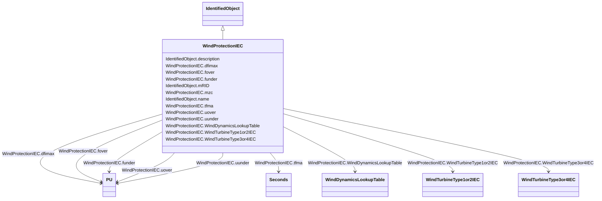

# WindProtectionIEC

_The grid protection model includes protection against over- and under-voltage, and against over- and under-frequency._

_Reference: IEC 61400-27-1:2015, 5.6.6._

**URI**: [cim:WindProtectionIEC](http://iec.ch/TC57/CIM100#WindProtectionIEC) 
**Type**: Class

## Inheritance
* [IdentifiedObject](IdentifiedObject.md)
    * **WindProtectionIEC**

## Attributes

| Name | URI | Cardinality and Range | Description | Inheritance |
| ---  | --- | --- | --- | --- |
| WindDynamicsLookupTable | [cim:WindProtectionIEC.WindDynamicsLookupTable](http://iec.ch/TC57/CIM100#WindProtectionIEC.WindDynamicsLookupTable) | 1..*    [WindDynamicsLookupTable](WindDynamicsLookupTable.md)  | The wind dynamics lookup table associated with this grid protection model | direct |
| dfimax | [cim:WindProtectionIEC.dfimax](http://iec.ch/TC57/CIM100#WindProtectionIEC.dfimax) | 1..1    [PU](PU.md)  | Maximum rate of change of frequency (<i>dF</i><i>max</i>) | direct |
| fover | [cim:WindProtectionIEC.fover](http://iec.ch/TC57/CIM100#WindProtectionIEC.fover) | 1..1    [PU](PU.md)  | Wind turbine over frequency protection activation threshold (<i>f</i><i>... | direct |
| funder | [cim:WindProtectionIEC.funder](http://iec.ch/TC57/CIM100#WindProtectionIEC.funder) | 1..1    [PU](PU.md)  | Wind turbine under frequency protection activation threshold (<i>f</i><i><sub... | direct |
| mzc | [cim:WindProtectionIEC.mzc](http://iec.ch/TC57/CIM100#WindProtectionIEC.mzc) | 1..1    boolean  | Zero crossing measurement mode (<i>Mzc</i>) | direct |
| tfma | [cim:WindProtectionIEC.tfma](http://iec.ch/TC57/CIM100#WindProtectionIEC.tfma) | 1..1    [Seconds](Seconds.md)  | Time interval of moving average window (<i>TfMA</i>) (&gt;= 0) | direct |
| uover | [cim:WindProtectionIEC.uover](http://iec.ch/TC57/CIM100#WindProtectionIEC.uover) | 1..1    [PU](PU.md)  | Wind turbine over voltage protection activation threshold (<i>u</i><i>ov... | direct |
| uunder | [cim:WindProtectionIEC.uunder](http://iec.ch/TC57/CIM100#WindProtectionIEC.uunder) | 1..1    [PU](PU.md)  | Wind turbine under voltage protection activation threshold (<i>u</i><i>u... | direct |
| WindTurbineType3or4IEC | [cim:WindProtectionIEC.WindTurbineType3or4IEC](http://iec.ch/TC57/CIM100#WindProtectionIEC.WindTurbineType3or4IEC) | 0..1    [WindTurbineType3or4IEC](WindTurbineType3or4IEC.md)  | Wind generator type 3 or type 4 model with which this wind turbine protection... | direct |
| WindTurbineType1or2IEC | [cim:WindProtectionIEC.WindTurbineType1or2IEC](http://iec.ch/TC57/CIM100#WindProtectionIEC.WindTurbineType1or2IEC) | 0..1    [WindTurbineType1or2IEC](WindTurbineType1or2IEC.md)  | Wind generator type 1 or type 2 model with which this wind turbine protection... | direct |
| description | [cim:IdentifiedObject.description](http://iec.ch/TC57/CIM100#IdentifiedObject.description) | 0..1    string  | The description is a free human readable text describing or naming the object | [IdentifiedObject](IdentifiedObject.md) |
| mRID | [cim:IdentifiedObject.mRID](http://iec.ch/TC57/CIM100#IdentifiedObject.mRID) | 1..1    string  | Master resource identifier issued by a model authority | [IdentifiedObject](IdentifiedObject.md) |
| name | [cim:IdentifiedObject.name](http://iec.ch/TC57/CIM100#IdentifiedObject.name) | 0..1    string  | The name is any free human readable and possibly non unique text naming the o... | [IdentifiedObject](IdentifiedObject.md) |

## Usages

| used by | used in | type | used |
| ---  | --- | --- | --- |
| [WindDynamicsLookupTable](WindDynamicsLookupTable.md) | WindProtectionIEC | range | [WindProtectionIEC](WindProtectionIEC.md) |
| [WindGenTurbineType1aIEC](WindGenTurbineType1aIEC.md) | WindProtectionIEC | range | [WindProtectionIEC](WindProtectionIEC.md) |
| [WindGenTurbineType1bIEC](WindGenTurbineType1bIEC.md) | WindProtectionIEC | range | [WindProtectionIEC](WindProtectionIEC.md) |
| [WindGenTurbineType2IEC](WindGenTurbineType2IEC.md) | WindProtectionIEC | range | [WindProtectionIEC](WindProtectionIEC.md) |
| [WindTurbineType1or2IEC](WindTurbineType1or2IEC.md) | WindProtectionIEC | range | [WindProtectionIEC](WindProtectionIEC.md) |
| [WindTurbineType3IEC](WindTurbineType3IEC.md) | WindProtectionIEC | range | [WindProtectionIEC](WindProtectionIEC.md) |
| [WindTurbineType3or4IEC](WindTurbineType3or4IEC.md) | WindProtectionIEC | range | [WindProtectionIEC](WindProtectionIEC.md) |
| [WindTurbineType4aIEC](WindTurbineType4aIEC.md) | WindProtectionIEC | range | [WindProtectionIEC](WindProtectionIEC.md) |
| [WindTurbineType4bIEC](WindTurbineType4bIEC.md) | WindProtectionIEC | range | [WindProtectionIEC](WindProtectionIEC.md) |
| [WindTurbineType4IEC](WindTurbineType4IEC.md) | WindProtectionIEC | range | [WindProtectionIEC](WindProtectionIEC.md) |

## Identifier and Mapping Information

### Schema Source

* from schema: http://iec.ch/TC57/ns/CIM/Dynamics-EU#Package_DynamicsProfile

## Mappings

| Mapping Type | Mapped Value |
| ---  | ---  |
| self | cim:WindProtectionIEC |
| native | this:WindProtectionIEC |

