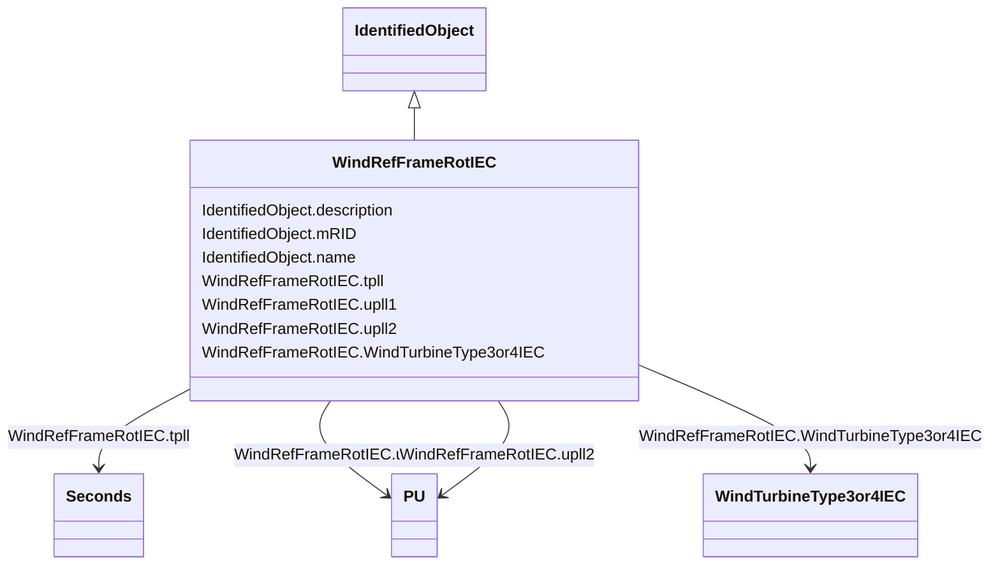

# WindRefFrameRotIEC

_Reference frame rotation model._

_Reference: IEC 61400-27-1:2015, 5.6.3.5._

**URI**: [cim:WindRefFrameRotIEC](http://iec.ch/TC57/CIM100#WindRefFrameRotIEC) 
**Type**: Class

## Inheritance
* [IdentifiedObject](IdentifiedObject.md)
    * **WindRefFrameRotIEC**

## Attributes

| Name | URI | Cardinality and Range | Description | Inheritance |
| ---  | --- | --- | --- | --- |
| tpll | [cim:WindRefFrameRotIEC.tpll](http://iec.ch/TC57/CIM100#WindRefFrameRotIEC.tpll) | 1..1    [Seconds](Seconds.md)  | Time constant for PLL first order filter model (<i>T</i><i>PLL</i>... | direct |
| upll1 | [cim:WindRefFrameRotIEC.upll1](http://iec.ch/TC57/CIM100#WindRefFrameRotIEC.upll1) | 1..1    [PU](PU.md)  | Voltage below which the angle of the voltage is filtered and possibly also fr... | direct |
| upll2 | [cim:WindRefFrameRotIEC.upll2](http://iec.ch/TC57/CIM100#WindRefFrameRotIEC.upll2) | 1..1    [PU](PU.md)  | Voltage (<i>u</i><i>PLL2</i>) below which the angle of the voltage... | direct |
| WindTurbineType3or4IEC | [cim:WindRefFrameRotIEC.WindTurbineType3or4IEC](http://iec.ch/TC57/CIM100#WindRefFrameRotIEC.WindTurbineType3or4IEC) | 1..1    [WindTurbineType3or4IEC](WindTurbineType3or4IEC.md)  | Wind turbine type 3 or type 4 model with which this reference frame rotation ... | direct |
| description | [cim:IdentifiedObject.description](http://iec.ch/TC57/CIM100#IdentifiedObject.description) | 0..1    string  | The description is a free human readable text describing or naming the object | [IdentifiedObject](IdentifiedObject.md) |
| mRID | [cim:IdentifiedObject.mRID](http://iec.ch/TC57/CIM100#IdentifiedObject.mRID) | 1..1    string  | Master resource identifier issued by a model authority | [IdentifiedObject](IdentifiedObject.md) |
| name | [cim:IdentifiedObject.name](http://iec.ch/TC57/CIM100#IdentifiedObject.name) | 0..1    string  | The name is any free human readable and possibly non unique text naming the o... | [IdentifiedObject](IdentifiedObject.md) |

## Usages

| used by | used in | type | used |
| ---  | --- | --- | --- |
| [WindTurbineType3IEC](WindTurbineType3IEC.md) | WindRefFrameRotIEC | range | [WindRefFrameRotIEC](WindRefFrameRotIEC.md) |
| [WindTurbineType3or4IEC](WindTurbineType3or4IEC.md) | WindRefFrameRotIEC | range | [WindRefFrameRotIEC](WindRefFrameRotIEC.md) |
| [WindTurbineType4aIEC](WindTurbineType4aIEC.md) | WindRefFrameRotIEC | range | [WindRefFrameRotIEC](WindRefFrameRotIEC.md) |
| [WindTurbineType4bIEC](WindTurbineType4bIEC.md) | WindRefFrameRotIEC | range | [WindRefFrameRotIEC](WindRefFrameRotIEC.md) |
| [WindTurbineType4IEC](WindTurbineType4IEC.md) | WindRefFrameRotIEC | range | [WindRefFrameRotIEC](WindRefFrameRotIEC.md) |

## Identifier and Mapping Information

### Schema Source

* from schema: http://iec.ch/TC57/ns/CIM/Dynamics-EU#Package_DynamicsProfile

## Mappings

| Mapping Type | Mapped Value |
| ---  | ---  |
| self | cim:WindRefFrameRotIEC |
| native | this:WindRefFrameRotIEC |

