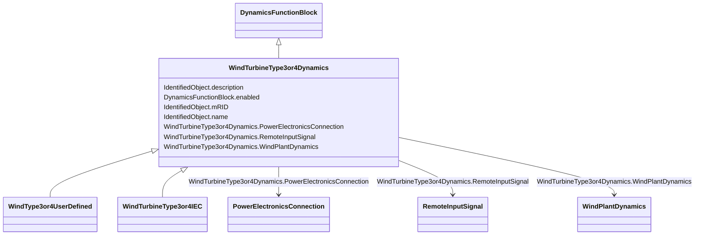

# WindTurbineType3or4Dynamics

_Parent class supporting relationships to wind turbines type 3 and type 4 and wind plant including their control models._

**URI**: [cim:WindTurbineType3or4Dynamics](http://iec.ch/TC57/CIM100#WindTurbineType3or4Dynamics) 
**Type**: Class

## Inheritance
* [IdentifiedObject](IdentifiedObject.md)
    * [DynamicsFunctionBlock](DynamicsFunctionBlock.md)
        * **WindTurbineType3or4Dynamics**
            * [WindType3or4UserDefined](WindType3or4UserDefined.md)
            * [WindTurbineType3or4IEC](WindTurbineType3or4IEC.md)

## Attributes

| Name | URI | Cardinality and Range | Description | Inheritance |
| ---  | --- | --- | --- | --- |
| PowerElectronicsConnection | [cim:WindTurbineType3or4Dynamics.PowerElectronicsConnection](http://iec.ch/TC57/CIM100#WindTurbineType3or4Dynamics.PowerElectronicsConnection) | 1    [PowerElectronicsConnection](PowerElectronicsConnection.md)  | The power electronics connection associated with this wind turbine type 3 or ... | direct |
| RemoteInputSignal | [cim:WindTurbineType3or4Dynamics.RemoteInputSignal](http://iec.ch/TC57/CIM100#WindTurbineType3or4Dynamics.RemoteInputSignal) | 0..1    [RemoteInputSignal](RemoteInputSignal.md)  | Remote input signal used by these wind turbine type 3 or type 4 models | direct |
| WindPlantDynamics | [cim:WindTurbineType3or4Dynamics.WindPlantDynamics](http://iec.ch/TC57/CIM100#WindTurbineType3or4Dynamics.WindPlantDynamics) | 0..1    [WindPlantDynamics](WindPlantDynamics.md)  | The wind plant with which the wind turbines type 3 or type 4 are associated | direct |
| enabled | [cim:DynamicsFunctionBlock.enabled](http://iec.ch/TC57/CIM100#DynamicsFunctionBlock.enabled) | 1    boolean  | Function block used indicator | [DynamicsFunctionBlock](DynamicsFunctionBlock.md) |
| description | [cim:IdentifiedObject.description](http://iec.ch/TC57/CIM100#IdentifiedObject.description) | 0..1    string  | The description is a free human readable text describing or naming the object | [IdentifiedObject](IdentifiedObject.md) |
| mRID | [cim:IdentifiedObject.mRID](http://iec.ch/TC57/CIM100#IdentifiedObject.mRID) | 1    string  | Master resource identifier issued by a model authority | [IdentifiedObject](IdentifiedObject.md) |
| name | [cim:IdentifiedObject.name](http://iec.ch/TC57/CIM100#IdentifiedObject.name) | 0..1    string  | The name is any free human readable and possibly non unique text naming the o... | [IdentifiedObject](IdentifiedObject.md) |

## Usages

| used by | used in | type | used |
| ---  | --- | --- | --- |
| [PowerElectronicsConnection](PowerElectronicsConnection.md) | WindTurbineType3or4Dynamics | range | [WindTurbineType3or4Dynamics](WindTurbineType3or4Dynamics.md) |
| [RemoteInputSignal](RemoteInputSignal.md) | WindTurbineType3or4Dynamics | range | [WindTurbineType3or4Dynamics](WindTurbineType3or4Dynamics.md) |
| [WindPlantUserDefined](WindPlantUserDefined.md) | WindTurbineType3or4Dynamics | range | [WindTurbineType3or4Dynamics](WindTurbineType3or4Dynamics.md) |
| [WindPlantDynamics](WindPlantDynamics.md) | WindTurbineType3or4Dynamics | range | [WindTurbineType3or4Dynamics](WindTurbineType3or4Dynamics.md) |
| [WindPlantIEC](WindPlantIEC.md) | WindTurbineType3or4Dynamics | range | [WindTurbineType3or4Dynamics](WindTurbineType3or4Dynamics.md) |

## Identifier and Mapping Information

### Schema Source

* from schema: http://iec.ch/TC57/ns/CIM/Dynamics-EU#Package_DynamicsProfile

## Mappings

| Mapping Type | Mapped Value |
| ---  | ---  |
| self | cim:WindTurbineType3or4Dynamics |
| native | this:WindTurbineType3or4Dynamics |

