# WindTurbineType4aIEC

_Wind turbine IEC type 4A._

_Reference: IEC 61400-27-1:2015, 5.5.5.2._

**URI**: [cim:WindTurbineType4aIEC](http://iec.ch/TC57/CIM100#WindTurbineType4aIEC) 
**Type**: Class

```mermaid
 classDiagram
    class WindTurbineType4aIEC
      WindTurbineType4IEC <|-- WindTurbineType4aIEC
      
      WindTurbineType4aIEC : IdentifiedObject.description
        
      WindTurbineType4aIEC : DynamicsFunctionBlock.enabled
        
      WindTurbineType4aIEC : IdentifiedObject.mRID
        
      WindTurbineType4aIEC : IdentifiedObject.name
        
      WindTurbineType4aIEC : WindTurbineType3or4Dynamics.PowerElectronicsConnection
        
          WindTurbineType4aIEC --> PowerElectronicsConnection : WindTurbineType3or4Dynamics.PowerElectronicsConnection
        
      WindTurbineType4aIEC : WindTurbineType3or4Dynamics.RemoteInputSignal
        
          WindTurbineType4aIEC --> RemoteInputSignal : WindTurbineType3or4Dynamics.RemoteInputSignal
        
      WindTurbineType4aIEC : WindTurbineType3or4IEC.WindContCurrLimIEC
        
          WindTurbineType4aIEC --> WindContCurrLimIEC : WindTurbineType3or4IEC.WindContCurrLimIEC
        
      WindTurbineType4aIEC : WindTurbineType4aIEC.WindContPType4aIEC
        
          WindTurbineType4aIEC --> WindContPType4aIEC : WindTurbineType4aIEC.WindContPType4aIEC
        
      WindTurbineType4aIEC : WindTurbineType3or4IEC.WIndContQIEC
        
          WindTurbineType4aIEC --> WindContQIEC : WindTurbineType3or4IEC.WIndContQIEC
        
      WindTurbineType4aIEC : WindTurbineType3or4IEC.WindContQLimIEC
        
          WindTurbineType4aIEC --> WindContQLimIEC : WindTurbineType3or4IEC.WindContQLimIEC
        
      WindTurbineType4aIEC : WindTurbineType3or4IEC.WindContQPQULimIEC
        
          WindTurbineType4aIEC --> WindContQPQULimIEC : WindTurbineType3or4IEC.WindContQPQULimIEC
        
      WindTurbineType4aIEC : WindTurbineType4IEC.WindGenType3aIEC
        
          WindTurbineType4aIEC --> WindGenType3aIEC : WindTurbineType4IEC.WindGenType3aIEC
        
      WindTurbineType4aIEC : WindTurbineType4aIEC.WindGenType4IEC
        
          WindTurbineType4aIEC --> WindGenType4IEC : WindTurbineType4aIEC.WindGenType4IEC
        
      WindTurbineType4aIEC : WindTurbineType3or4Dynamics.WindPlantDynamics
        
          WindTurbineType4aIEC --> WindPlantDynamics : WindTurbineType3or4Dynamics.WindPlantDynamics
        
      WindTurbineType4aIEC : WindTurbineType3or4IEC.WindProtectionIEC
        
          WindTurbineType4aIEC --> WindProtectionIEC : WindTurbineType3or4IEC.WindProtectionIEC
        
      WindTurbineType4aIEC : WindTurbineType3or4IEC.WindRefFrameRotIEC
        
          WindTurbineType4aIEC --> WindRefFrameRotIEC : WindTurbineType3or4IEC.WindRefFrameRotIEC
        
      
```

## Inheritance
* [IdentifiedObject](IdentifiedObject.md)
    * [DynamicsFunctionBlock](DynamicsFunctionBlock.md)
        * [WindTurbineType3or4Dynamics](WindTurbineType3or4Dynamics.md)
            * [WindTurbineType3or4IEC](WindTurbineType3or4IEC.md)
                * [WindTurbineType4IEC](WindTurbineType4IEC.md)
                    * **WindTurbineType4aIEC**

## Attributes

| Name | URI | Cardinality and Range | Description | Inheritance |
| ---  | --- | --- | --- | --- |
| WindContPType4aIEC | [cim:WindTurbineType4aIEC.WindContPType4aIEC](http://iec.ch/TC57/CIM100#WindTurbineType4aIEC.WindContPType4aIEC) | 1..1    [WindContPType4aIEC](WindContPType4aIEC.md)  | Wind control P type 4A model associated with this wind turbine type 4A model | direct |
| WindGenType4IEC | [cim:WindTurbineType4aIEC.WindGenType4IEC](http://iec.ch/TC57/CIM100#WindTurbineType4aIEC.WindGenType4IEC) | 0..1    [WindGenType4IEC](WindGenType4IEC.md)  | Wind generator type 4 model associated with this wind turbine type 4A model | direct |
| WindGenType3aIEC | [cim:WindTurbineType4IEC.WindGenType3aIEC](http://iec.ch/TC57/CIM100#WindTurbineType4IEC.WindGenType3aIEC) | 0..1    [WindGenType3aIEC](WindGenType3aIEC.md)  | Wind generator type 3A model associated with this wind turbine type 4 model | [WindTurbineType4IEC](WindTurbineType4IEC.md) |
| WindContCurrLimIEC | [cim:WindTurbineType3or4IEC.WindContCurrLimIEC](http://iec.ch/TC57/CIM100#WindTurbineType3or4IEC.WindContCurrLimIEC) | 1..1    [WindContCurrLimIEC](WindContCurrLimIEC.md)  | Wind control current limitation model associated with this wind turbine type ... | [WindTurbineType3or4IEC](WindTurbineType3or4IEC.md) |
| WIndContQIEC | [cim:WindTurbineType3or4IEC.WIndContQIEC](http://iec.ch/TC57/CIM100#WindTurbineType3or4IEC.WIndContQIEC) | 1..1    [WindContQIEC](WindContQIEC.md)  | Wind control Q model associated with this wind turbine type 3 or type 4 model | [WindTurbineType3or4IEC](WindTurbineType3or4IEC.md) |
| WindContQLimIEC | [cim:WindTurbineType3or4IEC.WindContQLimIEC](http://iec.ch/TC57/CIM100#WindTurbineType3or4IEC.WindContQLimIEC) | 0..1    [WindContQLimIEC](WindContQLimIEC.md)  | Constant Q limitation model associated with this wind generator type 3 or typ... | [WindTurbineType3or4IEC](WindTurbineType3or4IEC.md) |
| WindContQPQULimIEC | [cim:WindTurbineType3or4IEC.WindContQPQULimIEC](http://iec.ch/TC57/CIM100#WindTurbineType3or4IEC.WindContQPQULimIEC) | 0..1    [WindContQPQULimIEC](WindContQPQULimIEC.md)  | QP and QU limitation model associated with this wind generator type 3 or type... | [WindTurbineType3or4IEC](WindTurbineType3or4IEC.md) |
| WindProtectionIEC | [cim:WindTurbineType3or4IEC.WindProtectionIEC](http://iec.ch/TC57/CIM100#WindTurbineType3or4IEC.WindProtectionIEC) | 1..1    [WindProtectionIEC](WindProtectionIEC.md)  | Wind turbune protection model associated with this wind generator type 3 or t... | [WindTurbineType3or4IEC](WindTurbineType3or4IEC.md) |
| WindRefFrameRotIEC | [cim:WindTurbineType3or4IEC.WindRefFrameRotIEC](http://iec.ch/TC57/CIM100#WindTurbineType3or4IEC.WindRefFrameRotIEC) | 1..1    [WindRefFrameRotIEC](WindRefFrameRotIEC.md)  | Reference frame rotation model associated with this wind turbine type 3 or ty... | [WindTurbineType3or4IEC](WindTurbineType3or4IEC.md) |
| PowerElectronicsConnection | [cim:WindTurbineType3or4Dynamics.PowerElectronicsConnection](http://iec.ch/TC57/CIM100#WindTurbineType3or4Dynamics.PowerElectronicsConnection) | 1..1    [PowerElectronicsConnection](PowerElectronicsConnection.md)  | The power electronics connection associated with this wind turbine type 3 or ... | [WindTurbineType3or4Dynamics](WindTurbineType3or4Dynamics.md) |
| RemoteInputSignal | [cim:WindTurbineType3or4Dynamics.RemoteInputSignal](http://iec.ch/TC57/CIM100#WindTurbineType3or4Dynamics.RemoteInputSignal) | 0..1    [RemoteInputSignal](RemoteInputSignal.md)  | Remote input signal used by these wind turbine type 3 or type 4 models | [WindTurbineType3or4Dynamics](WindTurbineType3or4Dynamics.md) |
| WindPlantDynamics | [cim:WindTurbineType3or4Dynamics.WindPlantDynamics](http://iec.ch/TC57/CIM100#WindTurbineType3or4Dynamics.WindPlantDynamics) | 0..1    [WindPlantDynamics](WindPlantDynamics.md)  | The wind plant with which the wind turbines type 3 or type 4 are associated | [WindTurbineType3or4Dynamics](WindTurbineType3or4Dynamics.md) |
| enabled | [cim:DynamicsFunctionBlock.enabled](http://iec.ch/TC57/CIM100#DynamicsFunctionBlock.enabled) | 1..1    boolean  | Function block used indicator | [DynamicsFunctionBlock](DynamicsFunctionBlock.md) |
| description | [cim:IdentifiedObject.description](http://iec.ch/TC57/CIM100#IdentifiedObject.description) | 0..1    string  | The description is a free human readable text describing or naming the object | [IdentifiedObject](IdentifiedObject.md) |
| mRID | [cim:IdentifiedObject.mRID](http://iec.ch/TC57/CIM100#IdentifiedObject.mRID) | 1..1    string  | Master resource identifier issued by a model authority | [IdentifiedObject](IdentifiedObject.md) |
| name | [cim:IdentifiedObject.name](http://iec.ch/TC57/CIM100#IdentifiedObject.name) | 0..1    string  | The name is any free human readable and possibly non unique text naming the o... | [IdentifiedObject](IdentifiedObject.md) |

## Usages

| used by | used in | type | used |
| ---  | --- | --- | --- |
| [WindContPType4aIEC](WindContPType4aIEC.md) | WindTurbineType4aIEC | range | [WindTurbineType4aIEC](WindTurbineType4aIEC.md) |
| [WindGenType4IEC](WindGenType4IEC.md) | WindTurbineType4aIEC | range | [WindTurbineType4aIEC](WindTurbineType4aIEC.md) |

## Identifier and Mapping Information

### Schema Source

* from schema: http://iec.ch/TC57/ns/CIM/Dynamics-EU#Package_DynamicsProfile

## Mappings

| Mapping Type | Mapped Value |
| ---  | ---  |
| self | cim:WindTurbineType4aIEC |
| native | this:WindTurbineType4aIEC |

