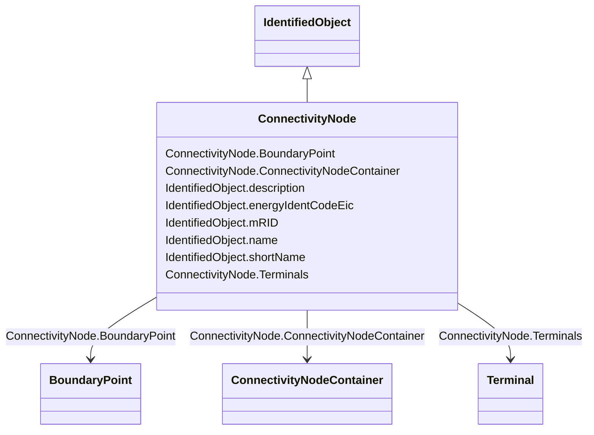

# ConnectivityNode

_Connectivity nodes are points where terminals of AC conducting equipment are connected together with zero impedance._

**URI**: [cim:ConnectivityNode](http://iec.ch/TC57/CIM100#ConnectivityNode) 
**Type**: Class

## Inheritance
* [IdentifiedObject](IdentifiedObject.md)
    * **ConnectivityNode**

## Attributes

| Name | URI | Cardinality and Range | Description | Inheritance |
| ---  | --- | --- | --- | --- |
| BoundaryPoint | [eu:ConnectivityNode.BoundaryPoint](http://iec.ch/TC57/CIM100-European#ConnectivityNode.BoundaryPoint) | 0..1    [BoundaryPoint](BoundaryPoint.md)  | The boundary point associated with the connectivity node | direct |
| Terminals | [cim:ConnectivityNode.Terminals](http://iec.ch/TC57/CIM100#ConnectivityNode.Terminals) | *    [Terminal](Terminal.md)  | Terminals interconnected with zero impedance at a this connectivity node | direct |
| ConnectivityNodeContainer | [cim:ConnectivityNode.ConnectivityNodeContainer](http://iec.ch/TC57/CIM100#ConnectivityNode.ConnectivityNodeContainer) | 1    [ConnectivityNodeContainer](ConnectivityNodeContainer.md)  | Container of this connectivity node | direct |
| description | [cim:IdentifiedObject.description](http://iec.ch/TC57/CIM100#IdentifiedObject.description) | 0..1    string  | The description is a free human readable text describing or naming the object | [IdentifiedObject](IdentifiedObject.md) |
| energyIdentCodeEic | [eu:IdentifiedObject.energyIdentCodeEic](http://iec.ch/TC57/CIM100-European#IdentifiedObject.energyIdentCodeEic) | 0..1    string  | The attribute is used for an exchange of the EIC code (Energy identification ... | [IdentifiedObject](IdentifiedObject.md) |
| mRID | [cim:IdentifiedObject.mRID](http://iec.ch/TC57/CIM100#IdentifiedObject.mRID) | 1    string  | Master resource identifier issued by a model authority | [IdentifiedObject](IdentifiedObject.md) |
| name | [cim:IdentifiedObject.name](http://iec.ch/TC57/CIM100#IdentifiedObject.name) | 1    string  | The name is any free human readable and possibly non unique text naming the o... | [IdentifiedObject](IdentifiedObject.md) |
| shortName | [eu:IdentifiedObject.shortName](http://iec.ch/TC57/CIM100-European#IdentifiedObject.shortName) | 0..1    string  | The attribute is used for an exchange of a human readable short name with len... | [IdentifiedObject](IdentifiedObject.md) |

## Usages

| used by | used in | type | used |
| ---  | --- | --- | --- |
| [Bay](Bay.md) | ConnectivityNodes | range | [ConnectivityNode](ConnectivityNode.md) |
| [BoundaryPoint](BoundaryPoint.md) | ConnectivityNode | range | [ConnectivityNode](ConnectivityNode.md) |
| [ConnectivityNodeContainer](ConnectivityNodeContainer.md) | ConnectivityNodes | range | [ConnectivityNode](ConnectivityNode.md) |
| [EquipmentContainer](EquipmentContainer.md) | ConnectivityNodes | range | [ConnectivityNode](ConnectivityNode.md) |
| [Line](Line.md) | ConnectivityNodes | range | [ConnectivityNode](ConnectivityNode.md) |
| [Substation](Substation.md) | ConnectivityNodes | range | [ConnectivityNode](ConnectivityNode.md) |
| [Terminal](Terminal.md) | ConnectivityNode | range | [ConnectivityNode](ConnectivityNode.md) |
| [VoltageLevel](VoltageLevel.md) | ConnectivityNodes | range | [ConnectivityNode](ConnectivityNode.md) |

## Identifier and Mapping Information

### Schema Source

* from schema: http://iec.ch/TC57/ns/CIM/EquipmentBoundary-EU#Package_EquipmentBoundaryProfile

## Mappings

| Mapping Type | Mapped Value |
| ---  | ---  |
| self | cim:ConnectivityNode |
| native | this:ConnectivityNode |

