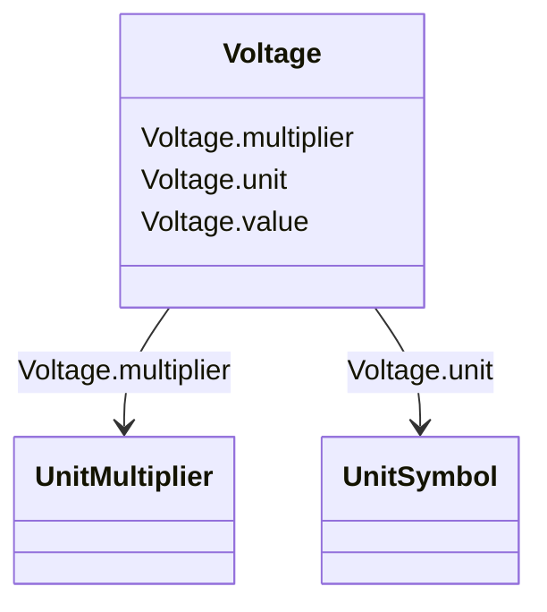

# Voltage

_Electrical voltage, can be both AC and DC._

**URI**: [cim:Voltage](http://iec.ch/TC57/CIM100#Voltage) 
**Type**: Class

<!-- no inheritance hierarchy -->

## Attributes

| Name | URI | Cardinality and Range | Description | Inheritance |
| ---  | --- | --- | --- | --- |
| value | [cim:Voltage.value](http://iec.ch/TC57/CIM100#Voltage.value) | 0..1    float  |  | direct |
| multiplier | [cim:Voltage.multiplier](http://iec.ch/TC57/CIM100#Voltage.multiplier) | 0..1    [UnitMultiplier](UnitMultiplier.md)  |  | direct |
| unit | [cim:Voltage.unit](http://iec.ch/TC57/CIM100#Voltage.unit) | 0..1    [UnitSymbol](UnitSymbol.md)  |  | direct |

## Usages

| used by | used in | type | used |
| ---  | --- | --- | --- |
| [BaseVoltage](BaseVoltage.md) | nominalVoltage | range | [Voltage](Voltage.md) |
| [VoltageLevel](VoltageLevel.md) | highVoltageLimit | range | [Voltage](Voltage.md) |
| [VoltageLevel](VoltageLevel.md) | lowVoltageLimit | range | [Voltage](Voltage.md) |

## Identifier and Mapping Information

### Schema Source

* from schema: http://iec.ch/TC57/ns/CIM/EquipmentBoundary-EU#Package_EquipmentBoundaryProfile

## Mappings

| Mapping Type | Mapped Value |
| ---  | ---  |
| self | cim:Voltage |
| native | this:Voltage |

