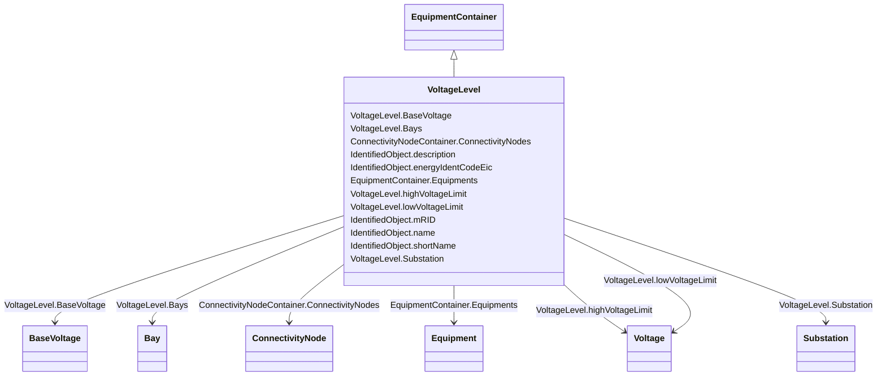

# VoltageLevel

_A collection of equipment at one common system voltage forming a switchgear. The equipment typically consists of breakers, busbars, instrumentation, control, regulation and protection devices as well as assemblies of all these._

**URI**: [cim:VoltageLevel](http://iec.ch/TC57/CIM100#VoltageLevel) 
**Type**: Class

## Inheritance
* [IdentifiedObject](IdentifiedObject.md)
    * [PowerSystemResource](PowerSystemResource.md)
        * [ConnectivityNodeContainer](ConnectivityNodeContainer.md)
            * [EquipmentContainer](EquipmentContainer.md)
                * **VoltageLevel**

## Attributes

| Name | URI | Cardinality and Range | Description | Inheritance |
| ---  | --- | --- | --- | --- |
| BaseVoltage | [cim:VoltageLevel.BaseVoltage](http://iec.ch/TC57/CIM100#VoltageLevel.BaseVoltage) | 1    [BaseVoltage](BaseVoltage.md)  | The base voltage used for all equipment within the voltage level | direct |
| Bays | [cim:VoltageLevel.Bays](http://iec.ch/TC57/CIM100#VoltageLevel.Bays) | *    [Bay](Bay.md)  | The bays within this voltage level | direct |
| Substation | [cim:VoltageLevel.Substation](http://iec.ch/TC57/CIM100#VoltageLevel.Substation) | 1    [Substation](Substation.md)  | The substation of the voltage level | direct |
| highVoltageLimit | [cim:VoltageLevel.highVoltageLimit](http://iec.ch/TC57/CIM100#VoltageLevel.highVoltageLimit) | 0..1    [Voltage](Voltage.md)  | The bus bar's high voltage limit | direct |
| lowVoltageLimit | [cim:VoltageLevel.lowVoltageLimit](http://iec.ch/TC57/CIM100#VoltageLevel.lowVoltageLimit) | 0..1    [Voltage](Voltage.md)  | The bus bar's low voltage limit | direct |
| Equipments | [cim:EquipmentContainer.Equipments](http://iec.ch/TC57/CIM100#EquipmentContainer.Equipments) | *    [Equipment](Equipment.md)  | Contained equipment | [EquipmentContainer](EquipmentContainer.md) |
| ConnectivityNodes | [cim:ConnectivityNodeContainer.ConnectivityNodes](http://iec.ch/TC57/CIM100#ConnectivityNodeContainer.ConnectivityNodes) | *    [ConnectivityNode](ConnectivityNode.md)  | Connectivity nodes which belong to this connectivity node container | [ConnectivityNodeContainer](ConnectivityNodeContainer.md) |
| description | [cim:IdentifiedObject.description](http://iec.ch/TC57/CIM100#IdentifiedObject.description) | 0..1    string  | The description is a free human readable text describing or naming the object | [IdentifiedObject](IdentifiedObject.md) |
| energyIdentCodeEic | [eu:IdentifiedObject.energyIdentCodeEic](http://iec.ch/TC57/CIM100-European#IdentifiedObject.energyIdentCodeEic) | 0..1    string  | The attribute is used for an exchange of the EIC code (Energy identification ... | [IdentifiedObject](IdentifiedObject.md) |
| mRID | [cim:IdentifiedObject.mRID](http://iec.ch/TC57/CIM100#IdentifiedObject.mRID) | 1    string  | Master resource identifier issued by a model authority | [IdentifiedObject](IdentifiedObject.md) |
| name | [cim:IdentifiedObject.name](http://iec.ch/TC57/CIM100#IdentifiedObject.name) | 1    string  | The name is any free human readable and possibly non unique text naming the o... | [IdentifiedObject](IdentifiedObject.md) |
| shortName | [eu:IdentifiedObject.shortName](http://iec.ch/TC57/CIM100-European#IdentifiedObject.shortName) | 0..1    string  | The attribute is used for an exchange of a human readable short name with len... | [IdentifiedObject](IdentifiedObject.md) |

## Usages

| used by | used in | type | used |
| ---  | --- | --- | --- |
| [BaseVoltage](BaseVoltage.md) | VoltageLevel | range | [VoltageLevel](VoltageLevel.md) |
| [Bay](Bay.md) | VoltageLevel | range | [VoltageLevel](VoltageLevel.md) |
| [Substation](Substation.md) | VoltageLevels | range | [VoltageLevel](VoltageLevel.md) |

## Identifier and Mapping Information

### Schema Source

* from schema: http://iec.ch/TC57/ns/CIM/EquipmentBoundary-EU#Package_EquipmentBoundaryProfile

## Mappings

| Mapping Type | Mapped Value |
| ---  | ---  |
| self | cim:VoltageLevel |
| native | this:VoltageLevel |

