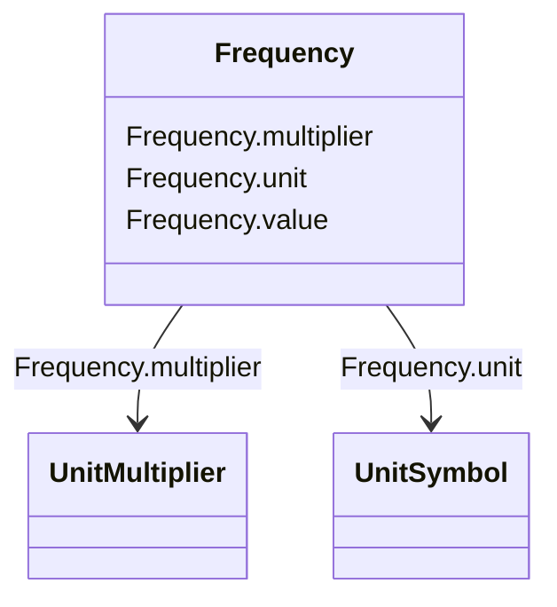

# Frequency

_Cycles per second._

**URI**: [cim:Frequency](http://iec.ch/TC57/CIM100#Frequency) 
**Type**: Class

<!-- no inheritance hierarchy -->

## Attributes

| Name | URI | Cardinality and Range | Description | Inheritance |
| ---  | --- | --- | --- | --- |
| value | [cim:Frequency.value](http://iec.ch/TC57/CIM100#Frequency.value) | 0..1    float  |  | direct |
| unit | [cim:Frequency.unit](http://iec.ch/TC57/CIM100#Frequency.unit) | 0..1    [UnitSymbol](UnitSymbol.md)  |  | direct |
| multiplier | [cim:Frequency.multiplier](http://iec.ch/TC57/CIM100#Frequency.multiplier) | 0..1    [UnitMultiplier](UnitMultiplier.md)  |  | direct |

## Usages

| used by | used in | type | used |
| ---  | --- | --- | --- |
| [AsynchronousMachine](AsynchronousMachine.md) | nominalFrequency | range | [Frequency](Frequency.md) |

## Identifier and Mapping Information

### Schema Source

* from schema: http://iec.ch/TC57/ns/CIM/CoreEquipment-EU#Package_CoreEquipmentProfile

## Mappings

| Mapping Type | Mapped Value |
| ---  | ---  |
| self | cim:Frequency |
| native | this:Frequency |

