# GeneratingUnit

_A single or set of synchronous machines for converting mechanical power into alternating-current power. For example, individual machines within a set may be defined for scheduling purposes while a single control signal is derived for the set. In this case there would be a GeneratingUnit for each member of the set and an additional GeneratingUnit corresponding to the set._

**URI**: [cim:GeneratingUnit](http://iec.ch/TC57/CIM100#GeneratingUnit) 
**Type**: Class

```mermaid
 classDiagram
    class GeneratingUnit
      Equipment <|-- GeneratingUnit
      

      GeneratingUnit <|-- HydroGeneratingUnit
      GeneratingUnit <|-- NuclearGeneratingUnit
      GeneratingUnit <|-- SolarGeneratingUnit
      GeneratingUnit <|-- ThermalGeneratingUnit
      GeneratingUnit <|-- WindGeneratingUnit
      
      
      GeneratingUnit : Equipment.aggregate
        
      GeneratingUnit : GeneratingUnit.ControlAreaGeneratingUnit
        
          GeneratingUnit --> ControlAreaGeneratingUnit : GeneratingUnit.ControlAreaGeneratingUnit
        
      GeneratingUnit : IdentifiedObject.description
        
      GeneratingUnit : IdentifiedObject.energyIdentCodeEic
        
      GeneratingUnit : Equipment.EquipmentContainer
        
          GeneratingUnit --> EquipmentContainer : Equipment.EquipmentContainer
        
      GeneratingUnit : GeneratingUnit.genControlSource
        
          GeneratingUnit --> GeneratorControlSource : GeneratingUnit.genControlSource
        
      GeneratingUnit : GeneratingUnit.governorSCD
        
          GeneratingUnit --> PerCent : GeneratingUnit.governorSCD
        
      GeneratingUnit : GeneratingUnit.GrossToNetActivePowerCurves
        
          GeneratingUnit --> GrossToNetActivePowerCurve : GeneratingUnit.GrossToNetActivePowerCurves
        
      GeneratingUnit : GeneratingUnit.longPF
        
      GeneratingUnit : GeneratingUnit.maximumAllowableSpinningReserve
        
          GeneratingUnit --> ActivePower : GeneratingUnit.maximumAllowableSpinningReserve
        
      GeneratingUnit : GeneratingUnit.maxOperatingP
        
          GeneratingUnit --> ActivePower : GeneratingUnit.maxOperatingP
        
      GeneratingUnit : GeneratingUnit.minOperatingP
        
          GeneratingUnit --> ActivePower : GeneratingUnit.minOperatingP
        
      GeneratingUnit : IdentifiedObject.mRID
        
      GeneratingUnit : IdentifiedObject.name
        
      GeneratingUnit : GeneratingUnit.nominalP
        
          GeneratingUnit --> ActivePower : GeneratingUnit.nominalP
        
      GeneratingUnit : Equipment.normallyInService
        
      GeneratingUnit : Equipment.OperationalLimitSet
        
          GeneratingUnit --> OperationalLimitSet : Equipment.OperationalLimitSet
        
      GeneratingUnit : GeneratingUnit.ratedGrossMaxP
        
          GeneratingUnit --> ActivePower : GeneratingUnit.ratedGrossMaxP
        
      GeneratingUnit : GeneratingUnit.ratedGrossMinP
        
          GeneratingUnit --> ActivePower : GeneratingUnit.ratedGrossMinP
        
      GeneratingUnit : GeneratingUnit.ratedNetMaxP
        
          GeneratingUnit --> ActivePower : GeneratingUnit.ratedNetMaxP
        
      GeneratingUnit : GeneratingUnit.RotatingMachine
        
          GeneratingUnit --> RotatingMachine : GeneratingUnit.RotatingMachine
        
      GeneratingUnit : IdentifiedObject.shortName
        
      GeneratingUnit : GeneratingUnit.shortPF
        
      GeneratingUnit : GeneratingUnit.startupCost
        
          GeneratingUnit --> Money : GeneratingUnit.startupCost
        
      GeneratingUnit : GeneratingUnit.startupTime
        
          GeneratingUnit --> Seconds : GeneratingUnit.startupTime
        
      GeneratingUnit : GeneratingUnit.totalEfficiency
        
          GeneratingUnit --> PerCent : GeneratingUnit.totalEfficiency
        
      GeneratingUnit : GeneratingUnit.variableCost
        
          GeneratingUnit --> Money : GeneratingUnit.variableCost
        
      
```

## Inheritance
* [IdentifiedObject](IdentifiedObject.md)
    * [PowerSystemResource](PowerSystemResource.md)
        * [Equipment](Equipment.md)
            * **GeneratingUnit**
                * [HydroGeneratingUnit](HydroGeneratingUnit.md)
                * [NuclearGeneratingUnit](NuclearGeneratingUnit.md)
                * [SolarGeneratingUnit](SolarGeneratingUnit.md)
                * [ThermalGeneratingUnit](ThermalGeneratingUnit.md)
                * [WindGeneratingUnit](WindGeneratingUnit.md)

## Attributes

| Name | URI | Cardinality and Range | Description | Inheritance |
| ---  | --- | --- | --- | --- |
| ControlAreaGeneratingUnit | [cim:GeneratingUnit.ControlAreaGeneratingUnit](http://iec.ch/TC57/CIM100#GeneratingUnit.ControlAreaGeneratingUnit) | 0..*    [ControlAreaGeneratingUnit](ControlAreaGeneratingUnit.md)  | ControlArea specifications for this generating unit | direct |
| genControlSource | [cim:GeneratingUnit.genControlSource](http://iec.ch/TC57/CIM100#GeneratingUnit.genControlSource) | 0..1    [GeneratorControlSource](GeneratorControlSource.md)  | The source of controls for a generating unit | direct |
| governorSCD | [cim:GeneratingUnit.governorSCD](http://iec.ch/TC57/CIM100#GeneratingUnit.governorSCD) | 0..1    [PerCent](PerCent.md)  | Governor Speed Changer Droop | direct |
| longPF | [cim:GeneratingUnit.longPF](http://iec.ch/TC57/CIM100#GeneratingUnit.longPF) | 0..1    float  | Generating unit long term economic participation factor | direct |
| maximumAllowableSpinningReserve | [cim:GeneratingUnit.maximumAllowableSpinningReserve](http://iec.ch/TC57/CIM100#GeneratingUnit.maximumAllowableSpinningReserve) | 0..1    [ActivePower](ActivePower.md)  | Maximum allowable spinning reserve | direct |
| maxOperatingP | [cim:GeneratingUnit.maxOperatingP](http://iec.ch/TC57/CIM100#GeneratingUnit.maxOperatingP) | 1..1    [ActivePower](ActivePower.md)  | This is the maximum operating active power limit the dispatcher can enter for... | direct |
| minOperatingP | [cim:GeneratingUnit.minOperatingP](http://iec.ch/TC57/CIM100#GeneratingUnit.minOperatingP) | 1..1    [ActivePower](ActivePower.md)  | This is the minimum operating active power limit the dispatcher can enter for... | direct |
| nominalP | [cim:GeneratingUnit.nominalP](http://iec.ch/TC57/CIM100#GeneratingUnit.nominalP) | 0..1    [ActivePower](ActivePower.md)  | The nominal power of the generating unit | direct |
| ratedGrossMaxP | [cim:GeneratingUnit.ratedGrossMaxP](http://iec.ch/TC57/CIM100#GeneratingUnit.ratedGrossMaxP) | 0..1    [ActivePower](ActivePower.md)  | The unit's gross rated maximum capacity (book value) | direct |
| ratedGrossMinP | [cim:GeneratingUnit.ratedGrossMinP](http://iec.ch/TC57/CIM100#GeneratingUnit.ratedGrossMinP) | 0..1    [ActivePower](ActivePower.md)  | The gross rated minimum generation level which the unit can safely operate at... | direct |
| ratedNetMaxP | [cim:GeneratingUnit.ratedNetMaxP](http://iec.ch/TC57/CIM100#GeneratingUnit.ratedNetMaxP) | 0..1    [ActivePower](ActivePower.md)  | The net rated maximum capacity determined by subtracting the auxiliary power ... | direct |
| shortPF | [cim:GeneratingUnit.shortPF](http://iec.ch/TC57/CIM100#GeneratingUnit.shortPF) | 0..1    float  | Generating unit short term economic participation factor | direct |
| startupCost | [cim:GeneratingUnit.startupCost](http://iec.ch/TC57/CIM100#GeneratingUnit.startupCost) | 0..1    [Money](Money.md)  | The initial startup cost incurred for each start of the GeneratingUnit | direct |
| variableCost | [cim:GeneratingUnit.variableCost](http://iec.ch/TC57/CIM100#GeneratingUnit.variableCost) | 0..1    [Money](Money.md)  | The variable cost component of production per unit of ActivePower | direct |
| startupTime | [cim:GeneratingUnit.startupTime](http://iec.ch/TC57/CIM100#GeneratingUnit.startupTime) | 0..1    [Seconds](Seconds.md)  | Time it takes to get the unit on-line, from the time that the prime mover mec... | direct |
| totalEfficiency | [cim:GeneratingUnit.totalEfficiency](http://iec.ch/TC57/CIM100#GeneratingUnit.totalEfficiency) | 0..1    [PerCent](PerCent.md)  | The efficiency of the unit in converting the fuel into electrical energy | direct |
| GrossToNetActivePowerCurves | [cim:GeneratingUnit.GrossToNetActivePowerCurves](http://iec.ch/TC57/CIM100#GeneratingUnit.GrossToNetActivePowerCurves) | 0..*    [GrossToNetActivePowerCurve](GrossToNetActivePowerCurve.md)  | A generating unit may have a gross active power to net active power curve, de... | direct |
| RotatingMachine | [cim:GeneratingUnit.RotatingMachine](http://iec.ch/TC57/CIM100#GeneratingUnit.RotatingMachine) | 1..*    [RotatingMachine](RotatingMachine.md)  | A synchronous machine may operate as a generator and as such becomes a member... | direct |
| aggregate | [cim:Equipment.aggregate](http://iec.ch/TC57/CIM100#Equipment.aggregate) | 0..1    boolean  | The aggregate flag provides an alternative way of representing an aggregated ... | [Equipment](Equipment.md) |
| normallyInService | [cim:Equipment.normallyInService](http://iec.ch/TC57/CIM100#Equipment.normallyInService) | 0..1    boolean  | Specifies the availability of the equipment under normal operating conditions | [Equipment](Equipment.md) |
| EquipmentContainer | [cim:Equipment.EquipmentContainer](http://iec.ch/TC57/CIM100#Equipment.EquipmentContainer) | 0..1    [EquipmentContainer](EquipmentContainer.md)  | Container of this equipment | [Equipment](Equipment.md) |
| OperationalLimitSet | [cim:Equipment.OperationalLimitSet](http://iec.ch/TC57/CIM100#Equipment.OperationalLimitSet) | 0..*    [OperationalLimitSet](OperationalLimitSet.md)  | The operational limit sets associated with this equipment | [Equipment](Equipment.md) |
| description | [cim:IdentifiedObject.description](http://iec.ch/TC57/CIM100#IdentifiedObject.description) | 0..1    string  | The description is a free human readable text describing or naming the object | [IdentifiedObject](IdentifiedObject.md) |
| energyIdentCodeEic | [eu:IdentifiedObject.energyIdentCodeEic](http://iec.ch/TC57/CIM100-European#IdentifiedObject.energyIdentCodeEic) | 0..1    string  | The attribute is used for an exchange of the EIC code (Energy identification ... | [IdentifiedObject](IdentifiedObject.md) |
| mRID | [cim:IdentifiedObject.mRID](http://iec.ch/TC57/CIM100#IdentifiedObject.mRID) | 1..1    string  | Master resource identifier issued by a model authority | [IdentifiedObject](IdentifiedObject.md) |
| name | [cim:IdentifiedObject.name](http://iec.ch/TC57/CIM100#IdentifiedObject.name) | 1..1    string  | The name is any free human readable and possibly non unique text naming the o... | [IdentifiedObject](IdentifiedObject.md) |
| shortName | [eu:IdentifiedObject.shortName](http://iec.ch/TC57/CIM100-European#IdentifiedObject.shortName) | 0..1    string  | The attribute is used for an exchange of a human readable short name with len... | [IdentifiedObject](IdentifiedObject.md) |

## Usages

| used by | used in | type | used |
| ---  | --- | --- | --- |
| [AsynchronousMachine](AsynchronousMachine.md) | GeneratingUnit | range | [GeneratingUnit](GeneratingUnit.md) |
| [ControlAreaGeneratingUnit](ControlAreaGeneratingUnit.md) | GeneratingUnit | range | [GeneratingUnit](GeneratingUnit.md) |
| [GrossToNetActivePowerCurve](GrossToNetActivePowerCurve.md) | GeneratingUnit | range | [GeneratingUnit](GeneratingUnit.md) |
| [RotatingMachine](RotatingMachine.md) | GeneratingUnit | range | [GeneratingUnit](GeneratingUnit.md) |
| [SynchronousMachine](SynchronousMachine.md) | GeneratingUnit | range | [GeneratingUnit](GeneratingUnit.md) |

## Identifier and Mapping Information

### Schema Source

* from schema: http://iec.ch/TC57/ns/CIM/CoreEquipment-EU#Package_CoreEquipmentProfile

## Mappings

| Mapping Type | Mapped Value |
| ---  | ---  |
| self | cim:GeneratingUnit |
| native | this:GeneratingUnit |

