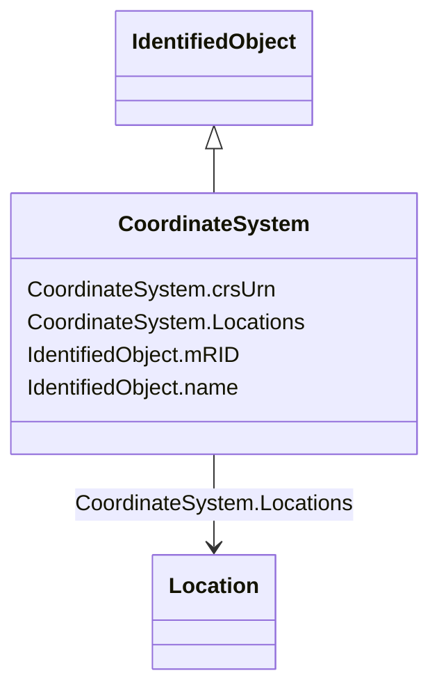

# CoordinateSystem

_Coordinate reference system._

**URI**: [cim:CoordinateSystem](http://iec.ch/TC57/CIM100#CoordinateSystem) 
**Type**: Class

## Inheritance
* [IdentifiedObject](IdentifiedObject.md)
    * **CoordinateSystem**

## Attributes

| Name | URI | Cardinality and Range | Description | Inheritance |
| ---  | --- | --- | --- | --- |
| crsUrn | [cim:CoordinateSystem.crsUrn](http://iec.ch/TC57/CIM100#CoordinateSystem.crsUrn) | 1..1    string  | A Uniform Resource Name (URN) for the coordinate reference system (crs) used ... | direct |
| Locations | [cim:CoordinateSystem.Locations](http://iec.ch/TC57/CIM100#CoordinateSystem.Locations) | 0..*    [Location](Location.md)  | All locations described with position points in this coordinate system | direct |
| mRID | [cim:IdentifiedObject.mRID](http://iec.ch/TC57/CIM100#IdentifiedObject.mRID) | 1..1    string  | Master resource identifier issued by a model authority | [IdentifiedObject](IdentifiedObject.md) |
| name | [cim:IdentifiedObject.name](http://iec.ch/TC57/CIM100#IdentifiedObject.name) | 0..1    string  | The name is any free human readable and possibly non unique text naming the o... | [IdentifiedObject](IdentifiedObject.md) |

## Usages

| used by | used in | type | used |
| ---  | --- | --- | --- |
| [ServiceLocation](ServiceLocation.md) | CoordinateSystem | range | [CoordinateSystem](CoordinateSystem.md) |
| [WorkLocation](WorkLocation.md) | CoordinateSystem | range | [CoordinateSystem](CoordinateSystem.md) |
| [Location](Location.md) | CoordinateSystem | range | [CoordinateSystem](CoordinateSystem.md) |

## Identifier and Mapping Information

### Schema Source

* from schema: http://iec.ch/TC57/ns/CIM/GeographicalLocation-EU#Package_GeographicalLocationProfile

## Mappings

| Mapping Type | Mapped Value |
| ---  | ---  |
| self | cim:CoordinateSystem |
| native | this:CoordinateSystem |

