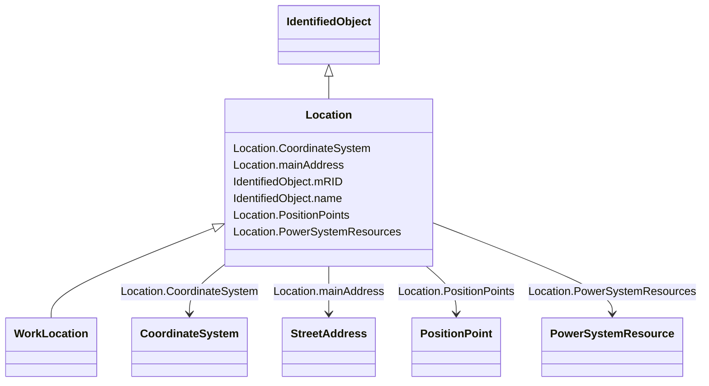

# Location

_The place, scene, or point of something where someone or something has been, is, and/or will be at a given moment in time. It can be defined with one or more position points (coordinates) in a given coordinate system._

**URI**: [cim:Location](http://iec.ch/TC57/CIM100#Location) 
**Type**: Class

## Inheritance
* [IdentifiedObject](IdentifiedObject.md)
    * **Location**
        * [WorkLocation](WorkLocation.md)

## Attributes

| Name | URI | Cardinality and Range | Description | Inheritance |
| ---  | --- | --- | --- | --- |
| CoordinateSystem | [cim:Location.CoordinateSystem](http://iec.ch/TC57/CIM100#Location.CoordinateSystem) | 1    [CoordinateSystem](CoordinateSystem.md)  | Coordinate system used to describe position points of this location | direct |
| mainAddress | [cim:Location.mainAddress](http://iec.ch/TC57/CIM100#Location.mainAddress) | 0..1    [StreetAddress](StreetAddress.md)  | Main address of the location | direct |
| PowerSystemResources | [cim:Location.PowerSystemResources](http://iec.ch/TC57/CIM100#Location.PowerSystemResources) | 1    [PowerSystemResource](PowerSystemResource.md)  | All power system resources at this location | direct |
| PositionPoints | [cim:Location.PositionPoints](http://iec.ch/TC57/CIM100#Location.PositionPoints) | *    [PositionPoint](PositionPoint.md)  | Sequence of position points describing this location, expressed in coordinate... | direct |
| mRID | [cim:IdentifiedObject.mRID](http://iec.ch/TC57/CIM100#IdentifiedObject.mRID) | 1    string  | Master resource identifier issued by a model authority | [IdentifiedObject](IdentifiedObject.md) |
| name | [cim:IdentifiedObject.name](http://iec.ch/TC57/CIM100#IdentifiedObject.name) | 0..1    string  | The name is any free human readable and possibly non unique text naming the o... | [IdentifiedObject](IdentifiedObject.md) |

## Usages

| used by | used in | type | used |
| ---  | --- | --- | --- |
| [CoordinateSystem](CoordinateSystem.md) | Locations | range | [Location](Location.md) |
| [PositionPoint](PositionPoint.md) | Location | range | [Location](Location.md) |
| [PowerSystemResource](PowerSystemResource.md) | Location | range | [Location](Location.md) |

## Identifier and Mapping Information

### Schema Source

* from schema: http://iec.ch/TC57/ns/CIM/GeographicalLocation-EU#Package_GeographicalLocationProfile

## Mappings

| Mapping Type | Mapped Value |
| ---  | ---  |
| self | cim:Location |
| native | this:Location |

