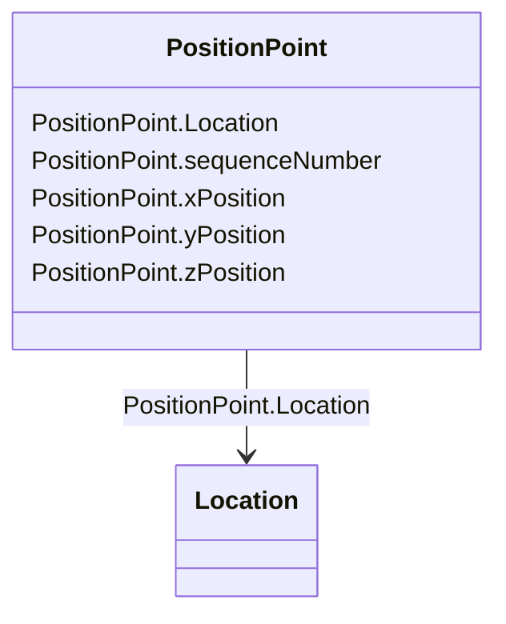

# PositionPoint

_Set of spatial coordinates that determine a point, defined in the coordinate system specified in 'Location.CoordinateSystem'. Use a single position point instance to describe a point-oriented location. Use a sequence of position points to describe a line-oriented object (physical location of non-point oriented objects like cables or lines), or area of an object (like a substation or a geographical zone - in this case, have first and last position point with the same values)._

**URI**: [cim:PositionPoint](http://iec.ch/TC57/CIM100#PositionPoint) 
**Type**: Class

<!-- no inheritance hierarchy -->

## Attributes

| Name | URI | Cardinality and Range | Description | Inheritance |
| ---  | --- | --- | --- | --- |
| Location | [cim:PositionPoint.Location](http://iec.ch/TC57/CIM100#PositionPoint.Location) | 1..1    [Location](Location.md)  | Location described by this position point | direct |
| sequenceNumber | [cim:PositionPoint.sequenceNumber](http://iec.ch/TC57/CIM100#PositionPoint.sequenceNumber) | 0..1    integer  | Zero-relative sequence number of this point within a series of points | direct |
| xPosition | [cim:PositionPoint.xPosition](http://iec.ch/TC57/CIM100#PositionPoint.xPosition) | 1..1    string  | X axis position | direct |
| yPosition | [cim:PositionPoint.yPosition](http://iec.ch/TC57/CIM100#PositionPoint.yPosition) | 1..1    string  | Y axis position | direct |
| zPosition | [cim:PositionPoint.zPosition](http://iec.ch/TC57/CIM100#PositionPoint.zPosition) | 0..1    string  | (if applicable) Z axis position | direct |

## Usages

| used by | used in | type | used |
| ---  | --- | --- | --- |
| [ServiceLocation](ServiceLocation.md) | PositionPoints | range | [PositionPoint](PositionPoint.md) |
| [WorkLocation](WorkLocation.md) | PositionPoints | range | [PositionPoint](PositionPoint.md) |
| [Location](Location.md) | PositionPoints | range | [PositionPoint](PositionPoint.md) |

## Identifier and Mapping Information

### Schema Source

* from schema: http://iec.ch/TC57/ns/CIM/GeographicalLocation-EU#Package_GeographicalLocationProfile

## Mappings

| Mapping Type | Mapped Value |
| ---  | ---  |
| self | cim:PositionPoint |
| native | this:PositionPoint |

