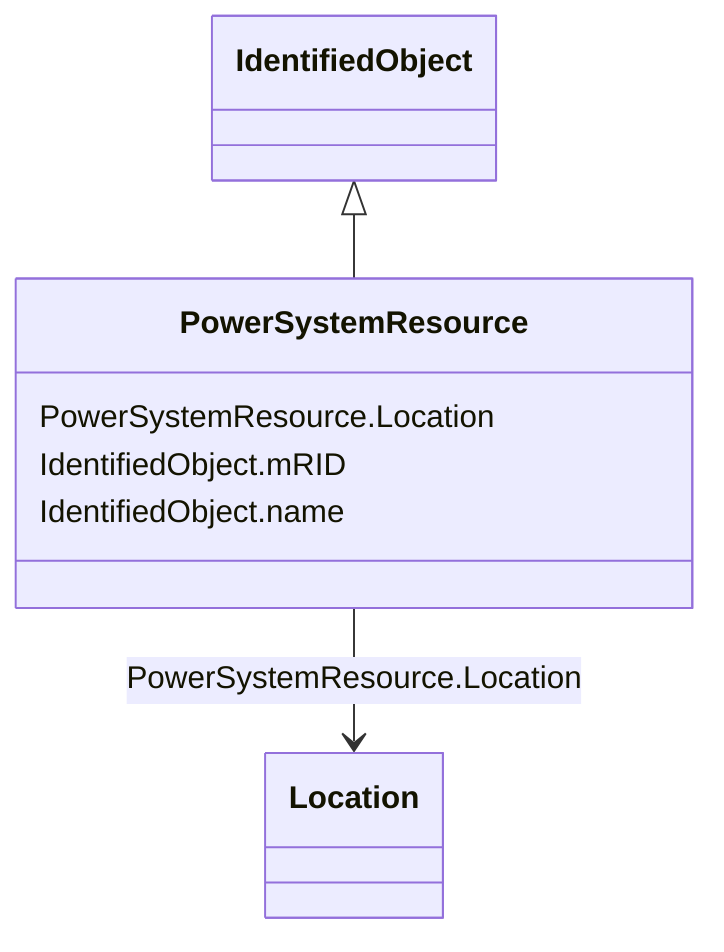

# PowerSystemResource

_A power system resource (PSR) can be an item of equipment such as a switch, an equipment container containing many individual items of equipment such as a substation, or an organisational entity such as sub-control area. Power system resources can have measurements associated._

**URI**: [cim:PowerSystemResource](http://iec.ch/TC57/CIM100#PowerSystemResource) 
**Type**: Class

## Inheritance
* [IdentifiedObject](IdentifiedObject.md)
    * **PowerSystemResource**

## Attributes

| Name | URI | Cardinality and Range | Description | Inheritance |
| ---  | --- | --- | --- | --- |
| Location | [cim:PowerSystemResource.Location](http://iec.ch/TC57/CIM100#PowerSystemResource.Location) | 0..1    [Location](Location.md)  | Location of this power system resource | direct |
| mRID | [cim:IdentifiedObject.mRID](http://iec.ch/TC57/CIM100#IdentifiedObject.mRID) | 1    string  | Master resource identifier issued by a model authority | [IdentifiedObject](IdentifiedObject.md) |
| name | [cim:IdentifiedObject.name](http://iec.ch/TC57/CIM100#IdentifiedObject.name) | 0..1    string  | The name is any free human readable and possibly non unique text naming the o... | [IdentifiedObject](IdentifiedObject.md) |

## Usages

| used by | used in | type | used |
| ---  | --- | --- | --- |
| [ServiceLocation](ServiceLocation.md) | PowerSystemResources | range | [PowerSystemResource](PowerSystemResource.md) |
| [WorkLocation](WorkLocation.md) | PowerSystemResources | range | [PowerSystemResource](PowerSystemResource.md) |
| [Location](Location.md) | PowerSystemResources | range | [PowerSystemResource](PowerSystemResource.md) |

## Identifier and Mapping Information

### Schema Source

* from schema: http://iec.ch/TC57/ns/CIM/GeographicalLocation-EU#Package_GeographicalLocationProfile

## Mappings

| Mapping Type | Mapped Value |
| ---  | ---  |
| self | cim:PowerSystemResource |
| native | this:PowerSystemResource |

