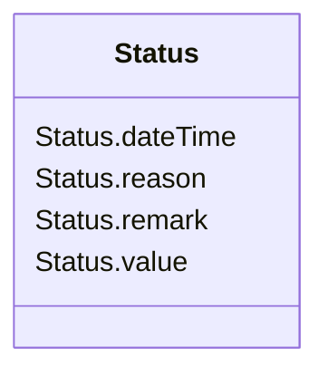

# Status

_Current status information relevant to an entity._

**URI**: [cim:Status](http://iec.ch/TC57/CIM100#Status) 
**Type**: Class

<!-- no inheritance hierarchy -->

## Attributes

| Name | URI | Cardinality and Range | Description | Inheritance |
| ---  | --- | --- | --- | --- |
| value | [cim:Status.value](http://iec.ch/TC57/CIM100#Status.value) | 0..1    string  | Status value at 'dateTime'; prior status changes may have been kept in instan... | direct |
| dateTime | [cim:Status.dateTime](http://iec.ch/TC57/CIM100#Status.dateTime) | 0..1    date  | Date and time for which status 'value' applies | direct |
| remark | [cim:Status.remark](http://iec.ch/TC57/CIM100#Status.remark) | 0..1    string  | Pertinent information regarding the current 'value', as free form text | direct |
| reason | [cim:Status.reason](http://iec.ch/TC57/CIM100#Status.reason) | 0..1    string  | Reason code or explanation for why an object went to the current status 'valu... | direct |

## Usages

| used by | used in | type | used |
| ---  | --- | --- | --- |
| [StreetAddress](StreetAddress.md) | status | range | [Status](Status.md) |

## Identifier and Mapping Information

### Schema Source

* from schema: http://iec.ch/TC57/ns/CIM/GeographicalLocation-EU#Package_GeographicalLocationProfile

## Mappings

| Mapping Type | Mapped Value |
| ---  | ---  |
| self | cim:Status |
| native | this:Status |

