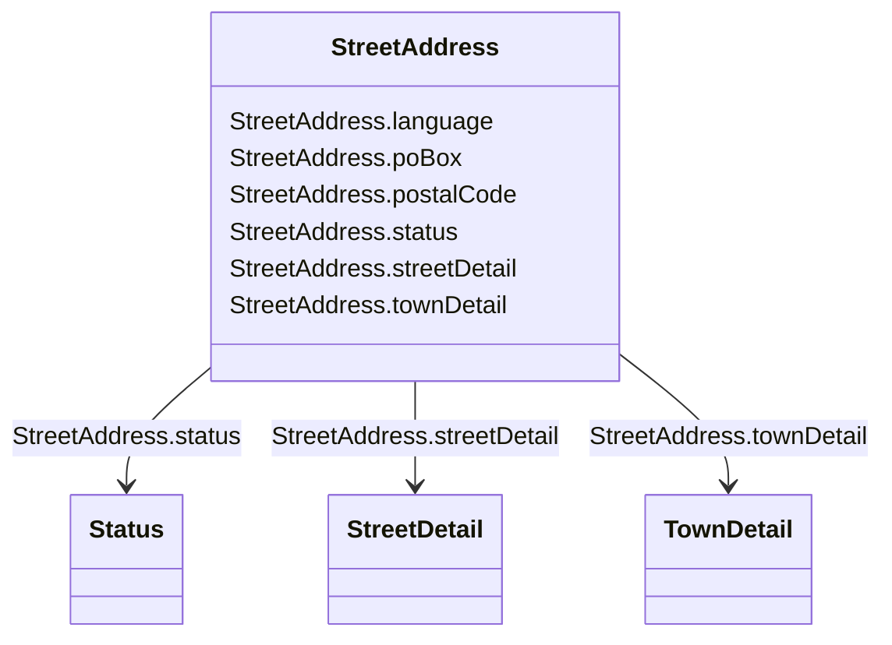

# StreetAddress

_General purpose street and postal address information._

**URI**: [cim:StreetAddress](http://iec.ch/TC57/CIM100#StreetAddress) 
**Type**: Class

<!-- no inheritance hierarchy -->

## Attributes

| Name | URI | Cardinality and Range | Description | Inheritance |
| ---  | --- | --- | --- | --- |
| streetDetail | [cim:StreetAddress.streetDetail](http://iec.ch/TC57/CIM100#StreetAddress.streetDetail) | 0..1    [StreetDetail](StreetDetail.md)  | Street detail | direct |
| townDetail | [cim:StreetAddress.townDetail](http://iec.ch/TC57/CIM100#StreetAddress.townDetail) | 0..1    [TownDetail](TownDetail.md)  | Town detail | direct |
| status | [cim:StreetAddress.status](http://iec.ch/TC57/CIM100#StreetAddress.status) | 0..1    [Status](Status.md)  | Status of this address | direct |
| postalCode | [cim:StreetAddress.postalCode](http://iec.ch/TC57/CIM100#StreetAddress.postalCode) | 0..1    string  | Postal code for the address | direct |
| poBox | [cim:StreetAddress.poBox](http://iec.ch/TC57/CIM100#StreetAddress.poBox) | 0..1    string  | Post office box | direct |
| language | [cim:StreetAddress.language](http://iec.ch/TC57/CIM100#StreetAddress.language) | 0..1    string  | The language in which the address is specified, using ISO 639-1 two digit lan... | direct |

## Usages

| used by | used in | type | used |
| ---  | --- | --- | --- |
| [ServiceLocation](ServiceLocation.md) | mainAddress | range | [StreetAddress](StreetAddress.md) |
| [WorkLocation](WorkLocation.md) | mainAddress | range | [StreetAddress](StreetAddress.md) |
| [Location](Location.md) | mainAddress | range | [StreetAddress](StreetAddress.md) |

## Identifier and Mapping Information

### Schema Source

* from schema: http://iec.ch/TC57/ns/CIM/GeographicalLocation-EU#Package_GeographicalLocationProfile

## Mappings

| Mapping Type | Mapped Value |
| ---  | ---  |
| self | cim:StreetAddress |
| native | this:StreetAddress |

