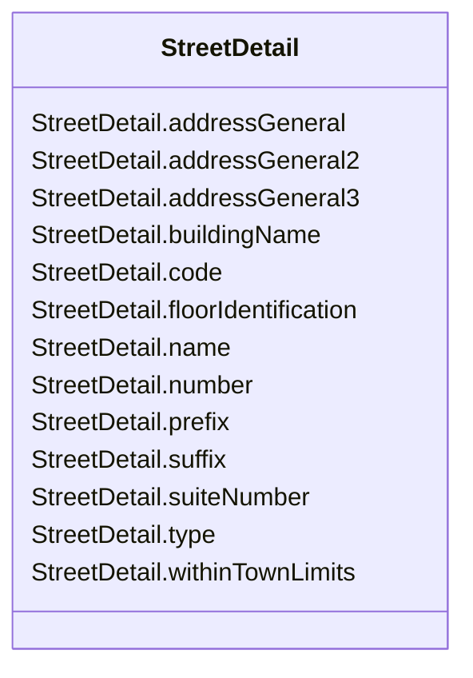

# StreetDetail

_Street details, in the context of address._

**URI**: [cim:StreetDetail](http://iec.ch/TC57/CIM100#StreetDetail) 
**Type**: Class

<!-- no inheritance hierarchy -->

## Attributes

| Name | URI | Cardinality and Range | Description | Inheritance |
| ---  | --- | --- | --- | --- |
| number | [cim:StreetDetail.number](http://iec.ch/TC57/CIM100#StreetDetail.number) | 0..1    string  | Designator of the specific location on the street | direct |
| name | [cim:StreetDetail.name](http://iec.ch/TC57/CIM100#StreetDetail.name) | 0..1    string  | Name of the street | direct |
| suffix | [cim:StreetDetail.suffix](http://iec.ch/TC57/CIM100#StreetDetail.suffix) | 0..1    string  | Suffix to the street name | direct |
| prefix | [cim:StreetDetail.prefix](http://iec.ch/TC57/CIM100#StreetDetail.prefix) | 0..1    string  | Prefix to the street name | direct |
| type | [cim:StreetDetail.type](http://iec.ch/TC57/CIM100#StreetDetail.type) | 0..1    string  | Type of street | direct |
| code | [cim:StreetDetail.code](http://iec.ch/TC57/CIM100#StreetDetail.code) | 0..1    string  | (if applicable) Utilities often make use of external reference systems, such ... | direct |
| buildingName | [cim:StreetDetail.buildingName](http://iec.ch/TC57/CIM100#StreetDetail.buildingName) | 0..1    string  | (if applicable) In certain cases the physical location of the place of intere... | direct |
| suiteNumber | [cim:StreetDetail.suiteNumber](http://iec.ch/TC57/CIM100#StreetDetail.suiteNumber) | 0..1    string  | Number of the apartment or suite | direct |
| addressGeneral | [cim:StreetDetail.addressGeneral](http://iec.ch/TC57/CIM100#StreetDetail.addressGeneral) | 0..1    string  | First line of a free form address or some additional address information (for... | direct |
| addressGeneral2 | [cim:StreetDetail.addressGeneral2](http://iec.ch/TC57/CIM100#StreetDetail.addressGeneral2) | 0..1    string  | (if applicable) Second line of a free form address | direct |
| addressGeneral3 | [cim:StreetDetail.addressGeneral3](http://iec.ch/TC57/CIM100#StreetDetail.addressGeneral3) | 0..1    string  | (if applicable) Third line of a free form address | direct |
| withinTownLimits | [cim:StreetDetail.withinTownLimits](http://iec.ch/TC57/CIM100#StreetDetail.withinTownLimits) | 0..1    boolean  | True if this street is within the legal geographical boundaries of the specif... | direct |
| floorIdentification | [cim:StreetDetail.floorIdentification](http://iec.ch/TC57/CIM100#StreetDetail.floorIdentification) | 0..1    string  | The identification by name or number, expressed as text, of the floor in the ... | direct |

## Usages

| used by | used in | type | used |
| ---  | --- | --- | --- |
| [StreetAddress](StreetAddress.md) | streetDetail | range | [StreetDetail](StreetDetail.md) |

## Identifier and Mapping Information

### Schema Source

* from schema: http://iec.ch/TC57/ns/CIM/GeographicalLocation-EU#Package_GeographicalLocationProfile

## Mappings

| Mapping Type | Mapped Value |
| ---  | ---  |
| self | cim:StreetDetail |
| native | this:StreetDetail |

