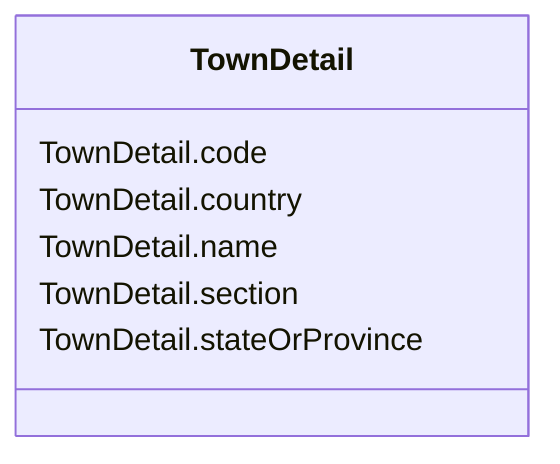

# TownDetail

_Town details, in the context of address._

**URI**: [cim:TownDetail](http://iec.ch/TC57/CIM100#TownDetail) 
**Type**: Class

<!-- no inheritance hierarchy -->

## Attributes

| Name | URI | Cardinality and Range | Description | Inheritance |
| ---  | --- | --- | --- | --- |
| code | [cim:TownDetail.code](http://iec.ch/TC57/CIM100#TownDetail.code) | 0..1    string  | Town code | direct |
| section | [cim:TownDetail.section](http://iec.ch/TC57/CIM100#TownDetail.section) | 0..1    string  | Town section | direct |
| name | [cim:TownDetail.name](http://iec.ch/TC57/CIM100#TownDetail.name) | 0..1    string  | Town name | direct |
| stateOrProvince | [cim:TownDetail.stateOrProvince](http://iec.ch/TC57/CIM100#TownDetail.stateOrProvince) | 0..1    string  | Name of the state or province | direct |
| country | [cim:TownDetail.country](http://iec.ch/TC57/CIM100#TownDetail.country) | 0..1    string  | Name of the country | direct |

## Usages

| used by | used in | type | used |
| ---  | --- | --- | --- |
| [StreetAddress](StreetAddress.md) | townDetail | range | [TownDetail](TownDetail.md) |

## Identifier and Mapping Information

### Schema Source

* from schema: http://iec.ch/TC57/ns/CIM/GeographicalLocation-EU#Package_GeographicalLocationProfile

## Mappings

| Mapping Type | Mapped Value |
| ---  | ---  |
| self | cim:TownDetail |
| native | this:TownDetail |

