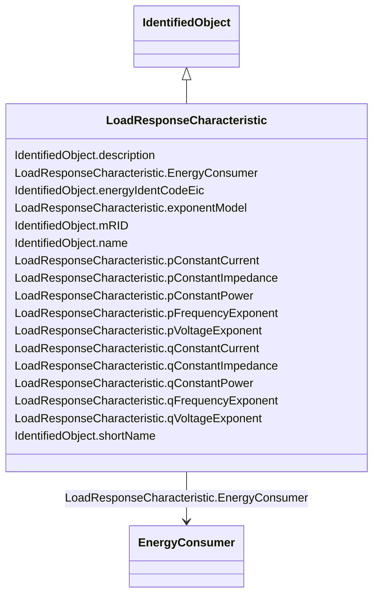

# LoadResponseCharacteristic

_Models the characteristic response of the load demand due to changes in system conditions such as voltage and frequency. It is not related to demand response._

_If LoadResponseCharacteristic.exponentModel is True, the exponential voltage or frequency dependent models are specified and used as to calculate active and reactive power components of the load model._

_The equations to calculate active and reactive power components of the load model are internal to the power flow calculation, hence they use different quantities depending on the use case of the data exchange. _

_The equations for exponential voltage dependent load model injected power are: _

_pInjection= Pnominal* (Voltage/cim:BaseVoltage.nominalVoltage) ** cim:LoadResponseCharacteristic.pVoltageExponent_

_qInjection= Qnominal* (Voltage/cim:BaseVoltage.nominalVoltage) ** cim:LoadResponseCharacteristic.qVoltageExponent_

_Where: _

_1) * means "multiply" and ** is "raised to power of";_

_2) Pnominal and Qnominal represent the active power and reactive power at nominal voltage as any load described by the voltage exponential model shall be given at nominal voltage.  This means that EnergyConsumer.p and EnergyConsumer.q  are at nominal voltage._

_3) After power flow is solved: _

_-pInjection and qInjection correspond to SvPowerflow.p and SvPowerflow.q respectively.  _

_- Voltage corresponds to SvVoltage.v at the TopologicalNode where the load is connected._

**URI**: [cim:LoadResponseCharacteristic](http://iec.ch/TC57/CIM100#LoadResponseCharacteristic) 
**Type**: Class

## Inheritance
* [IdentifiedObject](IdentifiedObject.md)
    * **LoadResponseCharacteristic**

## Attributes

| Name | URI | Cardinality and Range | Description | Inheritance |
| ---  | --- | --- | --- | --- |
| EnergyConsumer | [cim:LoadResponseCharacteristic.EnergyConsumer](http://iec.ch/TC57/CIM100#LoadResponseCharacteristic.EnergyConsumer) | 0..*    [EnergyConsumer](EnergyConsumer.md)  | The set of loads that have the response characteristics | direct |
| exponentModel | [cim:LoadResponseCharacteristic.exponentModel](http://iec.ch/TC57/CIM100#LoadResponseCharacteristic.exponentModel) | 1..1    boolean  | Indicates the exponential voltage dependency model is to be used | direct |
| pConstantCurrent | [cim:LoadResponseCharacteristic.pConstantCurrent](http://iec.ch/TC57/CIM100#LoadResponseCharacteristic.pConstantCurrent) | 0..1    float  | Portion of active power load modelled as constant current | direct |
| pConstantImpedance | [cim:LoadResponseCharacteristic.pConstantImpedance](http://iec.ch/TC57/CIM100#LoadResponseCharacteristic.pConstantImpedance) | 0..1    float  | Portion of active power load modelled as constant impedance | direct |
| pConstantPower | [cim:LoadResponseCharacteristic.pConstantPower](http://iec.ch/TC57/CIM100#LoadResponseCharacteristic.pConstantPower) | 0..1    float  | Portion of active power load modelled as constant power | direct |
| pFrequencyExponent | [cim:LoadResponseCharacteristic.pFrequencyExponent](http://iec.ch/TC57/CIM100#LoadResponseCharacteristic.pFrequencyExponent) | 0..1    float  | Exponent of per unit frequency effecting active power | direct |
| pVoltageExponent | [cim:LoadResponseCharacteristic.pVoltageExponent](http://iec.ch/TC57/CIM100#LoadResponseCharacteristic.pVoltageExponent) | 0..1    float  | Exponent of per unit voltage effecting real power | direct |
| qConstantCurrent | [cim:LoadResponseCharacteristic.qConstantCurrent](http://iec.ch/TC57/CIM100#LoadResponseCharacteristic.qConstantCurrent) | 0..1    float  | Portion of reactive power load modelled as constant current | direct |
| qConstantImpedance | [cim:LoadResponseCharacteristic.qConstantImpedance](http://iec.ch/TC57/CIM100#LoadResponseCharacteristic.qConstantImpedance) | 0..1    float  | Portion of reactive power load modelled as constant impedance | direct |
| qConstantPower | [cim:LoadResponseCharacteristic.qConstantPower](http://iec.ch/TC57/CIM100#LoadResponseCharacteristic.qConstantPower) | 0..1    float  | Portion of reactive power load modelled as constant power | direct |
| qFrequencyExponent | [cim:LoadResponseCharacteristic.qFrequencyExponent](http://iec.ch/TC57/CIM100#LoadResponseCharacteristic.qFrequencyExponent) | 0..1    float  | Exponent of per unit frequency effecting reactive power | direct |
| qVoltageExponent | [cim:LoadResponseCharacteristic.qVoltageExponent](http://iec.ch/TC57/CIM100#LoadResponseCharacteristic.qVoltageExponent) | 0..1    float  | Exponent of per unit voltage effecting reactive power | direct |
| description | [cim:IdentifiedObject.description](http://iec.ch/TC57/CIM100#IdentifiedObject.description) | 0..1    string  | The description is a free human readable text describing or naming the object | [IdentifiedObject](IdentifiedObject.md) |
| energyIdentCodeEic | [eu:IdentifiedObject.energyIdentCodeEic](http://iec.ch/TC57/CIM100-European#IdentifiedObject.energyIdentCodeEic) | 0..1    string  | The attribute is used for an exchange of the EIC code (Energy identification ... | [IdentifiedObject](IdentifiedObject.md) |
| mRID | [cim:IdentifiedObject.mRID](http://iec.ch/TC57/CIM100#IdentifiedObject.mRID) | 1..1    string  | Master resource identifier issued by a model authority | [IdentifiedObject](IdentifiedObject.md) |
| name | [cim:IdentifiedObject.name](http://iec.ch/TC57/CIM100#IdentifiedObject.name) | 1..1    string  | The name is any free human readable and possibly non unique text naming the o... | [IdentifiedObject](IdentifiedObject.md) |
| shortName | [eu:IdentifiedObject.shortName](http://iec.ch/TC57/CIM100-European#IdentifiedObject.shortName) | 0..1    string  | The attribute is used for an exchange of a human readable short name with len... | [IdentifiedObject](IdentifiedObject.md) |

## Usages

| used by | used in | type | used |
| ---  | --- | --- | --- |
| [ConformLoad](ConformLoad.md) | LoadResponse | range | [LoadResponseCharacteristic](LoadResponseCharacteristic.md) |
| [EnergyConsumer](EnergyConsumer.md) | LoadResponse | range | [LoadResponseCharacteristic](LoadResponseCharacteristic.md) |
| [NonConformLoad](NonConformLoad.md) | LoadResponse | range | [LoadResponseCharacteristic](LoadResponseCharacteristic.md) |
| [StationSupply](StationSupply.md) | LoadResponse | range | [LoadResponseCharacteristic](LoadResponseCharacteristic.md) |

## Identifier and Mapping Information

### Schema Source

* from schema: http://iec.ch/TC57/ns/CIM/CoreEquipment-EU#Package_CoreEquipmentProfile

## Mappings

| Mapping Type | Mapped Value |
| ---  | ---  |
| self | cim:LoadResponseCharacteristic |
| native | this:LoadResponseCharacteristic |

