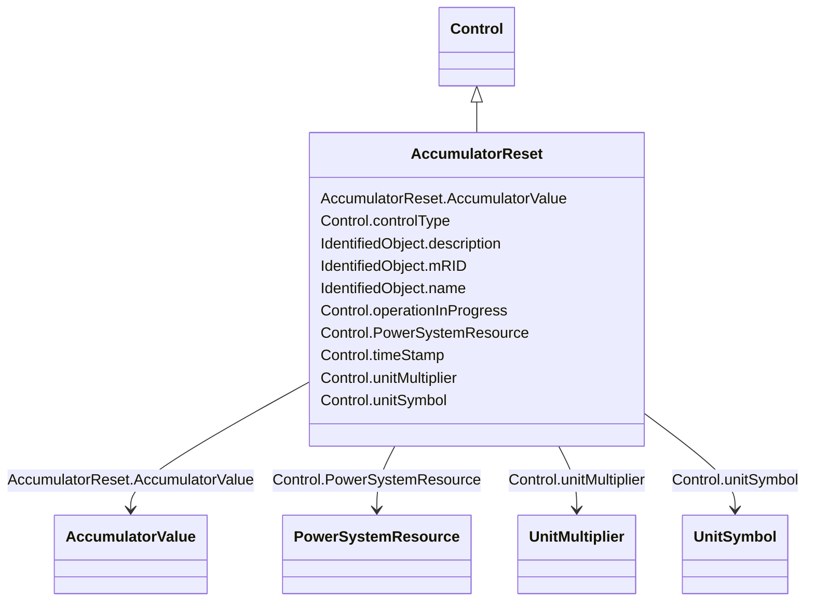

# AccumulatorReset

_This command resets the counter value to zero._

**URI**: [cim:AccumulatorReset](http://iec.ch/TC57/CIM100#AccumulatorReset) 
**Type**: Class

## Inheritance
* [IdentifiedObject](IdentifiedObject.md)
    * [IOPoint](IOPoint.md)
        * [Control](Control.md)
            * **AccumulatorReset**

## Attributes

| Name | URI | Cardinality and Range | Description | Inheritance |
| ---  | --- | --- | --- | --- |
| AccumulatorValue | [cim:AccumulatorReset.AccumulatorValue](http://iec.ch/TC57/CIM100#AccumulatorReset.AccumulatorValue) | 1    [AccumulatorValue](AccumulatorValue.md)  | The accumulator value that is reset by the command | direct |
| controlType | [cim:Control.controlType](http://iec.ch/TC57/CIM100#Control.controlType) | 1    string  | Specifies the type of Control | [Control](Control.md) |
| operationInProgress | [cim:Control.operationInProgress](http://iec.ch/TC57/CIM100#Control.operationInProgress) | 0..1    boolean  | Indicates that a client is currently sending control commands that has not co... | [Control](Control.md) |
| timeStamp | [cim:Control.timeStamp](http://iec.ch/TC57/CIM100#Control.timeStamp) | 0..1    date  | The last time a control output was sent | [Control](Control.md) |
| unitMultiplier | [cim:Control.unitMultiplier](http://iec.ch/TC57/CIM100#Control.unitMultiplier) | 0..1    [UnitMultiplier](UnitMultiplier.md)  | The unit multiplier of the controlled quantity | [Control](Control.md) |
| unitSymbol | [cim:Control.unitSymbol](http://iec.ch/TC57/CIM100#Control.unitSymbol) | 0..1    [UnitSymbol](UnitSymbol.md)  | The unit of measure of the controlled quantity | [Control](Control.md) |
| PowerSystemResource | [cim:Control.PowerSystemResource](http://iec.ch/TC57/CIM100#Control.PowerSystemResource) | 0..1    [PowerSystemResource](PowerSystemResource.md)  | Regulating device governed by this control output | [Control](Control.md) |
| description | [cim:IdentifiedObject.description](http://iec.ch/TC57/CIM100#IdentifiedObject.description) | 0..1    string  | The description is a free human readable text describing or naming the object | [IdentifiedObject](IdentifiedObject.md) |
| mRID | [cim:IdentifiedObject.mRID](http://iec.ch/TC57/CIM100#IdentifiedObject.mRID) | 1    string  | Master resource identifier issued by a model authority | [IdentifiedObject](IdentifiedObject.md) |
| name | [cim:IdentifiedObject.name](http://iec.ch/TC57/CIM100#IdentifiedObject.name) | 1    string  | The name is any free human readable and possibly non unique text naming the o... | [IdentifiedObject](IdentifiedObject.md) |

## Usages

| used by | used in | type | used |
| ---  | --- | --- | --- |
| [AccumulatorValue](AccumulatorValue.md) | AccumulatorReset | range | [AccumulatorReset](AccumulatorReset.md) |

## Identifier and Mapping Information

### Schema Source

* from schema: http://iec.ch/TC57/ns/CIM/Operation-EU#Package_OperationProfile

## Mappings

| Mapping Type | Mapped Value |
| ---  | ---  |
| self | cim:AccumulatorReset |
| native | this:AccumulatorReset |

