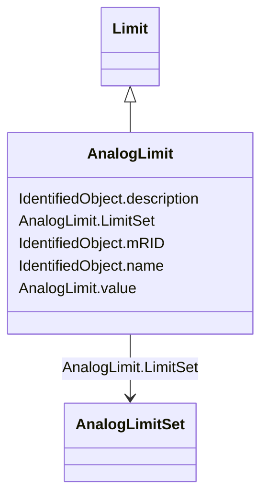

# AnalogLimit

_Limit values for Analog measurements._

**URI**: [cim:AnalogLimit](http://iec.ch/TC57/CIM100#AnalogLimit) 
**Type**: Class

## Inheritance
* [IdentifiedObject](IdentifiedObject.md)
    * [Limit](Limit.md)
        * **AnalogLimit**

## Attributes

| Name | URI | Cardinality and Range | Description | Inheritance |
| ---  | --- | --- | --- | --- |
| value | [cim:AnalogLimit.value](http://iec.ch/TC57/CIM100#AnalogLimit.value) | 1    float  | The value to supervise against | direct |
| LimitSet | [cim:AnalogLimit.LimitSet](http://iec.ch/TC57/CIM100#AnalogLimit.LimitSet) | 1    [AnalogLimitSet](AnalogLimitSet.md)  | The set of limits | direct |
| description | [cim:IdentifiedObject.description](http://iec.ch/TC57/CIM100#IdentifiedObject.description) | 0..1    string  | The description is a free human readable text describing or naming the object | [IdentifiedObject](IdentifiedObject.md) |
| mRID | [cim:IdentifiedObject.mRID](http://iec.ch/TC57/CIM100#IdentifiedObject.mRID) | 1    string  | Master resource identifier issued by a model authority | [IdentifiedObject](IdentifiedObject.md) |
| name | [cim:IdentifiedObject.name](http://iec.ch/TC57/CIM100#IdentifiedObject.name) | 1    string  | The name is any free human readable and possibly non unique text naming the o... | [IdentifiedObject](IdentifiedObject.md) |

## Usages

| used by | used in | type | used |
| ---  | --- | --- | --- |
| [AnalogLimitSet](AnalogLimitSet.md) | Limits | range | [AnalogLimit](AnalogLimit.md) |

## Identifier and Mapping Information

### Schema Source

* from schema: http://iec.ch/TC57/ns/CIM/Operation-EU#Package_OperationProfile

## Mappings

| Mapping Type | Mapped Value |
| ---  | ---  |
| self | cim:AnalogLimit |
| native | this:AnalogLimit |

