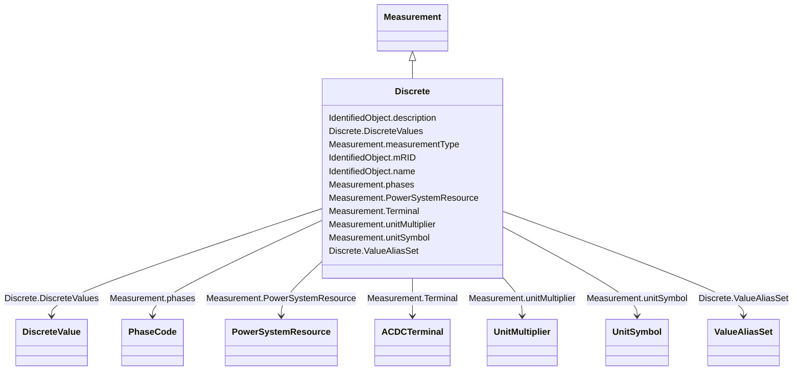

# Discrete

_Discrete represents a discrete Measurement, i.e. a Measurement representing discrete values, e.g. a Breaker position._

**URI**: [cim:Discrete](http://iec.ch/TC57/CIM100#Discrete) 
**Type**: Class

## Inheritance
* [IdentifiedObject](IdentifiedObject.md)
    * [Measurement](Measurement.md)
        * **Discrete**

## Attributes

| Name | URI | Cardinality and Range | Description | Inheritance |
| ---  | --- | --- | --- | --- |
| DiscreteValues | [cim:Discrete.DiscreteValues](http://iec.ch/TC57/CIM100#Discrete.DiscreteValues) | 0..*    [DiscreteValue](DiscreteValue.md)  | The values connected to this measurement | direct |
| ValueAliasSet | [cim:Discrete.ValueAliasSet](http://iec.ch/TC57/CIM100#Discrete.ValueAliasSet) | 0..1    [ValueAliasSet](ValueAliasSet.md)  | The ValueAliasSet used for translation of a MeasurementValue | direct |
| Terminal | [cim:Measurement.Terminal](http://iec.ch/TC57/CIM100#Measurement.Terminal) | 0..1    [ACDCTerminal](ACDCTerminal.md)  | One or more measurements may be associated with a terminal in the network | [Measurement](Measurement.md) |
| measurementType | [cim:Measurement.measurementType](http://iec.ch/TC57/CIM100#Measurement.measurementType) | 1..1    string  | Specifies the type of measurement | [Measurement](Measurement.md) |
| phases | [cim:Measurement.phases](http://iec.ch/TC57/CIM100#Measurement.phases) | 0..1    [PhaseCode](PhaseCode.md)  | Indicates to which phases the measurement applies and avoids the need to use ... | [Measurement](Measurement.md) |
| unitMultiplier | [cim:Measurement.unitMultiplier](http://iec.ch/TC57/CIM100#Measurement.unitMultiplier) | 1..1    [UnitMultiplier](UnitMultiplier.md)  | The unit multiplier of the measured quantity | [Measurement](Measurement.md) |
| unitSymbol | [cim:Measurement.unitSymbol](http://iec.ch/TC57/CIM100#Measurement.unitSymbol) | 1..1    [UnitSymbol](UnitSymbol.md)  | The unit of measure of the measured quantity | [Measurement](Measurement.md) |
| PowerSystemResource | [cim:Measurement.PowerSystemResource](http://iec.ch/TC57/CIM100#Measurement.PowerSystemResource) | 1..1    [PowerSystemResource](PowerSystemResource.md)  | The power system resource that contains the measurement | [Measurement](Measurement.md) |
| description | [cim:IdentifiedObject.description](http://iec.ch/TC57/CIM100#IdentifiedObject.description) | 0..1    string  | The description is a free human readable text describing or naming the object | [IdentifiedObject](IdentifiedObject.md) |
| mRID | [cim:IdentifiedObject.mRID](http://iec.ch/TC57/CIM100#IdentifiedObject.mRID) | 1..1    string  | Master resource identifier issued by a model authority | [IdentifiedObject](IdentifiedObject.md) |
| name | [cim:IdentifiedObject.name](http://iec.ch/TC57/CIM100#IdentifiedObject.name) | 1..1    string  | The name is any free human readable and possibly non unique text naming the o... | [IdentifiedObject](IdentifiedObject.md) |

## Usages

| used by | used in | type | used |
| ---  | --- | --- | --- |
| [DiscreteValue](DiscreteValue.md) | Discrete | range | [Discrete](Discrete.md) |
| [ValueAliasSet](ValueAliasSet.md) | Discretes | range | [Discrete](Discrete.md) |

## Identifier and Mapping Information

### Schema Source

* from schema: http://iec.ch/TC57/ns/CIM/Operation-EU#Package_OperationProfile

## Mappings

| Mapping Type | Mapped Value |
| ---  | ---  |
| self | cim:Discrete |
| native | this:Discrete |

