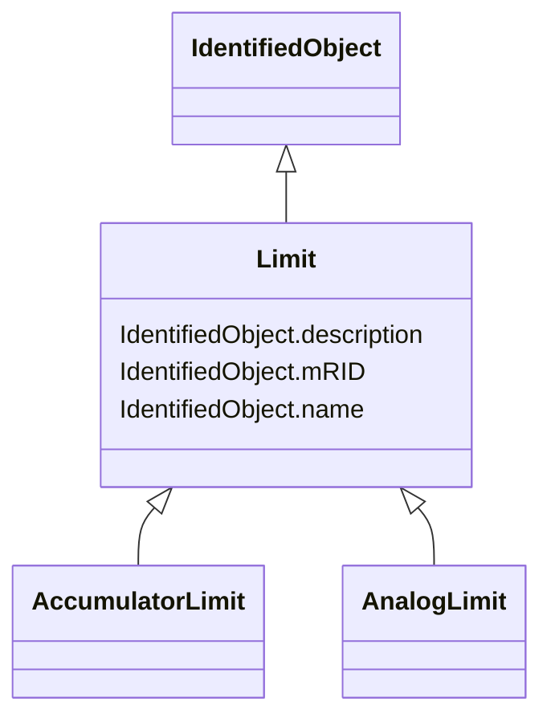

# Limit

_Specifies one limit value for a Measurement. A Measurement typically has several limits that are kept together by the LimitSet class. The actual meaning and use of a Limit instance (i.e., if it is an alarm or warning limit or if it is a high or low limit) is not captured in the Limit class. However the name of a Limit instance may indicate both meaning and use._

**URI**: [cim:Limit](http://iec.ch/TC57/CIM100#Limit) 
**Type**: Class

## Inheritance
* [IdentifiedObject](IdentifiedObject.md)
    * **Limit**
        * [AccumulatorLimit](AccumulatorLimit.md)
        * [AnalogLimit](AnalogLimit.md)

## Attributes

| Name | URI | Cardinality and Range | Description | Inheritance |
| ---  | --- | --- | --- | --- |
| description | [cim:IdentifiedObject.description](http://iec.ch/TC57/CIM100#IdentifiedObject.description) | 0..1    string  | The description is a free human readable text describing or naming the object | [IdentifiedObject](IdentifiedObject.md) |
| mRID | [cim:IdentifiedObject.mRID](http://iec.ch/TC57/CIM100#IdentifiedObject.mRID) | 1    string  | Master resource identifier issued by a model authority | [IdentifiedObject](IdentifiedObject.md) |
| name | [cim:IdentifiedObject.name](http://iec.ch/TC57/CIM100#IdentifiedObject.name) | 1    string  | The name is any free human readable and possibly non unique text naming the o... | [IdentifiedObject](IdentifiedObject.md) |

## Identifier and Mapping Information

### Schema Source

* from schema: http://iec.ch/TC57/ns/CIM/Operation-EU#Package_OperationProfile

## Mappings

| Mapping Type | Mapped Value |
| ---  | ---  |
| self | cim:Limit |
| native | this:Limit |

