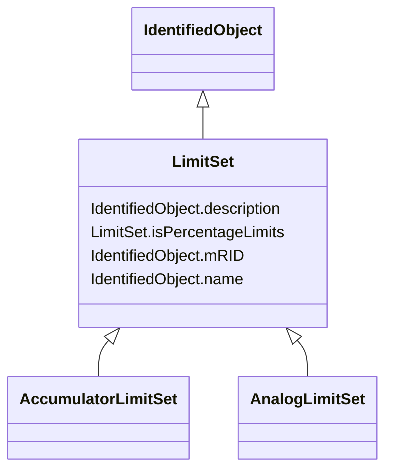

# LimitSet

_Specifies a set of Limits that are associated with a Measurement. A Measurement may have several LimitSets corresponding to seasonal or other changing conditions. The condition is captured in the name and description attributes. The same LimitSet may be used for several Measurements. In particular percentage limits are used this way._

**URI**: [cim:LimitSet](http://iec.ch/TC57/CIM100#LimitSet) 
**Type**: Class

## Inheritance
* [IdentifiedObject](IdentifiedObject.md)
    * **LimitSet**
        * [AccumulatorLimitSet](AccumulatorLimitSet.md)
        * [AnalogLimitSet](AnalogLimitSet.md)

## Attributes

| Name | URI | Cardinality and Range | Description | Inheritance |
| ---  | --- | --- | --- | --- |
| isPercentageLimits | [cim:LimitSet.isPercentageLimits](http://iec.ch/TC57/CIM100#LimitSet.isPercentageLimits) | 0..1    boolean  | Tells if the limit values are in percentage of normalValue or the specified U... | direct |
| description | [cim:IdentifiedObject.description](http://iec.ch/TC57/CIM100#IdentifiedObject.description) | 0..1    string  | The description is a free human readable text describing or naming the object | [IdentifiedObject](IdentifiedObject.md) |
| mRID | [cim:IdentifiedObject.mRID](http://iec.ch/TC57/CIM100#IdentifiedObject.mRID) | 1..1    string  | Master resource identifier issued by a model authority | [IdentifiedObject](IdentifiedObject.md) |
| name | [cim:IdentifiedObject.name](http://iec.ch/TC57/CIM100#IdentifiedObject.name) | 1..1    string  | The name is any free human readable and possibly non unique text naming the o... | [IdentifiedObject](IdentifiedObject.md) |

## Identifier and Mapping Information

### Schema Source

* from schema: http://iec.ch/TC57/ns/CIM/Operation-EU#Package_OperationProfile

## Mappings

| Mapping Type | Mapped Value |
| ---  | ---  |
| self | cim:LimitSet |
| native | this:LimitSet |

