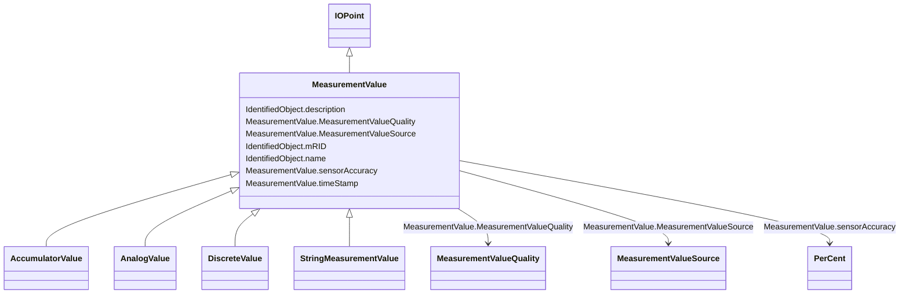

# MeasurementValue

_The current state for a measurement. A state value is an instance of a measurement from a specific source. Measurements can be associated with many state values, each representing a different source for the measurement._

**URI**: [cim:MeasurementValue](http://iec.ch/TC57/CIM100#MeasurementValue) 
**Type**: Class

## Inheritance
* [IdentifiedObject](IdentifiedObject.md)
    * [IOPoint](IOPoint.md)
        * **MeasurementValue**
            * [AccumulatorValue](AccumulatorValue.md)
            * [AnalogValue](AnalogValue.md)
            * [DiscreteValue](DiscreteValue.md)
            * [StringMeasurementValue](StringMeasurementValue.md)

## Attributes

| Name | URI | Cardinality and Range | Description | Inheritance |
| ---  | --- | --- | --- | --- |
| timeStamp | [cim:MeasurementValue.timeStamp](http://iec.ch/TC57/CIM100#MeasurementValue.timeStamp) | 0..1    date  | The time when the value was last updated | direct |
| sensorAccuracy | [cim:MeasurementValue.sensorAccuracy](http://iec.ch/TC57/CIM100#MeasurementValue.sensorAccuracy) | 0..1    [PerCent](PerCent.md)  | The limit, expressed as a percentage of the sensor maximum, that errors will ... | direct |
| MeasurementValueQuality | [cim:MeasurementValue.MeasurementValueQuality](http://iec.ch/TC57/CIM100#MeasurementValue.MeasurementValueQuality) | 0..1    [MeasurementValueQuality](MeasurementValueQuality.md)  | A MeasurementValue has a MeasurementValueQuality associated with it | direct |
| MeasurementValueSource | [cim:MeasurementValue.MeasurementValueSource](http://iec.ch/TC57/CIM100#MeasurementValue.MeasurementValueSource) | 1..1    [MeasurementValueSource](MeasurementValueSource.md)  | A reference to the type of source that updates the MeasurementValue, e | direct |
| description | [cim:IdentifiedObject.description](http://iec.ch/TC57/CIM100#IdentifiedObject.description) | 0..1    string  | The description is a free human readable text describing or naming the object | [IdentifiedObject](IdentifiedObject.md) |
| mRID | [cim:IdentifiedObject.mRID](http://iec.ch/TC57/CIM100#IdentifiedObject.mRID) | 1..1    string  | Master resource identifier issued by a model authority | [IdentifiedObject](IdentifiedObject.md) |
| name | [cim:IdentifiedObject.name](http://iec.ch/TC57/CIM100#IdentifiedObject.name) | 1..1    string  | The name is any free human readable and possibly non unique text naming the o... | [IdentifiedObject](IdentifiedObject.md) |

## Usages

| used by | used in | type | used |
| ---  | --- | --- | --- |
| [MeasurementValueQuality](MeasurementValueQuality.md) | MeasurementValue | range | [MeasurementValue](MeasurementValue.md) |
| [MeasurementValueSource](MeasurementValueSource.md) | MeasurementValues | range | [MeasurementValue](MeasurementValue.md) |

## Identifier and Mapping Information

### Schema Source

* from schema: http://iec.ch/TC57/ns/CIM/Operation-EU#Package_OperationProfile

## Mappings

| Mapping Type | Mapped Value |
| ---  | ---  |
| self | cim:MeasurementValue |
| native | this:MeasurementValue |

