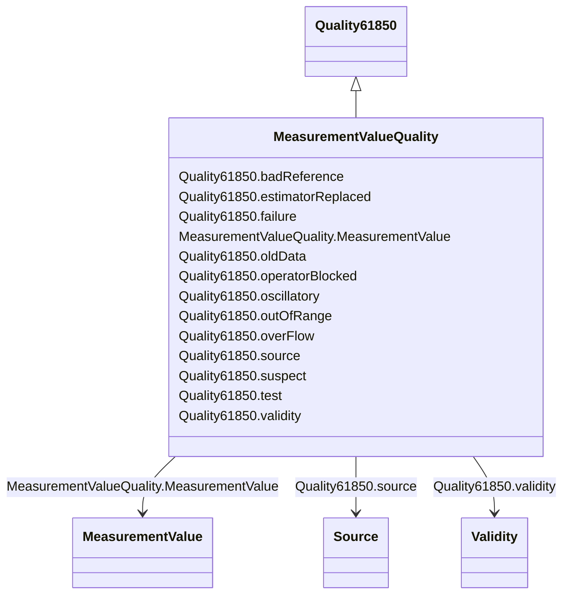

# MeasurementValueQuality

_Measurement quality flags. Bits 0-10 are defined for substation automation in IEC 61850-7-3. Bits 11-15 are reserved for future expansion by that document. Bits 16-31 are reserved for EMS applications._

**URI**: [cim:MeasurementValueQuality](http://iec.ch/TC57/CIM100#MeasurementValueQuality) 
**Type**: Class

## Inheritance
* [Quality61850](Quality61850.md)
    * **MeasurementValueQuality**

## Attributes

| Name | URI | Cardinality and Range | Description | Inheritance |
| ---  | --- | --- | --- | --- |
| MeasurementValue | [cim:MeasurementValueQuality.MeasurementValue](http://iec.ch/TC57/CIM100#MeasurementValueQuality.MeasurementValue) | 1..1    [MeasurementValue](MeasurementValue.md)  | A MeasurementValue has a MeasurementValueQuality associated with it | direct |
| badReference | [cim:Quality61850.badReference](http://iec.ch/TC57/CIM100#Quality61850.badReference) | 0..1    boolean  | Measurement value may be incorrect due to a reference being out of calibratio... | [Quality61850](Quality61850.md) |
| estimatorReplaced | [cim:Quality61850.estimatorReplaced](http://iec.ch/TC57/CIM100#Quality61850.estimatorReplaced) | 0..1    boolean  | Value has been replaced by State Estimator | [Quality61850](Quality61850.md) |
| failure | [cim:Quality61850.failure](http://iec.ch/TC57/CIM100#Quality61850.failure) | 0..1    boolean  | This identifier indicates that a supervision function has detected an interna... | [Quality61850](Quality61850.md) |
| oldData | [cim:Quality61850.oldData](http://iec.ch/TC57/CIM100#Quality61850.oldData) | 0..1    boolean  | Measurement value is old and possibly invalid, as it has not been successfull... | [Quality61850](Quality61850.md) |
| operatorBlocked | [cim:Quality61850.operatorBlocked](http://iec.ch/TC57/CIM100#Quality61850.operatorBlocked) | 0..1    boolean  | Measurement value is blocked and hence unavailable for transmission | [Quality61850](Quality61850.md) |
| oscillatory | [cim:Quality61850.oscillatory](http://iec.ch/TC57/CIM100#Quality61850.oscillatory) | 0..1    boolean  | To prevent some overload of the communication it is sensible to detect and su... | [Quality61850](Quality61850.md) |
| outOfRange | [cim:Quality61850.outOfRange](http://iec.ch/TC57/CIM100#Quality61850.outOfRange) | 0..1    boolean  | Measurement value is beyond a predefined range of value | [Quality61850](Quality61850.md) |
| overFlow | [cim:Quality61850.overFlow](http://iec.ch/TC57/CIM100#Quality61850.overFlow) | 0..1    boolean  | Measurement value is beyond the capability of being  represented properly | [Quality61850](Quality61850.md) |
| source | [cim:Quality61850.source](http://iec.ch/TC57/CIM100#Quality61850.source) | 0..1    [Source](Source.md)  | Source gives information related to the origin of a value | [Quality61850](Quality61850.md) |
| suspect | [cim:Quality61850.suspect](http://iec.ch/TC57/CIM100#Quality61850.suspect) | 0..1    boolean  | A correlation function has detected that the value is not consistent with oth... | [Quality61850](Quality61850.md) |
| test | [cim:Quality61850.test](http://iec.ch/TC57/CIM100#Quality61850.test) | 0..1    boolean  | Measurement value is transmitted for test purposes | [Quality61850](Quality61850.md) |
| validity | [cim:Quality61850.validity](http://iec.ch/TC57/CIM100#Quality61850.validity) | 0..1    [Validity](Validity.md)  | Validity of the measurement value | [Quality61850](Quality61850.md) |

## Usages

| used by | used in | type | used |
| ---  | --- | --- | --- |
| [AccumulatorValue](AccumulatorValue.md) | MeasurementValueQuality | range | [MeasurementValueQuality](MeasurementValueQuality.md) |
| [AnalogValue](AnalogValue.md) | MeasurementValueQuality | range | [MeasurementValueQuality](MeasurementValueQuality.md) |
| [DiscreteValue](DiscreteValue.md) | MeasurementValueQuality | range | [MeasurementValueQuality](MeasurementValueQuality.md) |
| [MeasurementValue](MeasurementValue.md) | MeasurementValueQuality | range | [MeasurementValueQuality](MeasurementValueQuality.md) |
| [StringMeasurementValue](StringMeasurementValue.md) | MeasurementValueQuality | range | [MeasurementValueQuality](MeasurementValueQuality.md) |

## Identifier and Mapping Information

### Schema Source

* from schema: http://iec.ch/TC57/ns/CIM/Operation-EU#Package_OperationProfile

## Mappings

| Mapping Type | Mapped Value |
| ---  | ---  |
| self | cim:MeasurementValueQuality |
| native | this:MeasurementValueQuality |

