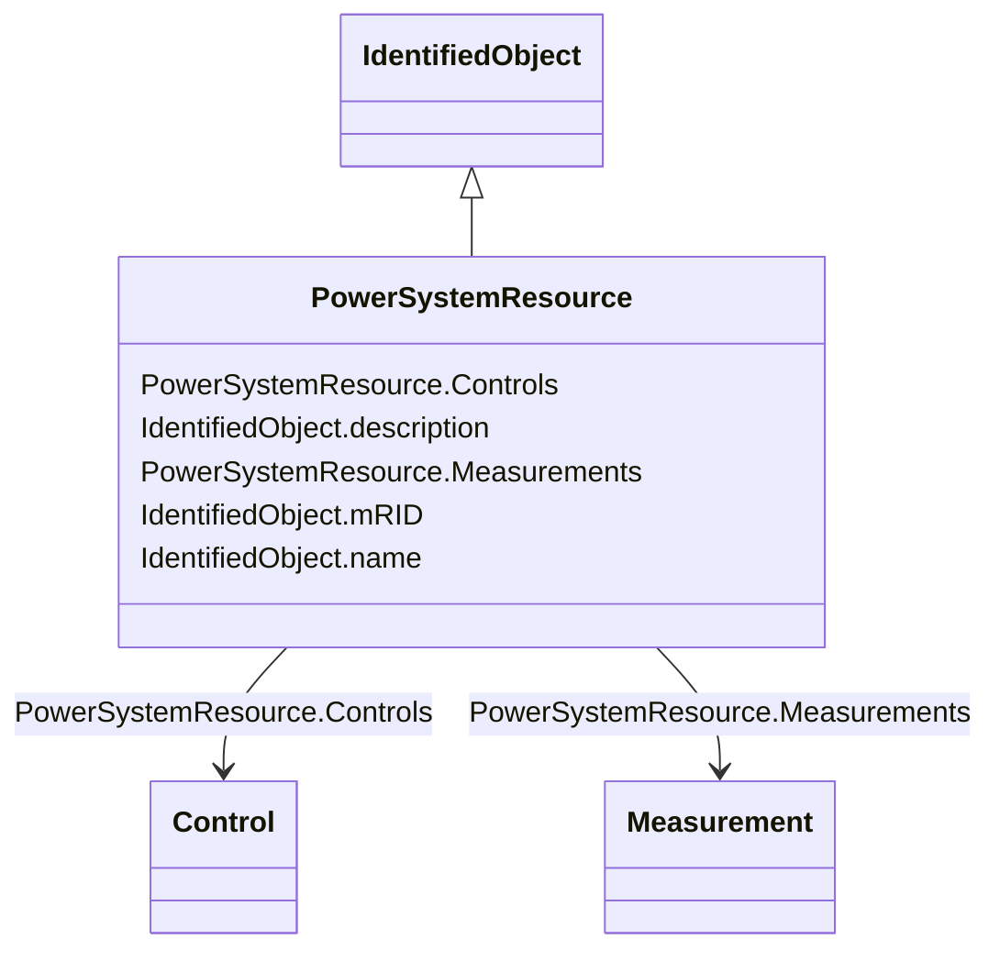

# PowerSystemResource

_A power system resource (PSR) can be an item of equipment such as a switch, an equipment container containing many individual items of equipment such as a substation, or an organisational entity such as sub-control area. Power system resources can have measurements associated._

**URI**: [cim:PowerSystemResource](http://iec.ch/TC57/CIM100#PowerSystemResource) 
**Type**: Class

## Inheritance
* [IdentifiedObject](IdentifiedObject.md)
    * **PowerSystemResource**

## Attributes

| Name | URI | Cardinality and Range | Description | Inheritance |
| ---  | --- | --- | --- | --- |
| Controls | [cim:PowerSystemResource.Controls](http://iec.ch/TC57/CIM100#PowerSystemResource.Controls) | 0..*    [Control](Control.md)  | The controller outputs used to actually govern a regulating device, e | direct |
| Measurements | [cim:PowerSystemResource.Measurements](http://iec.ch/TC57/CIM100#PowerSystemResource.Measurements) | 0..*    [Measurement](Measurement.md)  | The measurements associated with this power system resource | direct |
| description | [cim:IdentifiedObject.description](http://iec.ch/TC57/CIM100#IdentifiedObject.description) | 0..1    string  | The description is a free human readable text describing or naming the object | [IdentifiedObject](IdentifiedObject.md) |
| mRID | [cim:IdentifiedObject.mRID](http://iec.ch/TC57/CIM100#IdentifiedObject.mRID) | 1..1    string  | Master resource identifier issued by a model authority | [IdentifiedObject](IdentifiedObject.md) |
| name | [cim:IdentifiedObject.name](http://iec.ch/TC57/CIM100#IdentifiedObject.name) | 1..1    string  | The name is any free human readable and possibly non unique text naming the o... | [IdentifiedObject](IdentifiedObject.md) |

## Usages

| used by | used in | type | used |
| ---  | --- | --- | --- |
| [Accumulator](Accumulator.md) | PowerSystemResource | range | [PowerSystemResource](PowerSystemResource.md) |
| [AccumulatorReset](AccumulatorReset.md) | PowerSystemResource | range | [PowerSystemResource](PowerSystemResource.md) |
| [Analog](Analog.md) | PowerSystemResource | range | [PowerSystemResource](PowerSystemResource.md) |
| [AnalogControl](AnalogControl.md) | PowerSystemResource | range | [PowerSystemResource](PowerSystemResource.md) |
| [Command](Command.md) | PowerSystemResource | range | [PowerSystemResource](PowerSystemResource.md) |
| [Control](Control.md) | PowerSystemResource | range | [PowerSystemResource](PowerSystemResource.md) |
| [Discrete](Discrete.md) | PowerSystemResource | range | [PowerSystemResource](PowerSystemResource.md) |
| [Measurement](Measurement.md) | PowerSystemResource | range | [PowerSystemResource](PowerSystemResource.md) |
| [RaiseLowerCommand](RaiseLowerCommand.md) | PowerSystemResource | range | [PowerSystemResource](PowerSystemResource.md) |
| [SetPoint](SetPoint.md) | PowerSystemResource | range | [PowerSystemResource](PowerSystemResource.md) |
| [StringMeasurement](StringMeasurement.md) | PowerSystemResource | range | [PowerSystemResource](PowerSystemResource.md) |

## Identifier and Mapping Information

### Schema Source

* from schema: http://iec.ch/TC57/ns/CIM/Operation-EU#Package_OperationProfile

## Mappings

| Mapping Type | Mapped Value |
| ---  | ---  |
| self | cim:PowerSystemResource |
| native | this:PowerSystemResource |

