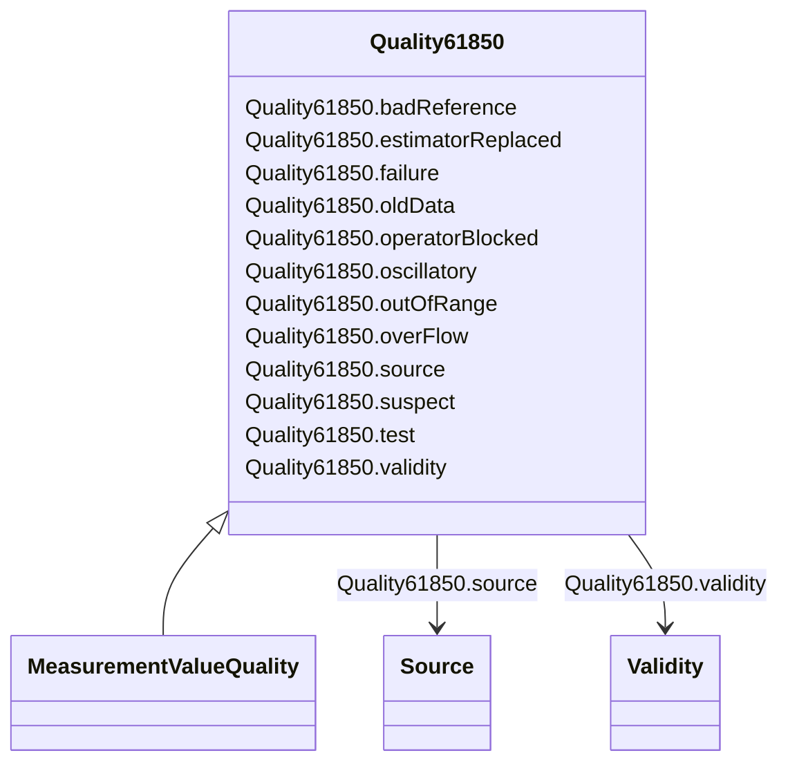

# Quality61850

_Quality flags in this class are as defined in IEC 61850, except for estimatorReplaced, which has been included in this class for convenience._

**URI**: [cim:Quality61850](http://iec.ch/TC57/CIM100#Quality61850) 
**Type**: Class

## Inheritance
* **Quality61850**
    * [MeasurementValueQuality](MeasurementValueQuality.md)

## Attributes

| Name | URI | Cardinality and Range | Description | Inheritance |
| ---  | --- | --- | --- | --- |
| badReference | [cim:Quality61850.badReference](http://iec.ch/TC57/CIM100#Quality61850.badReference) | 0..1    boolean  | Measurement value may be incorrect due to a reference being out of calibratio... | direct |
| estimatorReplaced | [cim:Quality61850.estimatorReplaced](http://iec.ch/TC57/CIM100#Quality61850.estimatorReplaced) | 0..1    boolean  | Value has been replaced by State Estimator | direct |
| failure | [cim:Quality61850.failure](http://iec.ch/TC57/CIM100#Quality61850.failure) | 0..1    boolean  | This identifier indicates that a supervision function has detected an interna... | direct |
| oldData | [cim:Quality61850.oldData](http://iec.ch/TC57/CIM100#Quality61850.oldData) | 0..1    boolean  | Measurement value is old and possibly invalid, as it has not been successfull... | direct |
| operatorBlocked | [cim:Quality61850.operatorBlocked](http://iec.ch/TC57/CIM100#Quality61850.operatorBlocked) | 0..1    boolean  | Measurement value is blocked and hence unavailable for transmission | direct |
| oscillatory | [cim:Quality61850.oscillatory](http://iec.ch/TC57/CIM100#Quality61850.oscillatory) | 0..1    boolean  | To prevent some overload of the communication it is sensible to detect and su... | direct |
| outOfRange | [cim:Quality61850.outOfRange](http://iec.ch/TC57/CIM100#Quality61850.outOfRange) | 0..1    boolean  | Measurement value is beyond a predefined range of value | direct |
| overFlow | [cim:Quality61850.overFlow](http://iec.ch/TC57/CIM100#Quality61850.overFlow) | 0..1    boolean  | Measurement value is beyond the capability of being  represented properly | direct |
| source | [cim:Quality61850.source](http://iec.ch/TC57/CIM100#Quality61850.source) | 0..1    [Source](Source.md)  | Source gives information related to the origin of a value | direct |
| suspect | [cim:Quality61850.suspect](http://iec.ch/TC57/CIM100#Quality61850.suspect) | 0..1    boolean  | A correlation function has detected that the value is not consistent with oth... | direct |
| test | [cim:Quality61850.test](http://iec.ch/TC57/CIM100#Quality61850.test) | 0..1    boolean  | Measurement value is transmitted for test purposes | direct |
| validity | [cim:Quality61850.validity](http://iec.ch/TC57/CIM100#Quality61850.validity) | 0..1    [Validity](Validity.md)  | Validity of the measurement value | direct |

## Identifier and Mapping Information

### Schema Source

* from schema: http://iec.ch/TC57/ns/CIM/Operation-EU#Package_OperationProfile

## Mappings

| Mapping Type | Mapped Value |
| ---  | ---  |
| self | cim:Quality61850 |
| native | this:Quality61850 |

