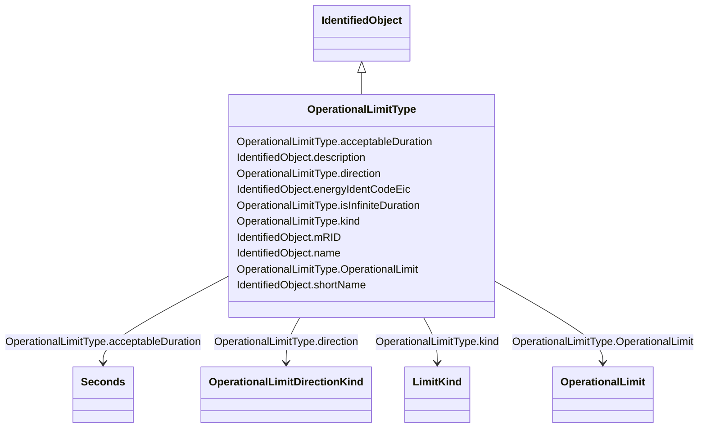

# OperationalLimitType

_The operational meaning of a category of limits._

**URI**: [cim:OperationalLimitType](http://iec.ch/TC57/CIM100#OperationalLimitType) 
**Type**: Class

## Inheritance
* [IdentifiedObject](IdentifiedObject.md)
    * **OperationalLimitType**

## Attributes

| Name | URI | Cardinality and Range | Description | Inheritance |
| ---  | --- | --- | --- | --- |
| OperationalLimit | [cim:OperationalLimitType.OperationalLimit](http://iec.ch/TC57/CIM100#OperationalLimitType.OperationalLimit) | 0..*    [OperationalLimit](OperationalLimit.md)  | The operational limits associated with this type of limit | direct |
| acceptableDuration | [cim:OperationalLimitType.acceptableDuration](http://iec.ch/TC57/CIM100#OperationalLimitType.acceptableDuration) | 0..1    [Seconds](Seconds.md)  | The nominal acceptable duration of the limit | direct |
| direction | [cim:OperationalLimitType.direction](http://iec.ch/TC57/CIM100#OperationalLimitType.direction) | 1..1    [OperationalLimitDirectionKind](OperationalLimitDirectionKind.md)  | The direction of the limit | direct |
| isInfiniteDuration | [cim:OperationalLimitType.isInfiniteDuration](http://iec.ch/TC57/CIM100#OperationalLimitType.isInfiniteDuration) | 1..1    boolean  | Defines if the operational limit type has infinite duration | direct |
| kind | [eu:OperationalLimitType.kind](http://iec.ch/TC57/CIM100-European#OperationalLimitType.kind) | 1..1    [LimitKind](LimitKind.md)  | Types of limits defined in the ENTSO-E Operational Handbook Policy 3 | direct |
| description | [cim:IdentifiedObject.description](http://iec.ch/TC57/CIM100#IdentifiedObject.description) | 0..1    string  | The description is a free human readable text describing or naming the object | [IdentifiedObject](IdentifiedObject.md) |
| energyIdentCodeEic | [eu:IdentifiedObject.energyIdentCodeEic](http://iec.ch/TC57/CIM100-European#IdentifiedObject.energyIdentCodeEic) | 0..1    string  | The attribute is used for an exchange of the EIC code (Energy identification ... | [IdentifiedObject](IdentifiedObject.md) |
| mRID | [cim:IdentifiedObject.mRID](http://iec.ch/TC57/CIM100#IdentifiedObject.mRID) | 1..1    string  | Master resource identifier issued by a model authority | [IdentifiedObject](IdentifiedObject.md) |
| name | [cim:IdentifiedObject.name](http://iec.ch/TC57/CIM100#IdentifiedObject.name) | 1..1    string  | The name is any free human readable and possibly non unique text naming the o... | [IdentifiedObject](IdentifiedObject.md) |
| shortName | [eu:IdentifiedObject.shortName](http://iec.ch/TC57/CIM100-European#IdentifiedObject.shortName) | 0..1    string  | The attribute is used for an exchange of a human readable short name with len... | [IdentifiedObject](IdentifiedObject.md) |

## Usages

| used by | used in | type | used |
| ---  | --- | --- | --- |
| [ActivePowerLimit](ActivePowerLimit.md) | OperationalLimitType | range | [OperationalLimitType](OperationalLimitType.md) |
| [ApparentPowerLimit](ApparentPowerLimit.md) | OperationalLimitType | range | [OperationalLimitType](OperationalLimitType.md) |
| [CurrentLimit](CurrentLimit.md) | OperationalLimitType | range | [OperationalLimitType](OperationalLimitType.md) |
| [OperationalLimit](OperationalLimit.md) | OperationalLimitType | range | [OperationalLimitType](OperationalLimitType.md) |
| [VoltageLimit](VoltageLimit.md) | OperationalLimitType | range | [OperationalLimitType](OperationalLimitType.md) |

## Identifier and Mapping Information

### Schema Source

* from schema: http://iec.ch/TC57/ns/CIM/CoreEquipment-EU#Package_CoreEquipmentProfile

## Mappings

| Mapping Type | Mapped Value |
| ---  | ---  |
| self | cim:OperationalLimitType |
| native | this:OperationalLimitType |

