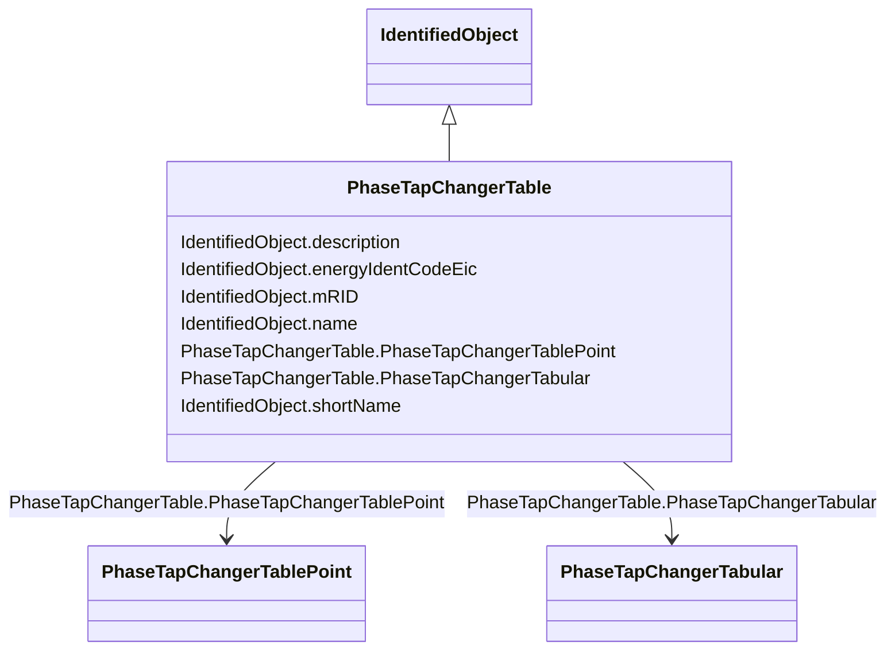

# PhaseTapChangerTable

_Describes a tabular curve for how the phase angle difference and impedance varies with the tap step._

**URI**: [cim:PhaseTapChangerTable](http://iec.ch/TC57/CIM100#PhaseTapChangerTable) 
**Type**: Class

## Inheritance
* [IdentifiedObject](IdentifiedObject.md)
    * **PhaseTapChangerTable**

## Attributes

| Name | URI | Cardinality and Range | Description | Inheritance |
| ---  | --- | --- | --- | --- |
| PhaseTapChangerTablePoint | [cim:PhaseTapChangerTable.PhaseTapChangerTablePoint](http://iec.ch/TC57/CIM100#PhaseTapChangerTable.PhaseTapChangerTablePoint) | 1..*    [PhaseTapChangerTablePoint](PhaseTapChangerTablePoint.md)  | The points of this table | direct |
| PhaseTapChangerTabular | [cim:PhaseTapChangerTable.PhaseTapChangerTabular](http://iec.ch/TC57/CIM100#PhaseTapChangerTable.PhaseTapChangerTabular) | 0..*    [PhaseTapChangerTabular](PhaseTapChangerTabular.md)  | The phase tap changers to which this phase tap table applies | direct |
| description | [cim:IdentifiedObject.description](http://iec.ch/TC57/CIM100#IdentifiedObject.description) | 0..1    string  | The description is a free human readable text describing or naming the object | [IdentifiedObject](IdentifiedObject.md) |
| energyIdentCodeEic | [eu:IdentifiedObject.energyIdentCodeEic](http://iec.ch/TC57/CIM100-European#IdentifiedObject.energyIdentCodeEic) | 0..1    string  | The attribute is used for an exchange of the EIC code (Energy identification ... | [IdentifiedObject](IdentifiedObject.md) |
| mRID | [cim:IdentifiedObject.mRID](http://iec.ch/TC57/CIM100#IdentifiedObject.mRID) | 1..1    string  | Master resource identifier issued by a model authority | [IdentifiedObject](IdentifiedObject.md) |
| name | [cim:IdentifiedObject.name](http://iec.ch/TC57/CIM100#IdentifiedObject.name) | 1..1    string  | The name is any free human readable and possibly non unique text naming the o... | [IdentifiedObject](IdentifiedObject.md) |
| shortName | [eu:IdentifiedObject.shortName](http://iec.ch/TC57/CIM100-European#IdentifiedObject.shortName) | 0..1    string  | The attribute is used for an exchange of a human readable short name with len... | [IdentifiedObject](IdentifiedObject.md) |

## Usages

| used by | used in | type | used |
| ---  | --- | --- | --- |
| [PhaseTapChangerTablePoint](PhaseTapChangerTablePoint.md) | PhaseTapChangerTable | range | [PhaseTapChangerTable](PhaseTapChangerTable.md) |
| [PhaseTapChangerTabular](PhaseTapChangerTabular.md) | PhaseTapChangerTable | range | [PhaseTapChangerTable](PhaseTapChangerTable.md) |

## Identifier and Mapping Information

### Schema Source

* from schema: http://iec.ch/TC57/ns/CIM/CoreEquipment-EU#Package_CoreEquipmentProfile

## Mappings

| Mapping Type | Mapped Value |
| ---  | ---  |
| self | cim:PhaseTapChangerTable |
| native | this:PhaseTapChangerTable |

