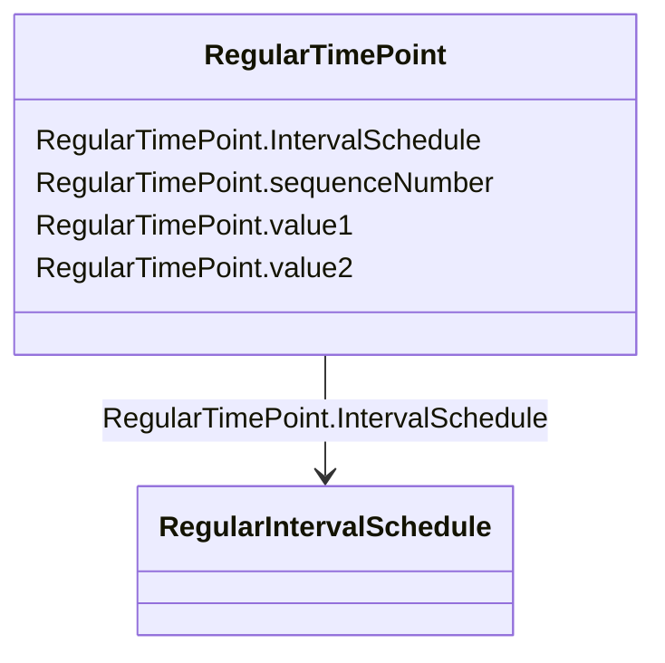

# RegularTimePoint

_Time point for a schedule where the time between the consecutive points is constant._

**URI**: [cim:RegularTimePoint](http://iec.ch/TC57/CIM100#RegularTimePoint) 
**Type**: Class

<!-- no inheritance hierarchy -->

## Attributes

| Name | URI | Cardinality and Range | Description | Inheritance |
| ---  | --- | --- | --- | --- |
| sequenceNumber | [cim:RegularTimePoint.sequenceNumber](http://iec.ch/TC57/CIM100#RegularTimePoint.sequenceNumber) | 1..1    integer  | The position of the regular time point in the sequence | direct |
| value1 | [cim:RegularTimePoint.value1](http://iec.ch/TC57/CIM100#RegularTimePoint.value1) | 1..1    float  | The first value at the time | direct |
| value2 | [cim:RegularTimePoint.value2](http://iec.ch/TC57/CIM100#RegularTimePoint.value2) | 0..1    float  | The second value at the time | direct |
| IntervalSchedule | [cim:RegularTimePoint.IntervalSchedule](http://iec.ch/TC57/CIM100#RegularTimePoint.IntervalSchedule) | 1..1    [RegularIntervalSchedule](RegularIntervalSchedule.md)  | Regular interval schedule containing this time point | direct |

## Usages

| used by | used in | type | used |
| ---  | --- | --- | --- |
| [ConformLoadSchedule](ConformLoadSchedule.md) | TimePoints | range | [RegularTimePoint](RegularTimePoint.md) |
| [RegulationSchedule](RegulationSchedule.md) | TimePoints | range | [RegularTimePoint](RegularTimePoint.md) |
| [TapSchedule](TapSchedule.md) | TimePoints | range | [RegularTimePoint](RegularTimePoint.md) |
| [NonConformLoadSchedule](NonConformLoadSchedule.md) | TimePoints | range | [RegularTimePoint](RegularTimePoint.md) |
| [RegularIntervalSchedule](RegularIntervalSchedule.md) | TimePoints | range | [RegularTimePoint](RegularTimePoint.md) |
| [SeasonDayTypeSchedule](SeasonDayTypeSchedule.md) | TimePoints | range | [RegularTimePoint](RegularTimePoint.md) |
| [SwitchSchedule](SwitchSchedule.md) | TimePoints | range | [RegularTimePoint](RegularTimePoint.md) |

## Identifier and Mapping Information

### Schema Source

* from schema: http://iec.ch/TC57/ns/CIM/CoreEquipment-EU#Package_CoreEquipmentProfile

## Mappings

| Mapping Type | Mapped Value |
| ---  | ---  |
| self | cim:RegularTimePoint |
| native | this:RegularTimePoint |

