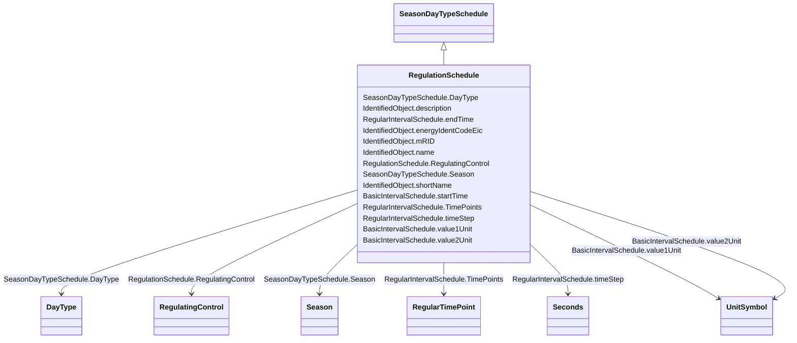

# RegulationSchedule

_A pre-established pattern over time for a controlled variable, e.g., busbar voltage._

**URI**: [cim:RegulationSchedule](http://iec.ch/TC57/CIM100#RegulationSchedule) 
**Type**: Class

## Inheritance
* [IdentifiedObject](IdentifiedObject.md)
    * [BasicIntervalSchedule](BasicIntervalSchedule.md)
        * [RegularIntervalSchedule](RegularIntervalSchedule.md)
            * [SeasonDayTypeSchedule](SeasonDayTypeSchedule.md)
                * **RegulationSchedule**

## Attributes

| Name | URI | Cardinality and Range | Description | Inheritance |
| ---  | --- | --- | --- | --- |
| RegulatingControl | [cim:RegulationSchedule.RegulatingControl](http://iec.ch/TC57/CIM100#RegulationSchedule.RegulatingControl) | 1..1    [RegulatingControl](RegulatingControl.md)  | Regulating controls that have this schedule | direct |
| DayType | [cim:SeasonDayTypeSchedule.DayType](http://iec.ch/TC57/CIM100#SeasonDayTypeSchedule.DayType) | 1..1    [DayType](DayType.md)  | DayType for the Schedule | [SeasonDayTypeSchedule](SeasonDayTypeSchedule.md) |
| Season | [cim:SeasonDayTypeSchedule.Season](http://iec.ch/TC57/CIM100#SeasonDayTypeSchedule.Season) | 1..1    [Season](Season.md)  | Season for the Schedule | [SeasonDayTypeSchedule](SeasonDayTypeSchedule.md) |
| TimePoints | [cim:RegularIntervalSchedule.TimePoints](http://iec.ch/TC57/CIM100#RegularIntervalSchedule.TimePoints) | 1..*    [RegularTimePoint](RegularTimePoint.md)  | The regular interval time point data values that define this schedule | [RegularIntervalSchedule](RegularIntervalSchedule.md) |
| timeStep | [cim:RegularIntervalSchedule.timeStep](http://iec.ch/TC57/CIM100#RegularIntervalSchedule.timeStep) | 1..1    [Seconds](Seconds.md)  | The time between each pair of subsequent regular time points in sequence orde... | [RegularIntervalSchedule](RegularIntervalSchedule.md) |
| endTime | [cim:RegularIntervalSchedule.endTime](http://iec.ch/TC57/CIM100#RegularIntervalSchedule.endTime) | 1..1    date  | The time for the last time point | [RegularIntervalSchedule](RegularIntervalSchedule.md) |
| startTime | [cim:BasicIntervalSchedule.startTime](http://iec.ch/TC57/CIM100#BasicIntervalSchedule.startTime) | 1..1    date  | The time for the first time point | [BasicIntervalSchedule](BasicIntervalSchedule.md) |
| value1Unit | [cim:BasicIntervalSchedule.value1Unit](http://iec.ch/TC57/CIM100#BasicIntervalSchedule.value1Unit) | 1..1    [UnitSymbol](UnitSymbol.md)  | Value1 units of measure | [BasicIntervalSchedule](BasicIntervalSchedule.md) |
| value2Unit | [cim:BasicIntervalSchedule.value2Unit](http://iec.ch/TC57/CIM100#BasicIntervalSchedule.value2Unit) | 0..1    [UnitSymbol](UnitSymbol.md)  | Value2 units of measure | [BasicIntervalSchedule](BasicIntervalSchedule.md) |
| description | [cim:IdentifiedObject.description](http://iec.ch/TC57/CIM100#IdentifiedObject.description) | 0..1    string  | The description is a free human readable text describing or naming the object | [IdentifiedObject](IdentifiedObject.md) |
| energyIdentCodeEic | [eu:IdentifiedObject.energyIdentCodeEic](http://iec.ch/TC57/CIM100-European#IdentifiedObject.energyIdentCodeEic) | 0..1    string  | The attribute is used for an exchange of the EIC code (Energy identification ... | [IdentifiedObject](IdentifiedObject.md) |
| mRID | [cim:IdentifiedObject.mRID](http://iec.ch/TC57/CIM100#IdentifiedObject.mRID) | 1..1    string  | Master resource identifier issued by a model authority | [IdentifiedObject](IdentifiedObject.md) |
| name | [cim:IdentifiedObject.name](http://iec.ch/TC57/CIM100#IdentifiedObject.name) | 1..1    string  | The name is any free human readable and possibly non unique text naming the o... | [IdentifiedObject](IdentifiedObject.md) |
| shortName | [eu:IdentifiedObject.shortName](http://iec.ch/TC57/CIM100-European#IdentifiedObject.shortName) | 0..1    string  | The attribute is used for an exchange of a human readable short name with len... | [IdentifiedObject](IdentifiedObject.md) |

## Usages

| used by | used in | type | used |
| ---  | --- | --- | --- |
| [RegulatingControl](RegulatingControl.md) | RegulationSchedule | range | [RegulationSchedule](RegulationSchedule.md) |
| [TapChangerControl](TapChangerControl.md) | RegulationSchedule | range | [RegulationSchedule](RegulationSchedule.md) |

## Identifier and Mapping Information

### Schema Source

* from schema: http://iec.ch/TC57/ns/CIM/CoreEquipment-EU#Package_CoreEquipmentProfile

## Mappings

| Mapping Type | Mapped Value |
| ---  | ---  |
| self | cim:RegulationSchedule |
| native | this:RegulationSchedule |

