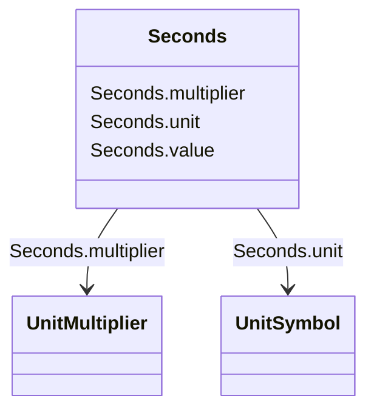

# Seconds

_Time, in seconds._

**URI**: [cim:Seconds](http://iec.ch/TC57/CIM100#Seconds) 
**Type**: Class

<!-- no inheritance hierarchy -->

## Attributes

| Name | URI | Cardinality and Range | Description | Inheritance |
| ---  | --- | --- | --- | --- |
| value | [cim:Seconds.value](http://iec.ch/TC57/CIM100#Seconds.value) | 0..1    float  | Time, in seconds | direct |
| unit | [cim:Seconds.unit](http://iec.ch/TC57/CIM100#Seconds.unit) | 0..1    [UnitSymbol](UnitSymbol.md)  |  | direct |
| multiplier | [cim:Seconds.multiplier](http://iec.ch/TC57/CIM100#Seconds.multiplier) | 0..1    [UnitMultiplier](UnitMultiplier.md)  |  | direct |

## Usages

| used by | used in | type | used |
| ---  | --- | --- | --- |
| [ConformLoadSchedule](ConformLoadSchedule.md) | timeStep | range | [Seconds](Seconds.md) |
| [RegulationSchedule](RegulationSchedule.md) | timeStep | range | [Seconds](Seconds.md) |
| [TapSchedule](TapSchedule.md) | timeStep | range | [Seconds](Seconds.md) |
| [GeneratingUnit](GeneratingUnit.md) | startupTime | range | [Seconds](Seconds.md) |
| [HydroGeneratingUnit](HydroGeneratingUnit.md) | startupTime | range | [Seconds](Seconds.md) |
| [LinearShuntCompensator](LinearShuntCompensator.md) | aVRDelay | range | [Seconds](Seconds.md) |
| [NonConformLoadSchedule](NonConformLoadSchedule.md) | timeStep | range | [Seconds](Seconds.md) |
| [NonlinearShuntCompensator](NonlinearShuntCompensator.md) | aVRDelay | range | [Seconds](Seconds.md) |
| [NuclearGeneratingUnit](NuclearGeneratingUnit.md) | startupTime | range | [Seconds](Seconds.md) |
| [OperationalLimitType](OperationalLimitType.md) | acceptableDuration | range | [Seconds](Seconds.md) |
| [RegularIntervalSchedule](RegularIntervalSchedule.md) | timeStep | range | [Seconds](Seconds.md) |
| [SeasonDayTypeSchedule](SeasonDayTypeSchedule.md) | timeStep | range | [Seconds](Seconds.md) |
| [ShuntCompensator](ShuntCompensator.md) | aVRDelay | range | [Seconds](Seconds.md) |
| [SolarGeneratingUnit](SolarGeneratingUnit.md) | startupTime | range | [Seconds](Seconds.md) |
| [SwitchSchedule](SwitchSchedule.md) | timeStep | range | [Seconds](Seconds.md) |
| [ThermalGeneratingUnit](ThermalGeneratingUnit.md) | startupTime | range | [Seconds](Seconds.md) |
| [WindGeneratingUnit](WindGeneratingUnit.md) | startupTime | range | [Seconds](Seconds.md) |

## Identifier and Mapping Information

### Schema Source

* from schema: http://iec.ch/TC57/ns/CIM/CoreEquipment-EU#Package_CoreEquipmentProfile

## Mappings

| Mapping Type | Mapped Value |
| ---  | ---  |
| self | cim:Seconds |
| native | this:Seconds |

