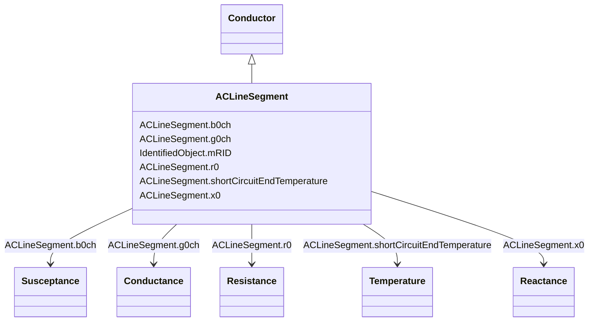

# ACLineSegment

_A wire or combination of wires, with consistent electrical characteristics, building a single electrical system, used to carry alternating current between points in the power system._

_For symmetrical, transposed three phase lines, it is sufficient to use attributes of the line segment, which describe impedances and admittances for the entire length of the segment.  Additionally impedances can be computed by using length and associated per length impedances._

_The BaseVoltage at the two ends of ACLineSegments in a Line shall have the same BaseVoltage.nominalVoltage. However, boundary lines may have slightly different BaseVoltage.nominalVoltages and variation is allowed. Larger voltage difference in general requires use of an equivalent branch._

**URI**: [cim:ACLineSegment](http://iec.ch/TC57/CIM100#ACLineSegment) 
**Type**: Class

## Inheritance
* [IdentifiedObject](IdentifiedObject.md)
    * [PowerSystemResource](PowerSystemResource.md)
        * [Equipment](Equipment.md)
            * [ConductingEquipment](ConductingEquipment.md)
                * [Conductor](Conductor.md)
                    * **ACLineSegment**

## Attributes

| Name | URI | Cardinality and Range | Description | Inheritance |
| ---  | --- | --- | --- | --- |
| b0ch | [cim:ACLineSegment.b0ch](http://iec.ch/TC57/CIM100#ACLineSegment.b0ch) | 1    [Susceptance](Susceptance.md)  | Zero sequence shunt (charging) susceptance, uniformly distributed, of the ent... | direct |
| g0ch | [cim:ACLineSegment.g0ch](http://iec.ch/TC57/CIM100#ACLineSegment.g0ch) | 1    [Conductance](Conductance.md)  | Zero sequence shunt (charging) conductance, uniformly distributed, of the ent... | direct |
| r0 | [cim:ACLineSegment.r0](http://iec.ch/TC57/CIM100#ACLineSegment.r0) | 1    [Resistance](Resistance.md)  | Zero sequence series resistance of the entire line section | direct |
| shortCircuitEndTemperature | [cim:ACLineSegment.shortCircuitEndTemperature](http://iec.ch/TC57/CIM100#ACLineSegment.shortCircuitEndTemperature) | 1    [Temperature](Temperature.md)  | Maximum permitted temperature at the end of SC for the calculation of minimum... | direct |
| x0 | [cim:ACLineSegment.x0](http://iec.ch/TC57/CIM100#ACLineSegment.x0) | 1    [Reactance](Reactance.md)  | Zero sequence series reactance of the entire line section | direct |
| mRID | [cim:IdentifiedObject.mRID](http://iec.ch/TC57/CIM100#IdentifiedObject.mRID) | 1    string  | Master resource identifier issued by a model authority | [IdentifiedObject](IdentifiedObject.md) |

## Identifier and Mapping Information

### Schema Source

* from schema: http://iec.ch/TC57/ns/CIM/ShortCircuit-EU#Package_ShortCircuitProfile

## Mappings

| Mapping Type | Mapped Value |
| ---  | ---  |
| self | cim:ACLineSegment |
| native | this:ACLineSegment |

