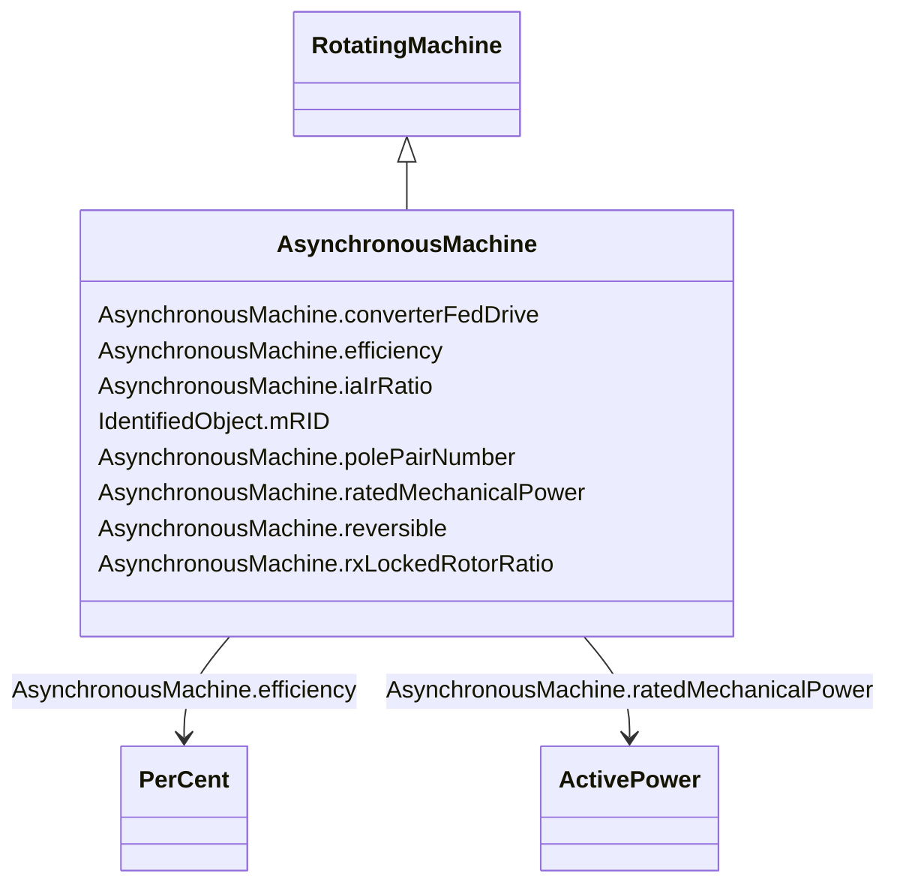

# AsynchronousMachine

_A rotating machine whose shaft rotates asynchronously with the electrical field.  Also known as an induction machine with no external connection to the rotor windings, e.g. squirrel-cage induction machine._

**URI**: [cim:AsynchronousMachine](http://iec.ch/TC57/CIM100#AsynchronousMachine) 
**Type**: Class

## Inheritance
* [IdentifiedObject](IdentifiedObject.md)
    * [PowerSystemResource](PowerSystemResource.md)
        * [Equipment](Equipment.md)
            * [ConductingEquipment](ConductingEquipment.md)
                * [EnergyConnection](EnergyConnection.md)
                    * [RegulatingCondEq](RegulatingCondEq.md)
                        * [RotatingMachine](RotatingMachine.md)
                            * **AsynchronousMachine**

## Attributes

| Name | URI | Cardinality and Range | Description | Inheritance |
| ---  | --- | --- | --- | --- |
| converterFedDrive | [cim:AsynchronousMachine.converterFedDrive](http://iec.ch/TC57/CIM100#AsynchronousMachine.converterFedDrive) | 1..1    boolean  | Indicates whether the machine is a converter fed drive | direct |
| efficiency | [cim:AsynchronousMachine.efficiency](http://iec.ch/TC57/CIM100#AsynchronousMachine.efficiency) | 1..1    [PerCent](PerCent.md)  | Efficiency of the asynchronous machine at nominal operation as a percentage | direct |
| iaIrRatio | [cim:AsynchronousMachine.iaIrRatio](http://iec.ch/TC57/CIM100#AsynchronousMachine.iaIrRatio) | 1..1    float  | Ratio of locked-rotor current to the rated current of the motor (Ia/Ir) | direct |
| polePairNumber | [cim:AsynchronousMachine.polePairNumber](http://iec.ch/TC57/CIM100#AsynchronousMachine.polePairNumber) | 1..1    integer  | Number of pole pairs of stator | direct |
| ratedMechanicalPower | [cim:AsynchronousMachine.ratedMechanicalPower](http://iec.ch/TC57/CIM100#AsynchronousMachine.ratedMechanicalPower) | 1..1    [ActivePower](ActivePower.md)  | Rated mechanical power (Pr in IEC 60909-0) | direct |
| reversible | [cim:AsynchronousMachine.reversible](http://iec.ch/TC57/CIM100#AsynchronousMachine.reversible) | 1..1    boolean  | Indicates for converter drive motors if the power can be reversible | direct |
| rxLockedRotorRatio | [cim:AsynchronousMachine.rxLockedRotorRatio](http://iec.ch/TC57/CIM100#AsynchronousMachine.rxLockedRotorRatio) | 0..1    float  | Locked rotor ratio (R/X) | direct |
| mRID | [cim:IdentifiedObject.mRID](http://iec.ch/TC57/CIM100#IdentifiedObject.mRID) | 1..1    string  | Master resource identifier issued by a model authority | [IdentifiedObject](IdentifiedObject.md) |

## Identifier and Mapping Information

### Schema Source

* from schema: http://iec.ch/TC57/ns/CIM/ShortCircuit-EU#Package_ShortCircuitProfile

## Mappings

| Mapping Type | Mapped Value |
| ---  | ---  |
| self | cim:AsynchronousMachine |
| native | this:AsynchronousMachine |

