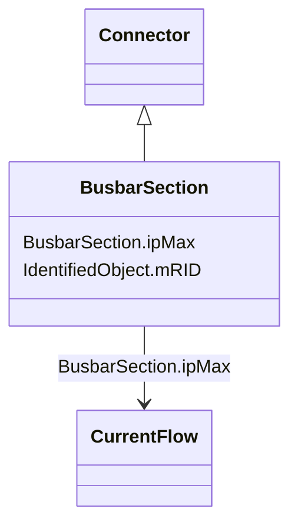

# BusbarSection

_A conductor, or group of conductors, with negligible impedance, that serve to connect other conducting equipment within a single substation. _

_Voltage measurements are typically obtained from voltage transformers that are connected to busbar sections. A bus bar section may have many physical terminals but for analysis is modelled with exactly one logical terminal._

**URI**: [cim:BusbarSection](http://iec.ch/TC57/CIM100#BusbarSection) 
**Type**: Class

## Inheritance
* [IdentifiedObject](IdentifiedObject.md)
    * [PowerSystemResource](PowerSystemResource.md)
        * [Equipment](Equipment.md)
            * [ConductingEquipment](ConductingEquipment.md)
                * [Connector](Connector.md)
                    * **BusbarSection**

## Attributes

| Name | URI | Cardinality and Range | Description | Inheritance |
| ---  | --- | --- | --- | --- |
| ipMax | [cim:BusbarSection.ipMax](http://iec.ch/TC57/CIM100#BusbarSection.ipMax) | 0..1    [CurrentFlow](CurrentFlow.md)  | Maximum allowable peak short-circuit current of busbar (Ipmax in IEC 60909-0) | direct |
| mRID | [cim:IdentifiedObject.mRID](http://iec.ch/TC57/CIM100#IdentifiedObject.mRID) | 1..1    string  | Master resource identifier issued by a model authority | [IdentifiedObject](IdentifiedObject.md) |

## Identifier and Mapping Information

### Schema Source

* from schema: http://iec.ch/TC57/ns/CIM/ShortCircuit-EU#Package_ShortCircuitProfile

## Mappings

| Mapping Type | Mapped Value |
| ---  | ---  |
| self | cim:BusbarSection |
| native | this:BusbarSection |

