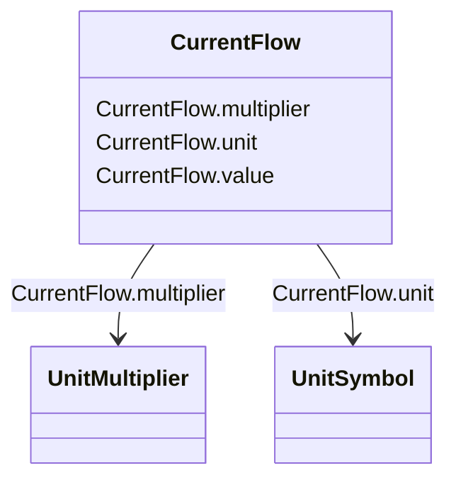

# CurrentFlow

_Electrical current with sign convention: positive flow is out of the conducting equipment into the connectivity node. Can be both AC and DC._

**URI**: [cim:CurrentFlow](http://iec.ch/TC57/CIM100#CurrentFlow) 
**Type**: Class

<!-- no inheritance hierarchy -->

## Attributes

| Name | URI | Cardinality and Range | Description | Inheritance |
| ---  | --- | --- | --- | --- |
| value | [cim:CurrentFlow.value](http://iec.ch/TC57/CIM100#CurrentFlow.value) | 0..1    float  |  | direct |
| multiplier | [cim:CurrentFlow.multiplier](http://iec.ch/TC57/CIM100#CurrentFlow.multiplier) | 0..1    [UnitMultiplier](UnitMultiplier.md)  |  | direct |
| unit | [cim:CurrentFlow.unit](http://iec.ch/TC57/CIM100#CurrentFlow.unit) | 0..1    [UnitSymbol](UnitSymbol.md)  |  | direct |

## Usages

| used by | used in | type | used |
| ---  | --- | --- | --- |
| [BusbarSection](BusbarSection.md) | ipMax | range | [CurrentFlow](CurrentFlow.md) |
| [ExternalNetworkInjection](ExternalNetworkInjection.md) | maxInitialSymShCCurrent | range | [CurrentFlow](CurrentFlow.md) |
| [ExternalNetworkInjection](ExternalNetworkInjection.md) | minInitialSymShCCurrent | range | [CurrentFlow](CurrentFlow.md) |
| [PetersenCoil](PetersenCoil.md) | offsetCurrent | range | [CurrentFlow](CurrentFlow.md) |
| [PetersenCoil](PetersenCoil.md) | positionCurrent | range | [CurrentFlow](CurrentFlow.md) |
| [PowerTransformer](PowerTransformer.md) | beforeShCircuitHighestOperatingCurrent | range | [CurrentFlow](CurrentFlow.md) |
| [SeriesCompensator](SeriesCompensator.md) | varistorRatedCurrent | range | [CurrentFlow](CurrentFlow.md) |
| [SynchronousMachine](SynchronousMachine.md) | ikk | range | [CurrentFlow](CurrentFlow.md) |

## Identifier and Mapping Information

### Schema Source

* from schema: http://iec.ch/TC57/ns/CIM/ShortCircuit-EU#Package_ShortCircuitProfile

## Mappings

| Mapping Type | Mapped Value |
| ---  | ---  |
| self | cim:CurrentFlow |
| native | this:CurrentFlow |

