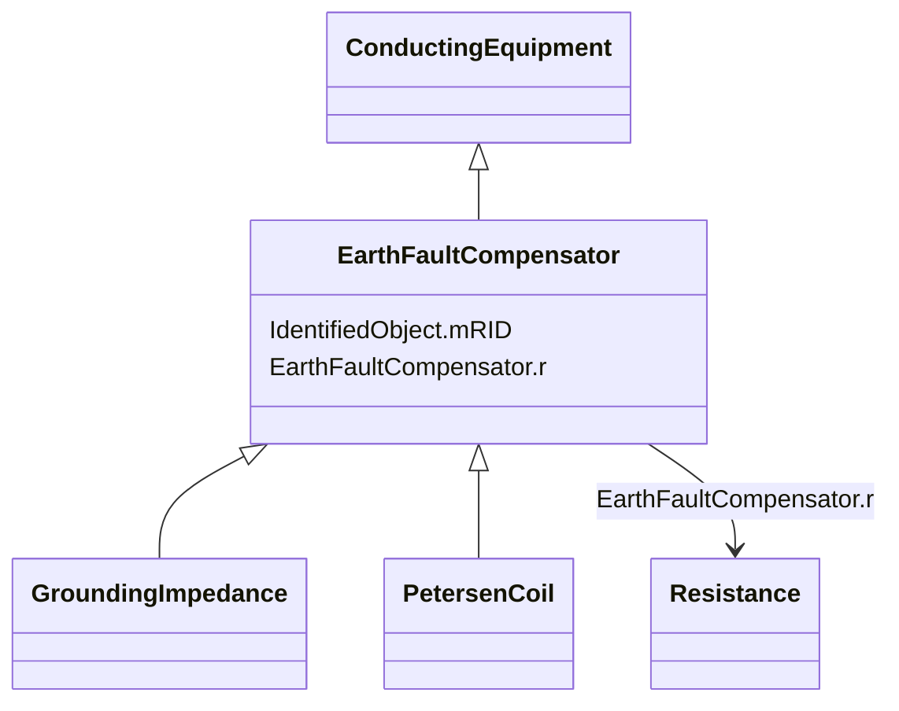

# EarthFaultCompensator

_A conducting equipment used to represent a connection to ground which is typically used to compensate earth faults.   An earth fault compensator device modelled with a single terminal implies a second terminal solidly connected to ground.  If two terminals are modelled, the ground is not assumed and normal connection rules apply._

**URI**: [cim:EarthFaultCompensator](http://iec.ch/TC57/CIM100#EarthFaultCompensator) 
**Type**: Class

## Inheritance
* [IdentifiedObject](IdentifiedObject.md)
    * [PowerSystemResource](PowerSystemResource.md)
        * [Equipment](Equipment.md)
            * [ConductingEquipment](ConductingEquipment.md)
                * **EarthFaultCompensator**
                    * [GroundingImpedance](GroundingImpedance.md)
                    * [PetersenCoil](PetersenCoil.md)

## Attributes

| Name | URI | Cardinality and Range | Description | Inheritance |
| ---  | --- | --- | --- | --- |
| r | [cim:EarthFaultCompensator.r](http://iec.ch/TC57/CIM100#EarthFaultCompensator.r) | 0..1    [Resistance](Resistance.md)  | Nominal resistance of device | direct |
| mRID | [cim:IdentifiedObject.mRID](http://iec.ch/TC57/CIM100#IdentifiedObject.mRID) | 1..1    string  | Master resource identifier issued by a model authority | [IdentifiedObject](IdentifiedObject.md) |

## Identifier and Mapping Information

### Schema Source

* from schema: http://iec.ch/TC57/ns/CIM/ShortCircuit-EU#Package_ShortCircuitProfile

## Mappings

| Mapping Type | Mapped Value |
| ---  | ---  |
| self | cim:EarthFaultCompensator |
| native | this:EarthFaultCompensator |

