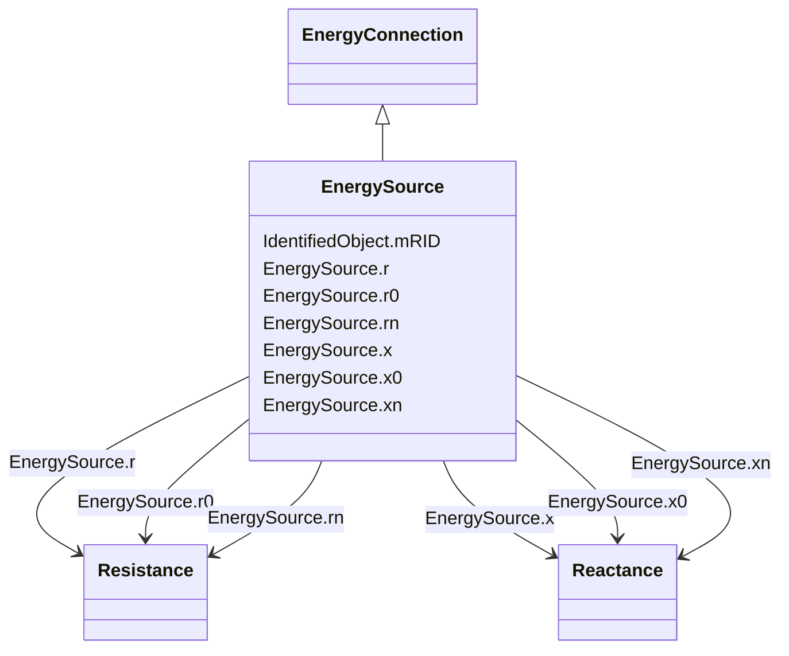

# EnergySource

_A generic equivalent for an energy supplier on a transmission or distribution voltage level._

**URI**: [cim:EnergySource](http://iec.ch/TC57/CIM100#EnergySource) 
**Type**: Class

## Inheritance
* [IdentifiedObject](IdentifiedObject.md)
    * [PowerSystemResource](PowerSystemResource.md)
        * [Equipment](Equipment.md)
            * [ConductingEquipment](ConductingEquipment.md)
                * [EnergyConnection](EnergyConnection.md)
                    * **EnergySource**

## Attributes

| Name | URI | Cardinality and Range | Description | Inheritance |
| ---  | --- | --- | --- | --- |
| r | [cim:EnergySource.r](http://iec.ch/TC57/CIM100#EnergySource.r) | 0..1    [Resistance](Resistance.md)  | Positive sequence Thevenin resistance | direct |
| r0 | [cim:EnergySource.r0](http://iec.ch/TC57/CIM100#EnergySource.r0) | 0..1    [Resistance](Resistance.md)  | Zero sequence Thevenin resistance | direct |
| rn | [cim:EnergySource.rn](http://iec.ch/TC57/CIM100#EnergySource.rn) | 0..1    [Resistance](Resistance.md)  | Negative sequence Thevenin resistance | direct |
| x | [cim:EnergySource.x](http://iec.ch/TC57/CIM100#EnergySource.x) | 0..1    [Reactance](Reactance.md)  | Positive sequence Thevenin reactance | direct |
| x0 | [cim:EnergySource.x0](http://iec.ch/TC57/CIM100#EnergySource.x0) | 0..1    [Reactance](Reactance.md)  | Zero sequence Thevenin reactance | direct |
| xn | [cim:EnergySource.xn](http://iec.ch/TC57/CIM100#EnergySource.xn) | 0..1    [Reactance](Reactance.md)  | Negative sequence Thevenin reactance | direct |
| mRID | [cim:IdentifiedObject.mRID](http://iec.ch/TC57/CIM100#IdentifiedObject.mRID) | 1..1    string  | Master resource identifier issued by a model authority | [IdentifiedObject](IdentifiedObject.md) |

## Identifier and Mapping Information

### Schema Source

* from schema: http://iec.ch/TC57/ns/CIM/ShortCircuit-EU#Package_ShortCircuitProfile

## Mappings

| Mapping Type | Mapped Value |
| ---  | ---  |
| self | cim:EnergySource |
| native | this:EnergySource |

