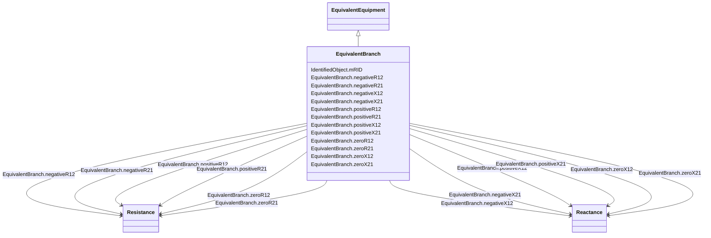

# EquivalentBranch

_The class represents equivalent branches. In cases where a transformer phase shift is modelled and the EquivalentBranch is spanning the same nodes, the impedance quantities for the EquivalentBranch shall consider the needed phase shift._

**URI**: [cim:EquivalentBranch](http://iec.ch/TC57/CIM100#EquivalentBranch) 
**Type**: Class

## Inheritance
* [IdentifiedObject](IdentifiedObject.md)
    * [PowerSystemResource](PowerSystemResource.md)
        * [Equipment](Equipment.md)
            * [ConductingEquipment](ConductingEquipment.md)
                * [EquivalentEquipment](EquivalentEquipment.md)
                    * **EquivalentBranch**

## Attributes

| Name | URI | Cardinality and Range | Description | Inheritance |
| ---  | --- | --- | --- | --- |
| negativeR12 | [cim:EquivalentBranch.negativeR12](http://iec.ch/TC57/CIM100#EquivalentBranch.negativeR12) | 1..1    [Resistance](Resistance.md)  | Negative sequence series resistance from terminal sequence  1 to terminal seq... | direct |
| negativeR21 | [cim:EquivalentBranch.negativeR21](http://iec.ch/TC57/CIM100#EquivalentBranch.negativeR21) | 1..1    [Resistance](Resistance.md)  | Negative sequence series resistance from terminal sequence 2 to terminal sequ... | direct |
| negativeX12 | [cim:EquivalentBranch.negativeX12](http://iec.ch/TC57/CIM100#EquivalentBranch.negativeX12) | 1..1    [Reactance](Reactance.md)  | Negative sequence series reactance from terminal sequence  1 to terminal sequ... | direct |
| negativeX21 | [cim:EquivalentBranch.negativeX21](http://iec.ch/TC57/CIM100#EquivalentBranch.negativeX21) | 1..1    [Reactance](Reactance.md)  | Negative sequence series reactance from terminal sequence 2 to terminal seque... | direct |
| positiveR12 | [cim:EquivalentBranch.positiveR12](http://iec.ch/TC57/CIM100#EquivalentBranch.positiveR12) | 1..1    [Resistance](Resistance.md)  | Positive sequence series resistance from terminal sequence  1 to terminal seq... | direct |
| positiveR21 | [cim:EquivalentBranch.positiveR21](http://iec.ch/TC57/CIM100#EquivalentBranch.positiveR21) | 1..1    [Resistance](Resistance.md)  | Positive sequence series resistance from terminal sequence 2 to terminal sequ... | direct |
| positiveX12 | [cim:EquivalentBranch.positiveX12](http://iec.ch/TC57/CIM100#EquivalentBranch.positiveX12) | 1..1    [Reactance](Reactance.md)  | Positive sequence series reactance from terminal sequence  1 to terminal sequ... | direct |
| positiveX21 | [cim:EquivalentBranch.positiveX21](http://iec.ch/TC57/CIM100#EquivalentBranch.positiveX21) | 1..1    [Reactance](Reactance.md)  | Positive sequence series reactance from terminal sequence 2 to terminal seque... | direct |
| zeroR12 | [cim:EquivalentBranch.zeroR12](http://iec.ch/TC57/CIM100#EquivalentBranch.zeroR12) | 1..1    [Resistance](Resistance.md)  | Zero sequence series resistance from terminal sequence  1 to terminal sequenc... | direct |
| zeroR21 | [cim:EquivalentBranch.zeroR21](http://iec.ch/TC57/CIM100#EquivalentBranch.zeroR21) | 1..1    [Resistance](Resistance.md)  | Zero sequence series resistance from terminal sequence  2 to terminal sequenc... | direct |
| zeroX12 | [cim:EquivalentBranch.zeroX12](http://iec.ch/TC57/CIM100#EquivalentBranch.zeroX12) | 1..1    [Reactance](Reactance.md)  | Zero sequence series reactance from terminal sequence  1 to terminal sequence... | direct |
| zeroX21 | [cim:EquivalentBranch.zeroX21](http://iec.ch/TC57/CIM100#EquivalentBranch.zeroX21) | 1..1    [Reactance](Reactance.md)  | Zero sequence series reactance from terminal sequence 2 to terminal sequence ... | direct |
| mRID | [cim:IdentifiedObject.mRID](http://iec.ch/TC57/CIM100#IdentifiedObject.mRID) | 1..1    string  | Master resource identifier issued by a model authority | [IdentifiedObject](IdentifiedObject.md) |

## Identifier and Mapping Information

### Schema Source

* from schema: http://iec.ch/TC57/ns/CIM/ShortCircuit-EU#Package_ShortCircuitProfile

## Mappings

| Mapping Type | Mapped Value |
| ---  | ---  |
| self | cim:EquivalentBranch |
| native | this:EquivalentBranch |

