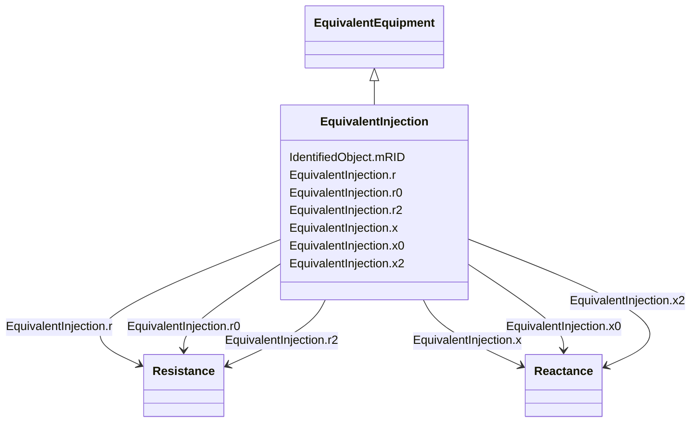

# EquivalentInjection

_This class represents equivalent injections (generation or load).  Voltage regulation is allowed only at the point of connection._

**URI**: [cim:EquivalentInjection](http://iec.ch/TC57/CIM100#EquivalentInjection) 
**Type**: Class

## Inheritance
* [IdentifiedObject](IdentifiedObject.md)
    * [PowerSystemResource](PowerSystemResource.md)
        * [Equipment](Equipment.md)
            * [ConductingEquipment](ConductingEquipment.md)
                * [EquivalentEquipment](EquivalentEquipment.md)
                    * **EquivalentInjection**

## Attributes

| Name | URI | Cardinality and Range | Description | Inheritance |
| ---  | --- | --- | --- | --- |
| r | [cim:EquivalentInjection.r](http://iec.ch/TC57/CIM100#EquivalentInjection.r) | 1..1    [Resistance](Resistance.md)  | Positive sequence resistance | direct |
| r0 | [cim:EquivalentInjection.r0](http://iec.ch/TC57/CIM100#EquivalentInjection.r0) | 1..1    [Resistance](Resistance.md)  | Zero sequence resistance | direct |
| r2 | [cim:EquivalentInjection.r2](http://iec.ch/TC57/CIM100#EquivalentInjection.r2) | 1..1    [Resistance](Resistance.md)  | Negative sequence resistance | direct |
| x | [cim:EquivalentInjection.x](http://iec.ch/TC57/CIM100#EquivalentInjection.x) | 1..1    [Reactance](Reactance.md)  | Positive sequence reactance | direct |
| x0 | [cim:EquivalentInjection.x0](http://iec.ch/TC57/CIM100#EquivalentInjection.x0) | 1..1    [Reactance](Reactance.md)  | Zero sequence reactance | direct |
| x2 | [cim:EquivalentInjection.x2](http://iec.ch/TC57/CIM100#EquivalentInjection.x2) | 1..1    [Reactance](Reactance.md)  | Negative sequence reactance | direct |
| mRID | [cim:IdentifiedObject.mRID](http://iec.ch/TC57/CIM100#IdentifiedObject.mRID) | 1..1    string  | Master resource identifier issued by a model authority | [IdentifiedObject](IdentifiedObject.md) |

## Identifier and Mapping Information

### Schema Source

* from schema: http://iec.ch/TC57/ns/CIM/ShortCircuit-EU#Package_ShortCircuitProfile

## Mappings

| Mapping Type | Mapped Value |
| ---  | ---  |
| self | cim:EquivalentInjection |
| native | this:EquivalentInjection |

