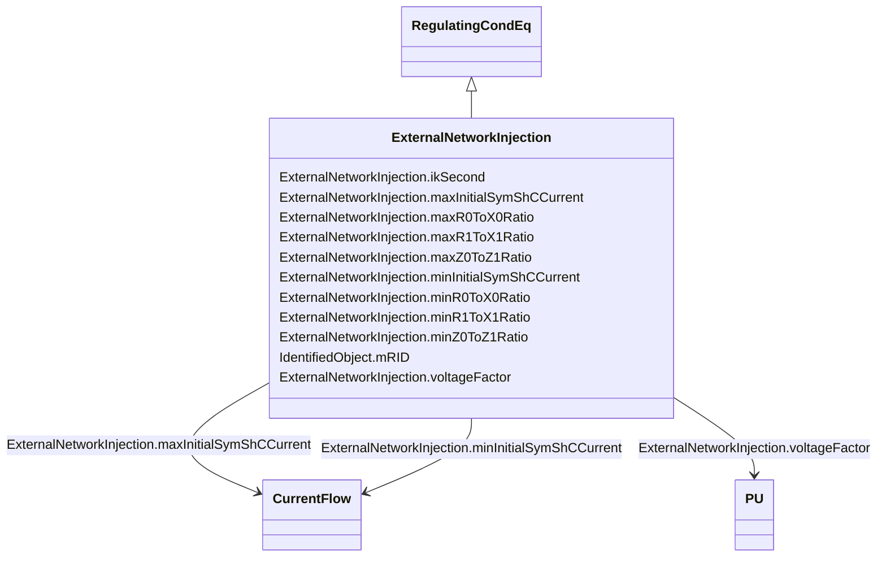

# ExternalNetworkInjection

_This class represents the external network and it is used for IEC 60909 calculations._

**URI**: [cim:ExternalNetworkInjection](http://iec.ch/TC57/CIM100#ExternalNetworkInjection) 
**Type**: Class

## Inheritance
* [IdentifiedObject](IdentifiedObject.md)
    * [PowerSystemResource](PowerSystemResource.md)
        * [Equipment](Equipment.md)
            * [ConductingEquipment](ConductingEquipment.md)
                * [EnergyConnection](EnergyConnection.md)
                    * [RegulatingCondEq](RegulatingCondEq.md)
                        * **ExternalNetworkInjection**

## Attributes

| Name | URI | Cardinality and Range | Description | Inheritance |
| ---  | --- | --- | --- | --- |
| ikSecond | [cim:ExternalNetworkInjection.ikSecond](http://iec.ch/TC57/CIM100#ExternalNetworkInjection.ikSecond) | 0..1    boolean  | Indicates whether initial symmetrical short-circuit current and power have be... | direct |
| maxInitialSymShCCurrent | [cim:ExternalNetworkInjection.maxInitialSymShCCurrent](http://iec.ch/TC57/CIM100#ExternalNetworkInjection.maxInitialSymShCCurrent) | 1    [CurrentFlow](CurrentFlow.md)  | Maximum initial symmetrical short-circuit currents (Ik" max) in A (Ik" = Sk"/... | direct |
| maxR0ToX0Ratio | [cim:ExternalNetworkInjection.maxR0ToX0Ratio](http://iec.ch/TC57/CIM100#ExternalNetworkInjection.maxR0ToX0Ratio) | 1    float  | Maximum ratio of zero sequence resistance of Network Feeder to its zero seque... | direct |
| maxR1ToX1Ratio | [cim:ExternalNetworkInjection.maxR1ToX1Ratio](http://iec.ch/TC57/CIM100#ExternalNetworkInjection.maxR1ToX1Ratio) | 1    float  | Maximum ratio of positive sequence resistance of Network Feeder to its positi... | direct |
| maxZ0ToZ1Ratio | [cim:ExternalNetworkInjection.maxZ0ToZ1Ratio](http://iec.ch/TC57/CIM100#ExternalNetworkInjection.maxZ0ToZ1Ratio) | 1    float  | Maximum ratio of zero sequence impedance to its positive sequence impedance (... | direct |
| minInitialSymShCCurrent | [cim:ExternalNetworkInjection.minInitialSymShCCurrent](http://iec.ch/TC57/CIM100#ExternalNetworkInjection.minInitialSymShCCurrent) | 1    [CurrentFlow](CurrentFlow.md)  | Minimum initial symmetrical short-circuit currents (Ik" min) in A (Ik" = Sk"/... | direct |
| minR0ToX0Ratio | [cim:ExternalNetworkInjection.minR0ToX0Ratio](http://iec.ch/TC57/CIM100#ExternalNetworkInjection.minR0ToX0Ratio) | 1    float  | Indicates whether initial symmetrical short-circuit current and power have be... | direct |
| minR1ToX1Ratio | [cim:ExternalNetworkInjection.minR1ToX1Ratio](http://iec.ch/TC57/CIM100#ExternalNetworkInjection.minR1ToX1Ratio) | 1    float  | Minimum ratio of positive sequence resistance of Network Feeder to its positi... | direct |
| minZ0ToZ1Ratio | [cim:ExternalNetworkInjection.minZ0ToZ1Ratio](http://iec.ch/TC57/CIM100#ExternalNetworkInjection.minZ0ToZ1Ratio) | 1    float  | Minimum ratio of zero sequence impedance to its positive sequence impedance (... | direct |
| voltageFactor | [cim:ExternalNetworkInjection.voltageFactor](http://iec.ch/TC57/CIM100#ExternalNetworkInjection.voltageFactor) | 0..1    [PU](PU.md)  | Voltage factor in pu, which was used to calculate short-circuit current Ik" a... | direct |
| mRID | [cim:IdentifiedObject.mRID](http://iec.ch/TC57/CIM100#IdentifiedObject.mRID) | 1    string  | Master resource identifier issued by a model authority | [IdentifiedObject](IdentifiedObject.md) |

## Identifier and Mapping Information

### Schema Source

* from schema: http://iec.ch/TC57/ns/CIM/ShortCircuit-EU#Package_ShortCircuitProfile

## Mappings

| Mapping Type | Mapped Value |
| ---  | ---  |
| self | cim:ExternalNetworkInjection |
| native | this:ExternalNetworkInjection |

