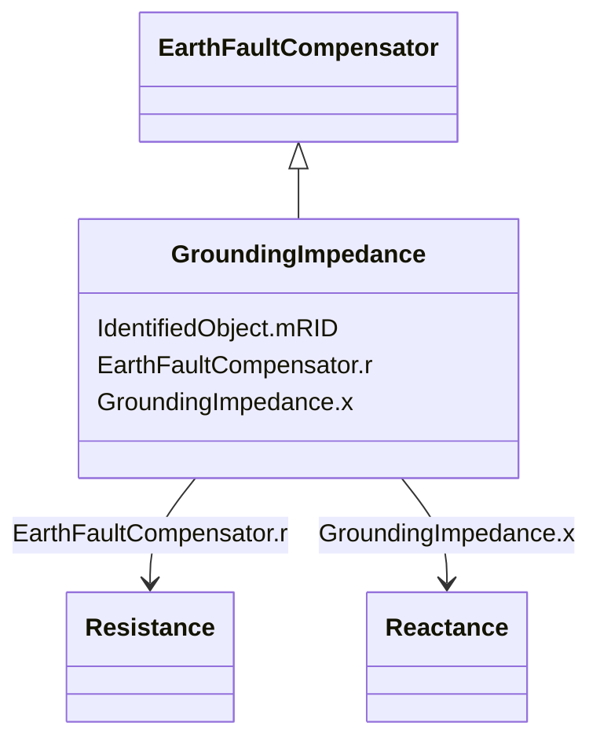

# GroundingImpedance

_A fixed impedance device used for grounding._

**URI**: [cim:GroundingImpedance](http://iec.ch/TC57/CIM100#GroundingImpedance) 
**Type**: Class

## Inheritance
* [IdentifiedObject](IdentifiedObject.md)
    * [PowerSystemResource](PowerSystemResource.md)
        * [Equipment](Equipment.md)
            * [ConductingEquipment](ConductingEquipment.md)
                * [EarthFaultCompensator](EarthFaultCompensator.md)
                    * **GroundingImpedance**

## Attributes

| Name | URI | Cardinality and Range | Description | Inheritance |
| ---  | --- | --- | --- | --- |
| x | [cim:GroundingImpedance.x](http://iec.ch/TC57/CIM100#GroundingImpedance.x) | 1    [Reactance](Reactance.md)  | Reactance of device | direct |
| r | [cim:EarthFaultCompensator.r](http://iec.ch/TC57/CIM100#EarthFaultCompensator.r) | 0..1    [Resistance](Resistance.md)  | Nominal resistance of device | [EarthFaultCompensator](EarthFaultCompensator.md) |
| mRID | [cim:IdentifiedObject.mRID](http://iec.ch/TC57/CIM100#IdentifiedObject.mRID) | 1    string  | Master resource identifier issued by a model authority | [IdentifiedObject](IdentifiedObject.md) |

## Identifier and Mapping Information

### Schema Source

* from schema: http://iec.ch/TC57/ns/CIM/ShortCircuit-EU#Package_ShortCircuitProfile

## Mappings

| Mapping Type | Mapped Value |
| ---  | ---  |
| self | cim:GroundingImpedance |
| native | this:GroundingImpedance |

