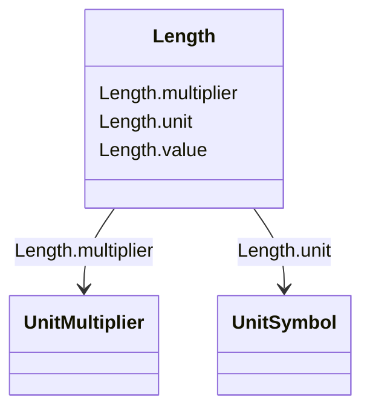

# Length

_Unit of length. It shall be a positive value or zero._

**URI**: [cim:Length](http://iec.ch/TC57/CIM100#Length) 
**Type**: Class

<!-- no inheritance hierarchy -->

## Attributes

| Name | URI | Cardinality and Range | Description | Inheritance |
| ---  | --- | --- | --- | --- |
| value | [cim:Length.value](http://iec.ch/TC57/CIM100#Length.value) | 0..1    float  |  | direct |
| unit | [cim:Length.unit](http://iec.ch/TC57/CIM100#Length.unit) | 0..1    [UnitSymbol](UnitSymbol.md)  |  | direct |
| multiplier | [cim:Length.multiplier](http://iec.ch/TC57/CIM100#Length.multiplier) | 0..1    [UnitMultiplier](UnitMultiplier.md)  |  | direct |

## Usages

| used by | used in | type | used |
| ---  | --- | --- | --- |
| [MutualCoupling](MutualCoupling.md) | distance11 | range | [Length](Length.md) |
| [MutualCoupling](MutualCoupling.md) | distance12 | range | [Length](Length.md) |
| [MutualCoupling](MutualCoupling.md) | distance21 | range | [Length](Length.md) |
| [MutualCoupling](MutualCoupling.md) | distance22 | range | [Length](Length.md) |

## Identifier and Mapping Information

### Schema Source

* from schema: http://iec.ch/TC57/ns/CIM/ShortCircuit-EU#Package_ShortCircuitProfile

## Mappings

| Mapping Type | Mapped Value |
| ---  | ---  |
| self | cim:Length |
| native | this:Length |

