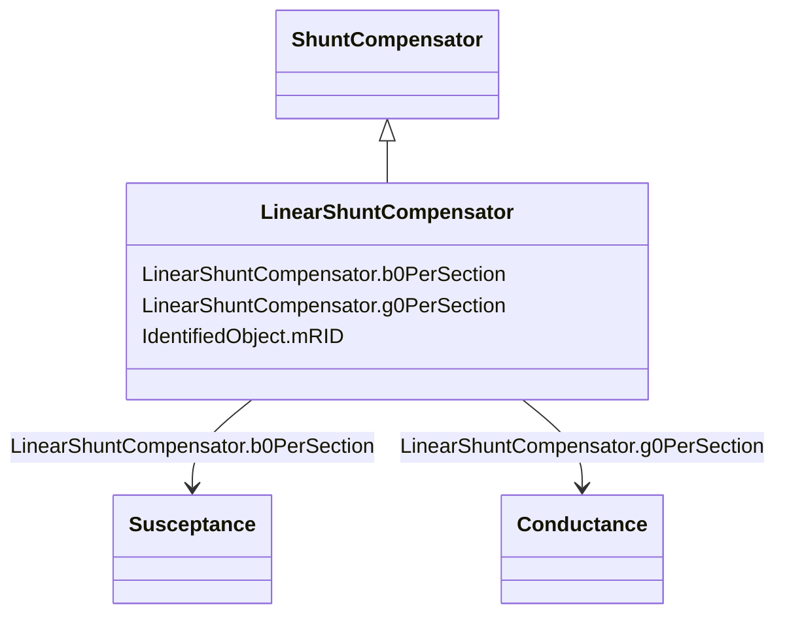

# LinearShuntCompensator

_A linear shunt compensator has banks or sections with equal admittance values._

**URI**: [cim:LinearShuntCompensator](http://iec.ch/TC57/CIM100#LinearShuntCompensator) 
**Type**: Class

## Inheritance
* [IdentifiedObject](IdentifiedObject.md)
    * [PowerSystemResource](PowerSystemResource.md)
        * [Equipment](Equipment.md)
            * [ConductingEquipment](ConductingEquipment.md)
                * [EnergyConnection](EnergyConnection.md)
                    * [RegulatingCondEq](RegulatingCondEq.md)
                        * [ShuntCompensator](ShuntCompensator.md)
                            * **LinearShuntCompensator**

## Attributes

| Name | URI | Cardinality and Range | Description | Inheritance |
| ---  | --- | --- | --- | --- |
| b0PerSection | [cim:LinearShuntCompensator.b0PerSection](http://iec.ch/TC57/CIM100#LinearShuntCompensator.b0PerSection) | 1    [Susceptance](Susceptance.md)  | Zero sequence shunt (charging) susceptance per section | direct |
| g0PerSection | [cim:LinearShuntCompensator.g0PerSection](http://iec.ch/TC57/CIM100#LinearShuntCompensator.g0PerSection) | 1    [Conductance](Conductance.md)  | Zero sequence shunt (charging) conductance per section | direct |
| mRID | [cim:IdentifiedObject.mRID](http://iec.ch/TC57/CIM100#IdentifiedObject.mRID) | 1    string  | Master resource identifier issued by a model authority | [IdentifiedObject](IdentifiedObject.md) |

## Identifier and Mapping Information

### Schema Source

* from schema: http://iec.ch/TC57/ns/CIM/ShortCircuit-EU#Package_ShortCircuitProfile

## Mappings

| Mapping Type | Mapped Value |
| ---  | ---  |
| self | cim:LinearShuntCompensator |
| native | this:LinearShuntCompensator |

