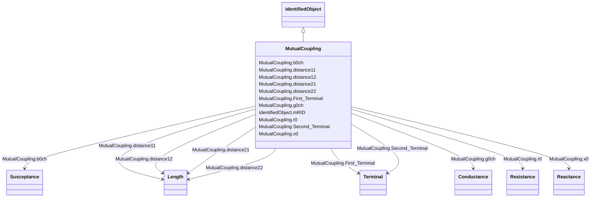

# MutualCoupling

_This class represents the zero sequence line mutual coupling._

**URI**: [cim:MutualCoupling](http://iec.ch/TC57/CIM100#MutualCoupling) 
**Type**: Class

## Inheritance
* [IdentifiedObject](IdentifiedObject.md)
    * **MutualCoupling**

## Attributes

| Name | URI | Cardinality and Range | Description | Inheritance |
| ---  | --- | --- | --- | --- |
| b0ch | [cim:MutualCoupling.b0ch](http://iec.ch/TC57/CIM100#MutualCoupling.b0ch) | 1    [Susceptance](Susceptance.md)  | Zero sequence mutual coupling shunt (charging) susceptance, uniformly distrib... | direct |
| distance11 | [cim:MutualCoupling.distance11](http://iec.ch/TC57/CIM100#MutualCoupling.distance11) | 1    [Length](Length.md)  | Distance to the start of the coupled region from the first line's terminal ha... | direct |
| distance12 | [cim:MutualCoupling.distance12](http://iec.ch/TC57/CIM100#MutualCoupling.distance12) | 1    [Length](Length.md)  | Distance to the end of the coupled region from the first line's terminal with... | direct |
| distance21 | [cim:MutualCoupling.distance21](http://iec.ch/TC57/CIM100#MutualCoupling.distance21) | 1    [Length](Length.md)  | Distance to the start of coupled region from the second line's terminal with ... | direct |
| distance22 | [cim:MutualCoupling.distance22](http://iec.ch/TC57/CIM100#MutualCoupling.distance22) | 1    [Length](Length.md)  | Distance to the end of coupled region from the second line's terminal with se... | direct |
| g0ch | [cim:MutualCoupling.g0ch](http://iec.ch/TC57/CIM100#MutualCoupling.g0ch) | 1    [Conductance](Conductance.md)  | Zero sequence mutual coupling shunt (charging) conductance, uniformly distrib... | direct |
| r0 | [cim:MutualCoupling.r0](http://iec.ch/TC57/CIM100#MutualCoupling.r0) | 1    [Resistance](Resistance.md)  | Zero sequence branch-to-branch mutual impedance coupling, resistance | direct |
| x0 | [cim:MutualCoupling.x0](http://iec.ch/TC57/CIM100#MutualCoupling.x0) | 1    [Reactance](Reactance.md)  | Zero sequence branch-to-branch mutual impedance coupling, reactance | direct |
| Second_Terminal | [cim:MutualCoupling.Second_Terminal](http://iec.ch/TC57/CIM100#MutualCoupling.Second_Terminal) | 1    [Terminal](Terminal.md)  | The starting terminal for the calculation of distances along the second branc... | direct |
| First_Terminal | [cim:MutualCoupling.First_Terminal](http://iec.ch/TC57/CIM100#MutualCoupling.First_Terminal) | 1    [Terminal](Terminal.md)  | The starting terminal for the calculation of distances along the first branch... | direct |
| mRID | [cim:IdentifiedObject.mRID](http://iec.ch/TC57/CIM100#IdentifiedObject.mRID) | 1    string  | Master resource identifier issued by a model authority | [IdentifiedObject](IdentifiedObject.md) |

## Usages

| used by | used in | type | used |
| ---  | --- | --- | --- |
| [Terminal](Terminal.md) | HasSecondMutualCoupling | range | [MutualCoupling](MutualCoupling.md) |
| [Terminal](Terminal.md) | HasFirstMutualCoupling | range | [MutualCoupling](MutualCoupling.md) |

## Identifier and Mapping Information

### Schema Source

* from schema: http://iec.ch/TC57/ns/CIM/ShortCircuit-EU#Package_ShortCircuitProfile

## Mappings

| Mapping Type | Mapped Value |
| ---  | ---  |
| self | cim:MutualCoupling |
| native | this:MutualCoupling |

