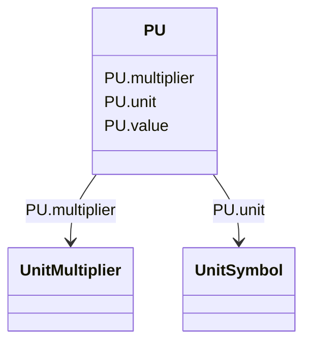

# PU

_Per Unit - a positive or negative value referred to a defined base. Values typically range from -10 to +10._

**URI**: [cim:PU](http://iec.ch/TC57/CIM100#PU) 
**Type**: Class

<!-- no inheritance hierarchy -->

## Attributes

| Name | URI | Cardinality and Range | Description | Inheritance |
| ---  | --- | --- | --- | --- |
| value | [cim:PU.value](http://iec.ch/TC57/CIM100#PU.value) | 0..1    float  |  | direct |
| unit | [cim:PU.unit](http://iec.ch/TC57/CIM100#PU.unit) | 0..1    [UnitSymbol](UnitSymbol.md)  |  | direct |
| multiplier | [cim:PU.multiplier](http://iec.ch/TC57/CIM100#PU.multiplier) | 0..1    [UnitMultiplier](UnitMultiplier.md)  |  | direct |

## Usages

| used by | used in | type | used |
| ---  | --- | --- | --- |
| [ExternalNetworkInjection](ExternalNetworkInjection.md) | voltageFactor | range | [PU](PU.md) |
| [SynchronousMachine](SynchronousMachine.md) | satDirectSubtransX | range | [PU](PU.md) |
| [SynchronousMachine](SynchronousMachine.md) | satDirectSyncX | range | [PU](PU.md) |
| [SynchronousMachine](SynchronousMachine.md) | satDirectTransX | range | [PU](PU.md) |

## Identifier and Mapping Information

### Schema Source

* from schema: http://iec.ch/TC57/ns/CIM/ShortCircuit-EU#Package_ShortCircuitProfile

## Mappings

| Mapping Type | Mapped Value |
| ---  | ---  |
| self | cim:PU |
| native | this:PU |

