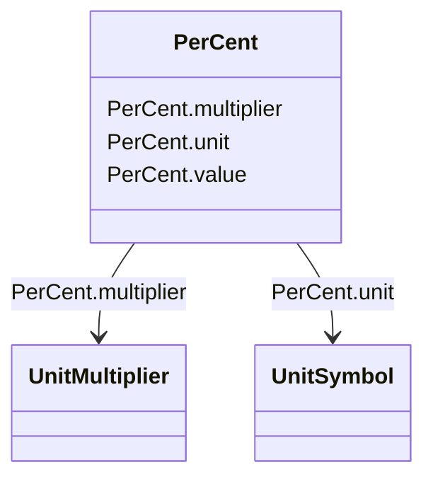

# PerCent

_Percentage on a defined base.   For example, specify as 100 to indicate at the defined base._

**URI**: [cim:PerCent](http://iec.ch/TC57/CIM100#PerCent) 
**Type**: Class

<!-- no inheritance hierarchy -->

## Attributes

| Name | URI | Cardinality and Range | Description | Inheritance |
| ---  | --- | --- | --- | --- |
| value | [cim:PerCent.value](http://iec.ch/TC57/CIM100#PerCent.value) | 0..1    float  | Normally 0 to 100 on a defined base | direct |
| unit | [cim:PerCent.unit](http://iec.ch/TC57/CIM100#PerCent.unit) | 0..1    [UnitSymbol](UnitSymbol.md)  |  | direct |
| multiplier | [cim:PerCent.multiplier](http://iec.ch/TC57/CIM100#PerCent.multiplier) | 0..1    [UnitMultiplier](UnitMultiplier.md)  |  | direct |

## Usages

| used by | used in | type | used |
| ---  | --- | --- | --- |
| [AsynchronousMachine](AsynchronousMachine.md) | efficiency | range | [PerCent](PerCent.md) |
| [SynchronousMachine](SynchronousMachine.md) | voltageRegulationRange | range | [PerCent](PerCent.md) |

## Identifier and Mapping Information

### Schema Source

* from schema: http://iec.ch/TC57/ns/CIM/ShortCircuit-EU#Package_ShortCircuitProfile

## Mappings

| Mapping Type | Mapped Value |
| ---  | ---  |
| self | cim:PerCent |
| native | this:PerCent |

