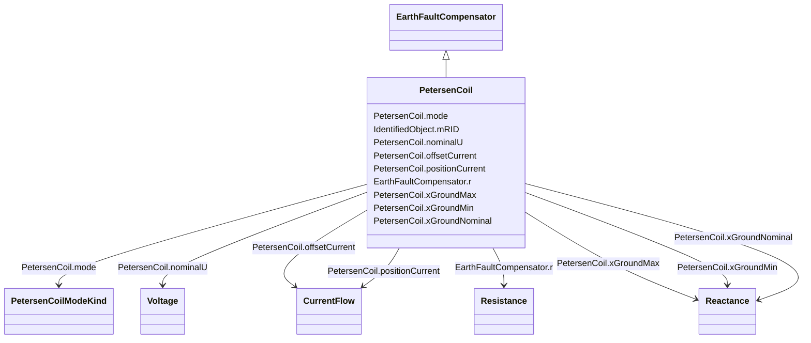

# PetersenCoil

_A variable impedance device normally used to offset line charging during single line faults in an ungrounded section of network._

**URI**: [cim:PetersenCoil](http://iec.ch/TC57/CIM100#PetersenCoil) 
**Type**: Class

## Inheritance
* [IdentifiedObject](IdentifiedObject.md)
    * [PowerSystemResource](PowerSystemResource.md)
        * [Equipment](Equipment.md)
            * [ConductingEquipment](ConductingEquipment.md)
                * [EarthFaultCompensator](EarthFaultCompensator.md)
                    * **PetersenCoil**

## Attributes

| Name | URI | Cardinality and Range | Description | Inheritance |
| ---  | --- | --- | --- | --- |
| mode | [cim:PetersenCoil.mode](http://iec.ch/TC57/CIM100#PetersenCoil.mode) | 1    [PetersenCoilModeKind](PetersenCoilModeKind.md)  | The mode of operation of the Petersen coil | direct |
| nominalU | [cim:PetersenCoil.nominalU](http://iec.ch/TC57/CIM100#PetersenCoil.nominalU) | 1    [Voltage](Voltage.md)  | The nominal voltage for which the coil is designed | direct |
| offsetCurrent | [cim:PetersenCoil.offsetCurrent](http://iec.ch/TC57/CIM100#PetersenCoil.offsetCurrent) | 0..1    [CurrentFlow](CurrentFlow.md)  | The offset current that the Petersen coil controller is operating from the re... | direct |
| positionCurrent | [cim:PetersenCoil.positionCurrent](http://iec.ch/TC57/CIM100#PetersenCoil.positionCurrent) | 0..1    [CurrentFlow](CurrentFlow.md)  | The control current used to control the Petersen coil also known as the posit... | direct |
| xGroundMax | [cim:PetersenCoil.xGroundMax](http://iec.ch/TC57/CIM100#PetersenCoil.xGroundMax) | 1    [Reactance](Reactance.md)  | The maximum reactance | direct |
| xGroundMin | [cim:PetersenCoil.xGroundMin](http://iec.ch/TC57/CIM100#PetersenCoil.xGroundMin) | 1    [Reactance](Reactance.md)  | The minimum reactance | direct |
| xGroundNominal | [cim:PetersenCoil.xGroundNominal](http://iec.ch/TC57/CIM100#PetersenCoil.xGroundNominal) | 1    [Reactance](Reactance.md)  | The nominal reactance | direct |
| r | [cim:EarthFaultCompensator.r](http://iec.ch/TC57/CIM100#EarthFaultCompensator.r) | 0..1    [Resistance](Resistance.md)  | Nominal resistance of device | [EarthFaultCompensator](EarthFaultCompensator.md) |
| mRID | [cim:IdentifiedObject.mRID](http://iec.ch/TC57/CIM100#IdentifiedObject.mRID) | 1    string  | Master resource identifier issued by a model authority | [IdentifiedObject](IdentifiedObject.md) |

## Identifier and Mapping Information

### Schema Source

* from schema: http://iec.ch/TC57/ns/CIM/ShortCircuit-EU#Package_ShortCircuitProfile

## Mappings

| Mapping Type | Mapped Value |
| ---  | ---  |
| self | cim:PetersenCoil |
| native | this:PetersenCoil |

